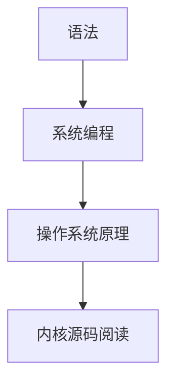

# ** 从语法到内核源码——编程进阶路线

**

创建时间：2026-05-06 22:13

**

```markdown
# 从语法到内核源码——编程进阶路线

## 一、学习目标
从编程语言的基础语法开始，逐步深入理解操作系统、编译原理、内存管理等底层知识，最终达到能够阅读和理解操作系统内核源码的水平。

---

## 二、学习路径

### 1. 语言基础（以 C/C++ 为例）
- **语法掌握：**
  - 变量、数据类型、运算符
  - 控制流（if/else、循环）
  - 数组、字符串、指针
  - 函数、结构体、枚举
- **进阶主题：**
  - 内存管理（堆栈、动态内存）
  - 预处理器、宏
  - 文件 I/O、标准库

### 2. 系统编程
- **进程与线程：**
  - 进程创建、通信（管道、信号量、消息队列）
  - 多线程编程、同步机制
- **内存管理：**
  - 虚拟内存、地址空间
 该内容继续深入系统底层，涉及操作系统的内存管理机制。
```



---

## 三、建议资源
- 《C 程序设计语言》（K&R）
- 《Unix 网络编程》
- Linux 内核源码（https://git.kernel.org/）
- 调试工具（GDB、Valgrind）

---

## 四、总结
学习编程需要从基础语法开始，逐步深入系统层面，最终通过阅读内核源码掌握底层原理。坚持理论与实践结合，逐步构建完整的知识体系。