# 随机现象

自然界与社会生活中的两类现象林林总总,它们可以分为两类,一类是确定性现象,另一类是随机现象

确定性现象是指:在一定条件下必然发生的现象
例如在一个标准大气压下,水加热到100度一定会沸腾

随机现象是指:在一定条件下具有多种可能结果,而且试验时无法预知出现哪个结果的现象
例如掷骰子,点数可能是1到6点,比如抽检样品,可能是合格品也可能是不合格品
___
- (1)向上抛出的物体会落下
这是一个确定性现象

- (2)打靶正中靶心
这是一个不确定的现象(随机现象)

- (3)买了彩票刚好中奖
这是一个随机现象
___
# 随机试验

随机现象在一次试验中可能表现出这样或者那样的结果,但是我们反复进行这种试验,随着试验次数的增大,它们会呈现出一定的规律性

概率论与数理统计是研究随机现象规律性的一门学科,为了对随机现象进行研究,我们就要进行这些试验,对随机现象的观察,记录,实验统称为随机试验,它具有以下特性:
- 可以在相同条件下重复进行
- 事先知道所有可能出现的结果
- 进行试验前并不知道哪个试验结果会发生

例如:

- 抛一枚硬币,观察试验结果
- 对某路公交车某停靠站登记下车人数
- 对听课人数进行一次登记
___
# 样本空间

我们定义:随机试验的所有可能结果构成的集合称为样本空间,记为
$$
S=\{ e \}
$$
$S$中的元素$e$称为样本点

例如:

- 抛一枚硬币
$$
S=\{ 正面,反面 \}
$$
- 记录某城市一日中发生交通事故的次数
$$
S=\{ 0,1,2,\dots \}
$$
- 记录一批灯泡的寿命
$$
S=\{ x:x\geq 0 \}
$$
- 记录某地一昼夜的最高气温$x$和最低气温$y$
$$
S=\{ (x,y):a\leq y\leq x\leq b \}
$$
___
# 随机事件

样本空间$S$是一个集合,它的子集$A$称为随机事件$A$,简称为事件$A$,当且仅当$A$中的某个样本点发生时称事件$A$发生

事件$A$的表示可用集合表示,也可用语言表示,之所以称为随机事件,是因为在试验时可能是$A$中的样本点出现,也可能是$A$之外的样本点出现,具有随机性,故而我们把这样的样本空间的子集称为随机事件
___
例如,观察某公交车站的候车人数,样本空间就是
$$
S=\{ 0,1,2,\dots \}
$$
如果事件$A$表示"至少有5人候车",则
$$
A=\{ 5,6,7,\dots \}
$$
如果事件$B$表示"候车人数不多于2人",则
$$
B=\{ 0,1,2 \}
$$
___
如果我们把样本空间$S$也看作一个事件,那么每次试验$S$总会发生,所有称$S$为必然事件

如果事件只含有一个样本点,我们称其为基本事件

如果事件是空集,里面不包含任何样本点,记为$\varnothing$,则每次试验$\varnothing$都不发生,称$\varnothing$为不可能事件
___
继续上面的例子

如果事件$C$表示"恰好有3人候车"
$$
C=\{ 3 \}
$$
那么$C$就是基本事件

如果事件$D$表示"候车人数既少于3个又多于3个"
$$
D=\varnothing
$$
$D$是不可能事件
___
# 两个事件的关系

我们举一个例子:
甲,乙两人进行掷骰子比赛,得到的点数大者胜,若甲已经投得5点分析乙胜负情况

$$
S=\{ 1,2,3,4,5,6 \}
$$
令$A$:"乙赢",$B$:"平局",$C$:"乙输"
$$
\begin{gather}
	A=\{ 6 \} \\
	B=\{ 5 \} \\
	C=\{ 1,2,3,4 \}
\end{gather}
$$
此时如果令$D$:"乙不输",则$D=\{ 5,6 \}$由$A,B$合并组成
___
我们先从集合最基本的关系开始,有以下定义

如果事件$A$发生一定导致$B$发生,我们称$B$包含$A$
$$
A\subset B
$$

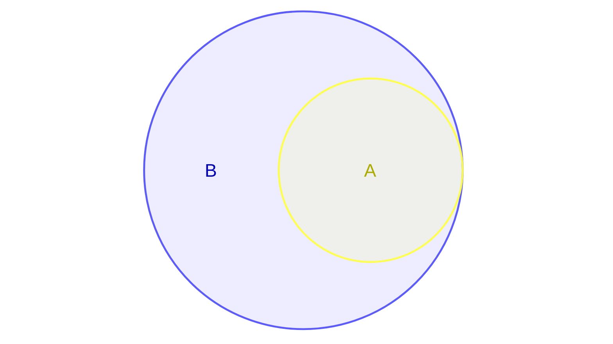

如果两个事件相等$A=B$,即$A$发生$B$一定发生,反过来$B$发生$A$也一定发生
$$
A=B \iff
\begin{cases}
	A \subset B \\
	B \subset A
\end{cases}
$$
___
例如

- (1)
$$
\begin{gather}
	A=\{ 明天天晴 \} \\
	B=\{ 明天无雨 \}
\end{gather}
$$
由于天气有
$$
S=\{ 晴,多云,阴,阵雨,雷阵雨 \}
$$
故而可见$A\subset B$

- (2)
$$
\begin{gather}
	A=\{ 有多于4人候车 \} \\
	B=\{ 至少有5人候车 \}
\end{gather}
$$
显然$A=B$

- (3)
一枚硬币抛两次
$$
\begin{gather}
	A=\{ 第一次是正面 \} \\
	B=\{ 至少有一次是正面 \}
\end{gather}
$$
由于
$$
\begin{gather}
	S=\{ 正正,正反,反正,反反 \} \\
	A=\{ 正正,正反 \} \\
	B=\{ 正正,正反,反正 \}
\end{gather}
$$
所以$B\supset A$
___
# 两个事件的运算

- $A$与$B$的和事件
记为$A\cup B$
$$
A\cup B=\{ x|x \in A或 x \in B \}
$$

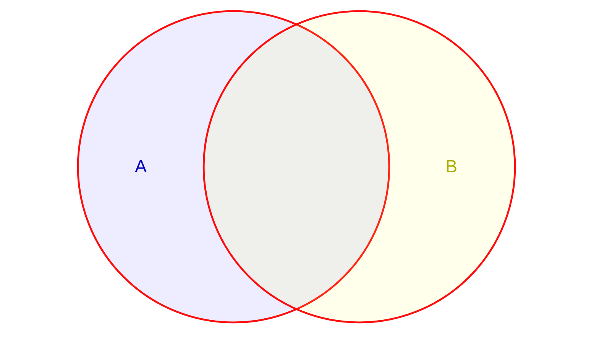

也即$A$与$B$至少有一个发生
$$
\bigcup_{i=1}^{n}A_{i}
$$
表示$A_{1},A_{2},\dots,A_{n}$至少有一个发生
___
- $A$与$B$的积事件
记为$A\cap B,A\cdot B,AB$
$$
A\cap B=\{ x|x \in A 且 x \in B \}
$$

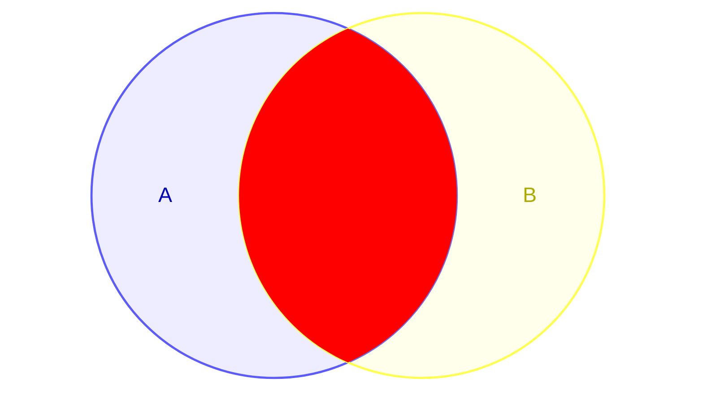

即$A$与$B$同时发生
$$
\bigcap_{i=1}^{n}A_{i}
$$
表示$A_{1},A_{2},\dots,A_{n}$同时发生
___
- $AB=\varnothing$
我们称这种情况为事件$A$与$B$不相容或互斥

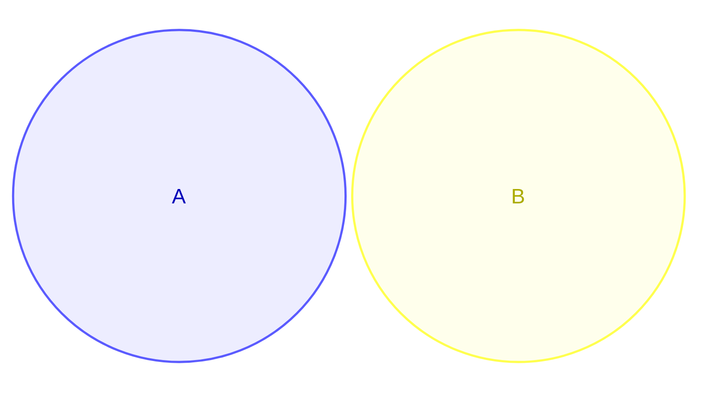

___
- $A$与$B$的差事件

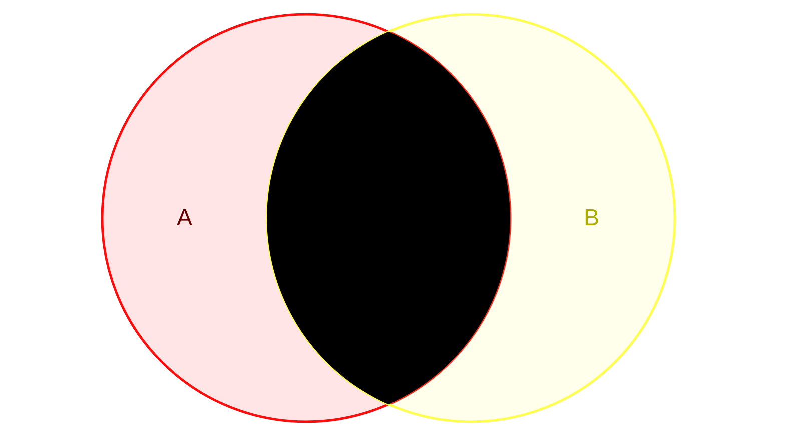

$$
A-B=\{ x|x \in A 且x \notin B \}
$$
即$A$发生但$B$不发生
___
- $A$的逆事件
记为$\bar{A}$,也称$A$的互逆,对立事件

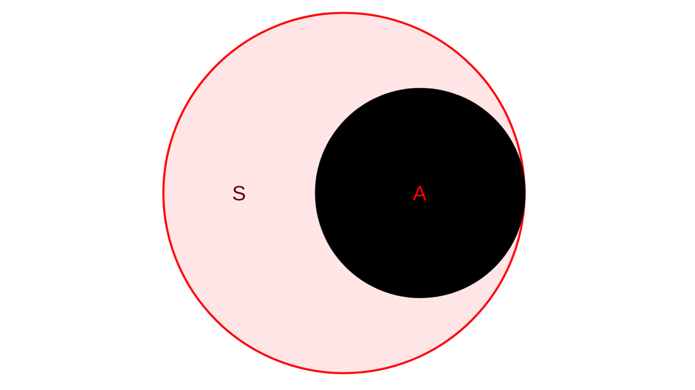

$$
\begin{gather}
	A\cup \bar{A}=S \\
	A\bar{A}=\varnothing \\
	\bar{\bar{A}}=A
\end{gather}
$$
这样的话,$A$与$B$的差事件可以表示为
$$
A-B=A\overline{B}=A\cup B-B=A-AB
$$
___
# 事件的运算定律

事件可以看作集合,故而它满足集合的运算定律

- 交换律:
$$
A\cup B=B\cup A,\quad A\cap B=B\cap A
$$
- 结合律:
$$
A\cup(B\cup C)=(A\cup B)\cup C,\quad A\cap(B\cap C)=(A\cap B)\cap C
$$
- 分配律:
$$
A\cup(B\cap C)=(A\cup B)\cap(A\cup C),\quad A\cap(B\cup C)=(A\cap B)\cup(A\cap B)
$$
- 对偶律(德摩根定律)
$$
\overline{A\cup B}=\overline{A}\cap\overline{B},\quad \overline{A\cap B}=\overline{A}\cup\overline{B}
$$
对偶律可推广为
$$
\begin{gather}
	\overline{\bigcap_{i=1}^{n}A_{i}}=\bigcup_{i=1}^{n}\overline{A_{i}}=\overline{A_{1}}\cup\overline{A_{2}}\cup\dots \cup\overline{A_{n}} \\
	\overline{\bigcup_{i=1}^{n}A_{i}}=\bigcap_{i=1}^{n}\overline{A_{i}}=\overline{A_{1}}\  \overline{A_{2}}\dots\overline{A_{n}}
\end{gather}
$$
注意$\overline{AB}$和$\overline{A}\ \overline{B}$的区别

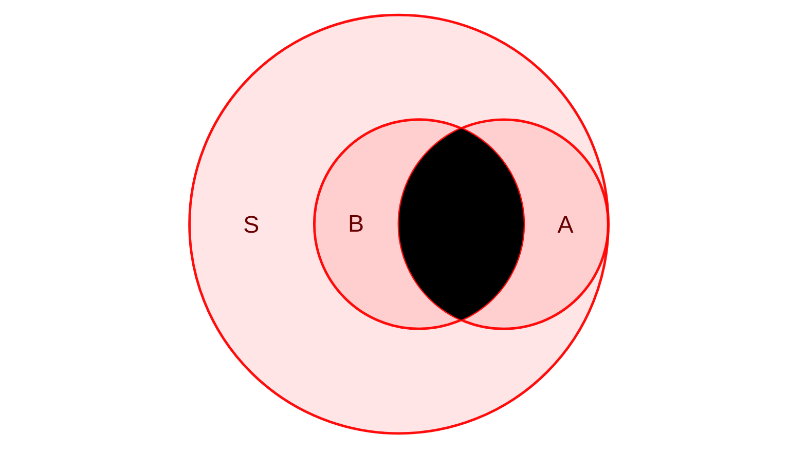
$$
\overline{AB}
$$
$\overline{AB}$表示的是$\overline{A\cap B}$,也就是$A,B$不同时发生

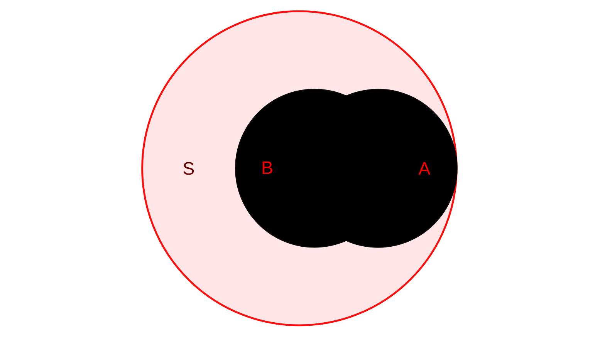
$$
\overline{A}\ \overline{B}
$$
$\overline{A}\ \overline{B}$表示的是$\overline{A}\cap \overline{B}$,即$A,B$都不发生

两者的联系是
$$
\overline{AB}=\overline{A}\ \overline{B}\cup A\overline{B}\cup\overline{A}B
$$
___
## 运算举例

### 示例1

用韦恩图验证等式
$$
(A\cup B)-C=A\cup(B-C)
$$
是否成立
___

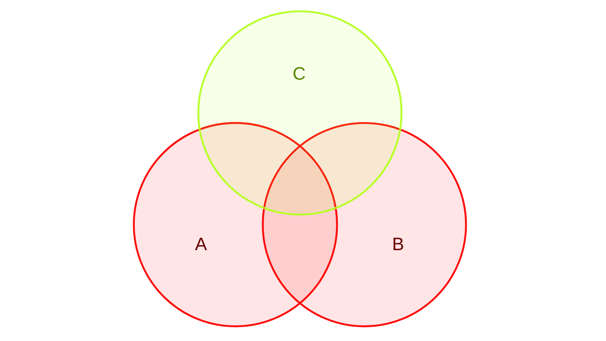
$$
A\cap B
$$

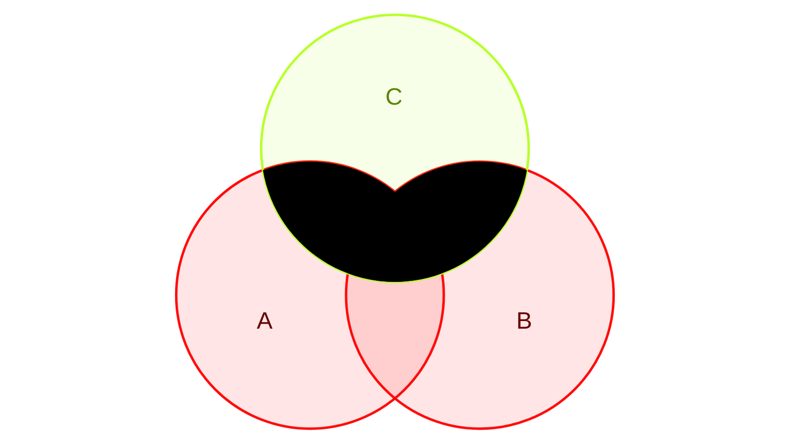
$$
(A\cup B)-C
$$
___

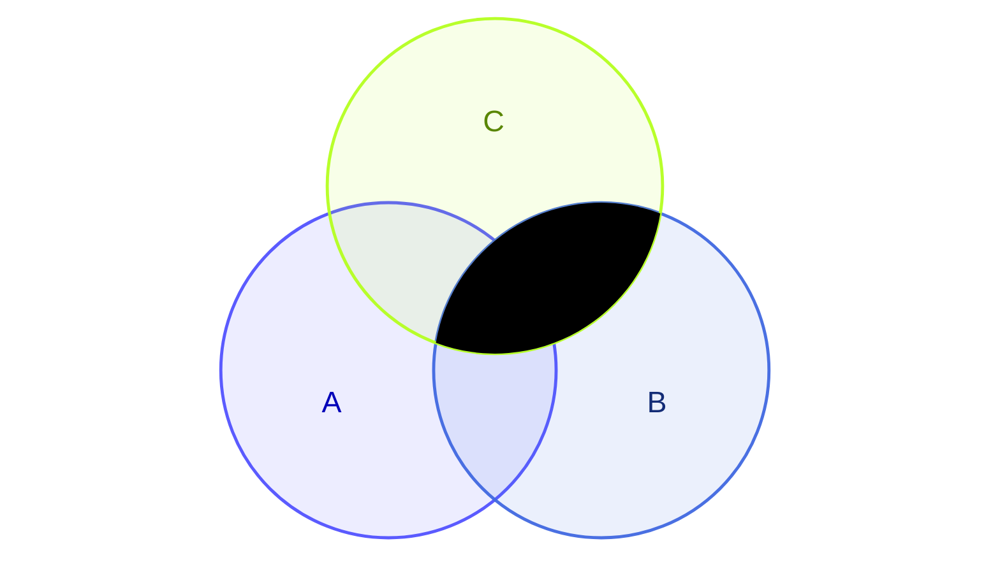
$$
B-C
$$

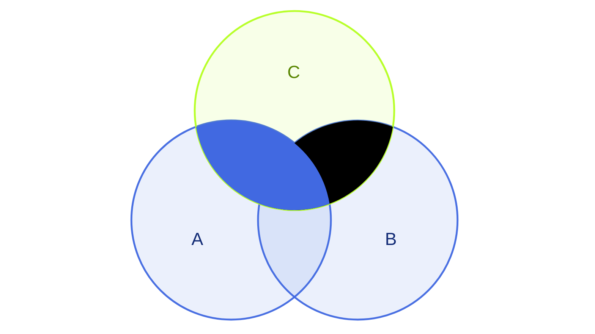
$$
A\cup(B-C)
$$

可见两者并不相等
___
### 示例2

设$A=\{ 甲来听课 \},B=\{ 乙来听课 \}$,则:
$$
\begin{gather}
	A\cup B=\{ 甲,乙至少有一人来 \} \\
	A\cap B=\{ 甲,乙都来 \} \\
	\overline{A\cup B}=\overline{A}\ \overline{B}=\{ 甲,乙都不来 \} \\
	\overline{A\cap B}=\overline{AB}=\{ 甲,乙不同时来 \}
\end{gather}
$$
___
### 示例3

用$A,B,C$三个事件关系及运算表示下列各事件

- $A$发生,$B,C$都不发生
$$
A\overline{B}\ \overline{C}=A-B-C
$$
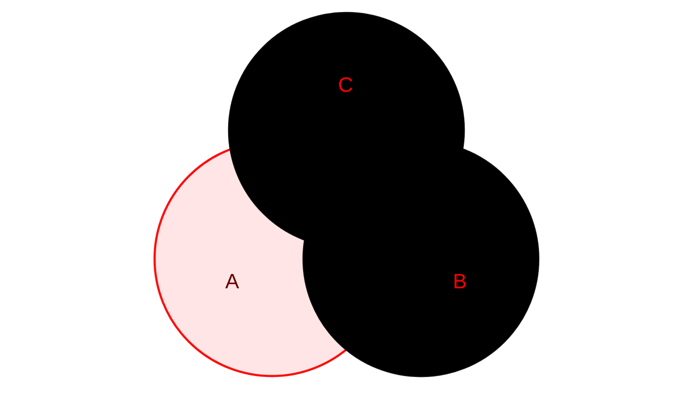

- 三者中恰有一个发生
$$
A\overline{B}\ \overline{C}\cup \overline{A}B\overline{C}\cup \overline{A}\ \overline{B}C
$$
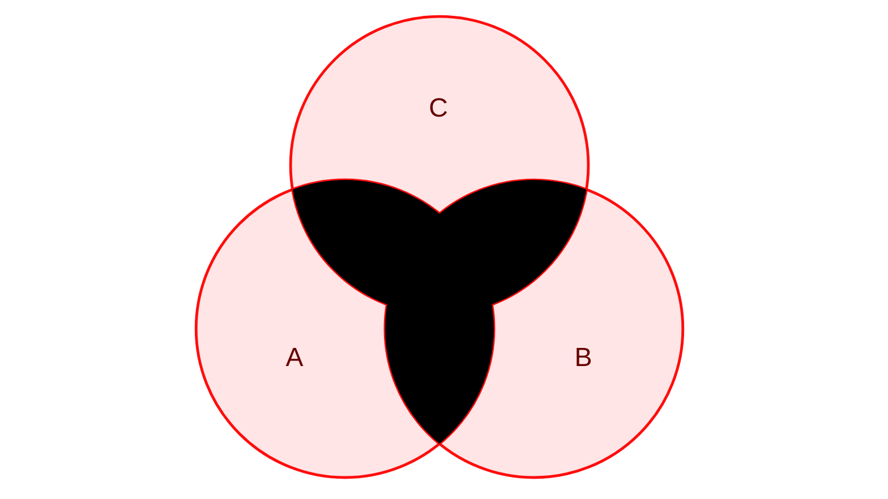

- 三者中至少有一个发生
$$
\begin{gather}
	A\cup B\cup C \\
	=\overline{\overline{A}\ \overline{B}\ \overline{C}} \\
	=(A\overline{B}\ \overline{C}\cup \overline{A}B\overline{C}\cup \overline{A}\ \overline{B}C)\cup(\overline{A}BC\cup A\overline{B}C\cup AB\overline{C})\cup ABC
\end{gather}
$$
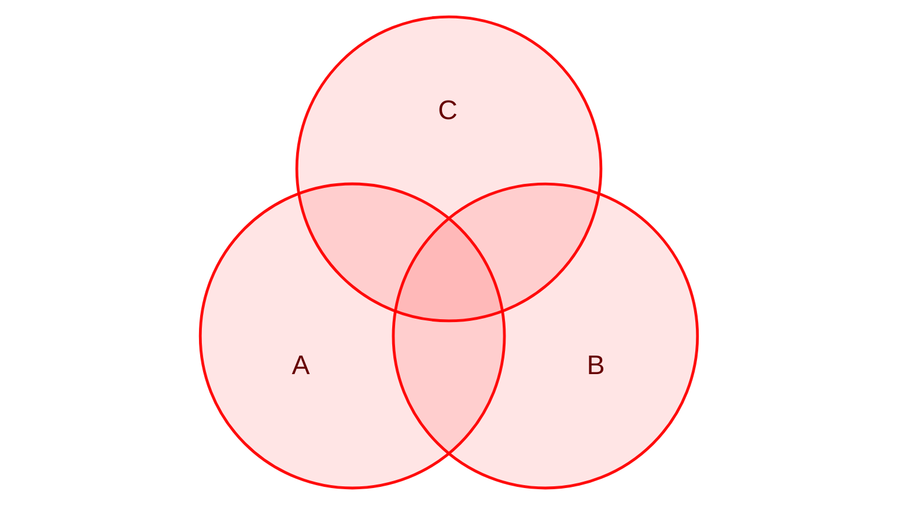

- 三者中至少有两个发生
$$
AB\cup AC\cup BC=\overline{A}BC\cup A\overline{B}C\cup AB\overline{C}\cup ABC
$$
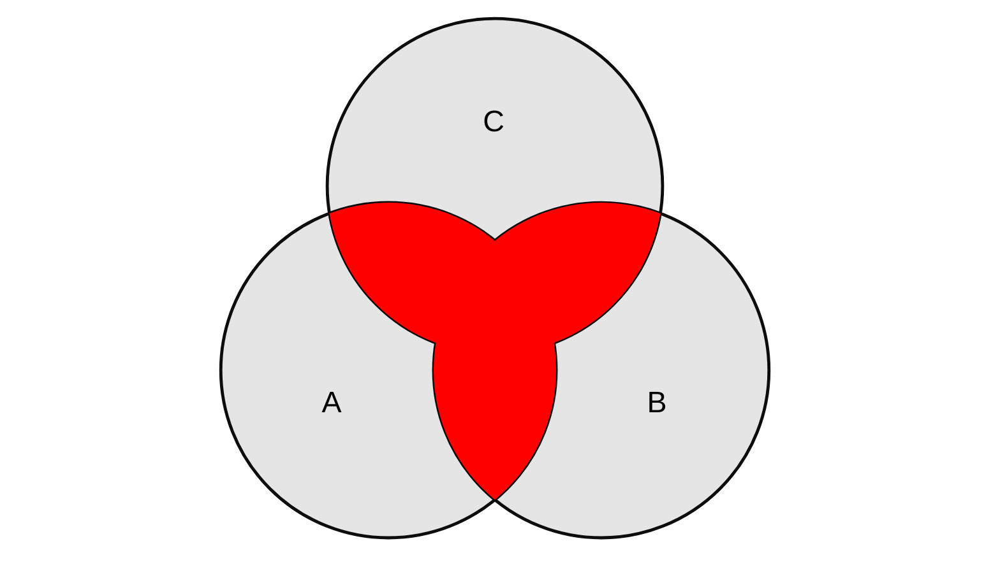

- 三者至少有一个不发生
$$
\begin{gather}
	\overline{A}\cup\overline{B}\cup\overline{C} \\
	=\overline{ABC} \\
	=(A\overline{B}\ \overline{C}\cup \overline{A}B\overline{C}\cup \overline{A}\ \overline{B}C)\cup(\overline{A}BC\cup A\overline{B}C\cup AB\overline{C})\cup \overline{A}\ \overline{B}\ \overline{C}
\end{gather}
$$
___
# 频率

频率是0~1之间的一个实数,在大量重复试验的基础上给出了随机事件发生的可能性的估计

频率的定义为
$$
f_{n}(A)=\frac{n_{A}}{n}
$$
其中$n_{A}$是$A$发生的次数(频数),$n$是总试验次数
称$f_{n}(A)$为$A$在这$n$次试验中发生的频率,反映了事件$A$发生的频繁程度

频率的性质有:
- $0\leq f_{n}(A)\leq 1$
- $f_{n}(S)=1$
- 若$A_{1},A_{2},\dots,A_{k}$两两互不相容,则
$$
f_{n}\left( \bigcup_{i=1}^{k}A_{i} \right)=\sum_{i=1}^{k}f_{n}(A_{i})
$$
频率的一个重要性质是:
$f_{n}(A)$随着$n$的增大渐趋稳定,稳定值为$p$
___
# 概率

概率的第一个定义我们称之为概率的统计性定义:
当试验的次数增加时,随机事件$A$发生的频率的稳定值$p$称为概率,记$P(A)=p$

对于频率所拥有的性质,概率也应该拥有,前苏联数学家柯尔莫哥洛夫由此给出了概率的公理化定义:
设随机试验对应的样本空间为$S$,对每个事件$A$,定义$P(A)$,满足:
- 非负性:$P(A)\geq 0$
- 规范性:$P(S)=1$
- 可列可加性:
$A_{1},A_{2},\dots$两两互斥,即$A_{i}A_{j}=\varnothing,i\ne j$,则
$$
P\left( \bigcup_{i=1}^{\infty}A_{i} \right)=\sum_{i=1}^{\infty}P(A_{i})
$$

满足这三条公理的$P(A)$称为事件$A$的概率
___
根据这个公理化定义,我们可以得到以下性质:
- $P(\varnothing)=0$
- $P(A)=1-P(\overline{A})$
- 有限可加性
$$
\begin{gather}
	A_{1},A_{2},\dots,A_{n},A_{i}A_{j}=\varnothing,i\ne j \\ \\
	\implies P\left( \bigcup_{i=1}^{n}A_{i} \right)=\sum_{i=1}^{n}P(A_{i})
\end{gather}
$$
___
另外还有一些性质

- 若$A\subset B$,则有$P(B-A)=P(B)-P(A)$


证明如下:
$B=A\cup (B-A)$且两部分互斥
$$
\begin{gather}
	\implies & P(B)=P(A)+P(B-A) \\
	\implies & P(B-A)=P(B)-P(A)
\end{gather}
$$
同时由于概率的非负性可得$P(B)\geq P(A)$,而且由于$P(S)=1$,所以对于所有的事件的概率都有$P(A)\leq P(S)=1$
___
另外对于一般的情况,$A,B$存在交集$A\cap B\ne\varnothing$,则

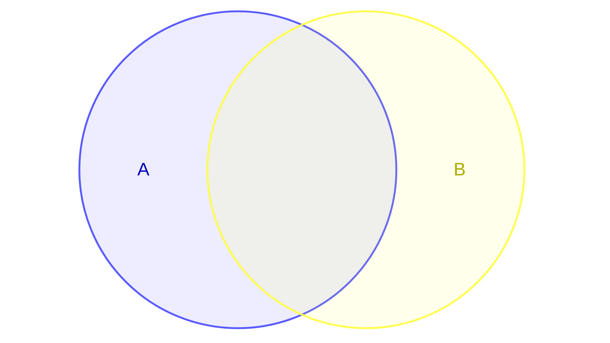

变为$AB\subset B$,故而有
$$
P(B-A)=P(B)-P(AB)
$$
___
- 概率的加法公式
$$
P(A\cup B)=P(A)+P(B)-P(AB)
$$


证明如下
$$
\begin{gather}
	 & A\cup B=A\cup (B-A) \\
	\implies & P(A\cup B)=P(A)+P(B-A) \\
	\implies & P(A\cup B)=P(A)+P(B)-P(AB)
\end{gather}
$$

我们推广到三个事件的情况
$$
P(A\cup B\cup C)=P(A)+P(B)+P(C)-P(AB)-P(AC)-P(BC)+P(ABC)
$$

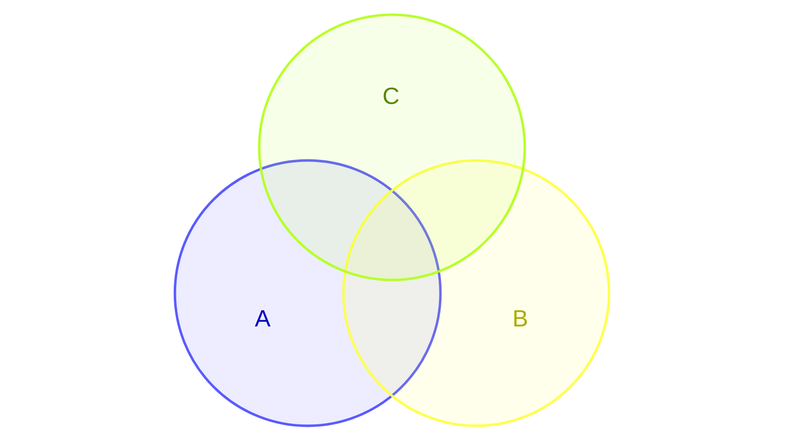

证明如下
$$
\begin{gather}
	P(A\cup B\cup C) \\
	=P(A\cup B)+P(C)-P(AC\cup BC) \\
	=P(A)+P(B)-P(AB)+P(C)-P(AC)-P(BC)+P(ABC)
\end{gather}
$$

继续推广有
$$
\begin{gather}
	P\left( \bigcup_{i=1}^{n}A_{i} \right)=\sum_{i=1}^{n}P(A_{i})-\sum_{1\leq i\leq j\leq n}P(A_{i}A_{j})+\sum_{1\leq i\leq j\leq k\leq n}P(A_{i}A_{j}A_{k}) \\
	+\dots+(-1)^{n-1}P(A_{1}A_{2}\dots A_{n})
\end{gather}
$$
___
例如

设甲,乙两人向同一目标进行射击,已知 甲击中的概率为0.7, 乙击中目标的概率为0.6, 两人同时击中目标的概率为0.4,求
(1)目标不被击中的概率
(2)甲击中目标而乙未击中

设$A=\{ 甲击中目标 \},B=\{ 乙击中目标 \}$,则$P(A)=0.7,P(B)=0.6,P(AB)=0.4$
我们分析有
$$
\begin{gather}
	\{目标不被击中\}=\overline{A}\ \overline{B}=\overline{A\cup B} \\
	\{ 甲击中目标而乙未击中 \}=A\overline{B}=A-AB
\end{gather}
$$
故而有
$$
\begin{gather}
	P(\overline{A}\ \overline{B})=1-P(A\cup B)=1-[P(A)+P(B)-P(AB)]=0.1 \\
	P(A\overline{B})=P(A)-P(AB)=0.7-0.4=0.3
\end{gather}
$$
___
# 等可能概型(古典概型)

若试验满足:
- 样本空间$S$中样本点有限(有限性)
- 出现每一个样本点的概率相等(等可能性)

我们称这种试验为等可能概型(或古典概型),这是概率论最初起源时所研究的概率模型

这样如果样本空间中有$n$个点,则每个点出现的概率都为$\frac{1}{n}$,当我们关心其中的一个随机事件时,我们只需要知道这个随机事件包含几个样本点,如果事件$A$包含了$k$个样本点,则$P(A)=\frac{k}{n}$
$$
P(A)=\frac{A所包含的样本点数}{S中的样本点数}
$$

对于古典概型,分析它的关键是厘清它的样本点数,样本点我们可以用排列组合的方式来求
___
## 取球问题

例如,一袋中有5个球,其中3个为白球,2个为黄球,设取到每一球的可能性相等,求:
(1)从袋子中随机取出一球,记$A=\{ 取到白球 \}$,求$P(A)$
(2)从袋子中不放回取两球,记$B=\{ 两个都是白球 \}$,求$P(B)$

抽样方法说明如下: 
不放回抽样:第1次取出一个球,记录其颜色, 不再放回,第2次从剩余的球中取出一球
放回抽样:第1次取出一个球,记录其颜色, 放回,第2次依然从全部的球中取出一球
___
我们对球进行编号,白球有1,2,3号,黄球有4,5号

(1)只取一次,$S_{1}=\{ 1,2,3,4,5 \}$,取到白球$A=\{ 1,2,3 \}$,可得$P(A)=\frac{3}{5}$
(2)取两次,有
$$
S_{2}=\{ (1,2),(1,3),\dots,(5,3),(5,4) \}
$$
取到两次白球有
$$
B=\{ (1,2),(1,3),(2,1),(2,3),(3,1),(3,2) \}
$$
故而有
$$
P(B)=\frac{C_{3}^2}{C_{5}^2}=\frac{3\times 2}{5\times 4}=0.3
$$
___
这里如果我们不考虑同种颜色的球,我们也能得到一样的结果,如果问题与顺序无关,那么我们考虑样本空间的时候也不用考虑顺序

我们将其推广到更一般的情况,有

一般地,如果有$N$个球,其中$a$个白球,$b=N-a$个黄球,采用不放回抽样取$n$个球$(n\leq N)$,记$A_{k}=\{ 恰好取到k个白球 \} \quad(k\leq a)$,则
$$
P(A_{k})=\frac{C_{a}^{k}C_{b}^{n-k}}{C_{N}^{n}}
$$
其中$C_{N}^{n}$是组合数$C_{N}^{n}={N\choose n}=\frac{N!}{n!(N-n)!}$

同时我们也可以求出至少取到几个球(用1减去拿得少的)

例如我们求至少取到2个的概率$P(B)$,我们先求出
$$
P(A_{0})=\frac{C_{a}^0C_{b}^n}{C_{N}^n} \quad P(A_{1})=\frac{C_{a}^1C_{b}^{n-1}}{C_{N}^{n}}
$$
可得$P(B)=1-P(A_{0})-P(A_{1})$

我们也可以求至多拿到几个(从零开始全部加起来)
再求一个至多取到2个$P(C)$,先求
$$
P(A_{2})=\frac{C_{a}^1C_{b}^{n-2}}{C_{N}^n}
$$
可得$P(C)=P(A_{0})+P(A_{1})+P(A_{2})$
___
## 生日问题

例如,足球场里有23个人(双方队员11人加裁判1人),至少有两人生日相同的概率为多大

我们假设每人的生日在一年(取365天)是等可能的,所以23人的生日一共有$365^{23}$种可能的结果,我们先考虑$A$:"所有人的生日都不同"
$$
P(A)=\frac{365\times 364\times\dots \times (365-22)}{365^{23}}\approx 0.493
$$
故而$P(\overline{A})=1-P(A)=0.507>0.5$

类似可以算出:50人的教室里至少有两人生日相同的概率约为0.97
___
## 抽签问题

一袋中有$a$个白球,$b$个黄球,记$a+b=n$,设每次摸到各球的概率相等,每次从袋中摸一球,不放回地摸$n$次,求第$k$次摸到白球的概率

即先抽和后抽之间是公平的吗,我们有两种方法来计算

第一种方法,我们先将$n$个球依次编号为:$1,2,\dots,n$,其中前$a$号球为白球,我们将$1,2,\dots,n$的每一个排列为一个样本点,每一样本点等概率,则有
$$
P(A_{k})=\frac{a(a+b-1)!}{(a+b)!}=\frac{a}{a+b}
$$
我们发现它与$k$无关,所以抽签是公平的

第二种解法,我们将第$k$次摸到的球号作为一个样本点,则由于对称性,取得各个球的概率是相等的,所以
$$
\begin{gather}
	S=\{ 1,2,\dots,a,a+1,\dots,n \} \\
	A_{k}=\{ 1,2,\dots,a \} \\ \\
	\implies P(A_{k})=\frac{a}{n}=\frac{a}{a+b}
\end{gather}
$$
可得一样的结果
___
# 条件概率

我们举一个例子:一个家庭中有两个小孩,已知至少一个是女孩的概率是多少(假定孩子的性别是男是女等可能的)

我们可得两个孩子的样本空间为
$$
S=\{ (兄,弟),(兄,妹),(姐,弟),(姐,妹) \}
$$
而我们已知其中一个是女孩,所以其中应该删去(兄,弟)这个样本点,故而可得
$$
A=\{ (兄,妹),(姐,弟),(姐,妹) \}
$$
两个都是女孩的事件是
$$
B=\{ (姐,妹) \}
$$
由于事件$A$已经发生,所以这时试验的所有可能只有三种,而事件$B$只包含一个,所以有
$$
P(B|A)=\frac{1}{3}
$$
我们用$P(B|A)$表示$A$发生的条件下$B$发生的概率,我们称这种概率为条件概率

在这里如果我们不知道事件$A$发生,则事件$B$发生的概率为$P(B)=\frac{1}{4}$
$$
P(B)\ne P(B|A)
$$
其原因是事件$A$的发生改变了样本空间,使它由原先的$S$缩减为新的样本空间$S_{A}=A$

```mermaid
venn-beta
	set A:3
	set B:2
	set S:15
	union A,B[""]:1
	union A,S[""]:3
	union S,B[""]:2
	style A,B fill:RoyalBlue
	style S fill:Gray
```
___
条件概率定义如下:

$$
P(B|A)=\frac{P(AB)}{P(A)},\quad P(A)> 0
$$
条件概率也满足概率的三条公理
- 非负性:$P(B|A)\geq 0$
- 规范性:$P(S|A)=1$
- 可列可加性
$$
\begin{gather}
	B_{1},B_{2},\dots\qquad B_{i}B_{j}=\varnothing,i\ne j \\ \\
	P\left( \bigcup_{i=1}^{\infty}B_{i}\bigg| A \right)=\sum_{i=1}^{\infty}P(B_{i}|A)
\end{gather}
$$
故而我们之前推导的一些性质也是满足的,例如
- $P(A)=1-P(\overline{A})$
$$
P(B|A)=1-P(\overline{B}|A)
$$

- 若$A\subset B$,则有$P(B-A)=P(B)-P(A)$
$$
B\supset C\implies P(B|A)\geq P(C|A)
$$

- $P(A\cup B)=P(A)+P(B)-P(AB)$
$$
P(B\cup C|A)=P(B|A)+P(C|A)-P(BC|A)
$$

使用这些性质时条件概率用保持条件一致,也就是都以事件$A$发生为前提,也可以说普通的概率是以样本空间$S$对应的事件发生为前提
___
例如,对某地区调查了1439,研究吸烟与患呼吸道疾病之间的关系,数据如下,在这1439人中随机选一人,设$A$表示吸烟,$B$表示患病

|     | 患病  | 不患病  |      |
| :-: | :-: | :--: | :--: |
| 吸烟  | 320 | 405  | 725  |
| 不吸烟 | 74  | 640  | 714  |
|     | 394 | 1045 | 1439 |

那么有
$$
\begin{gather}
	P(A)=\frac{725}{1439}=0.504 \\ \\
	P(B)=\frac{394}{1439}=0.274 \\ \\
	P(AB)=\frac{320}{1439}=0.222
\end{gather}
$$
所以有
$$
\begin{gather}
	P(B|A)=\frac{320}{725}=0.441 \\ \\
	P(B|\overline{A})=\frac{74}{714}=0.104
\end{gather}
$$
___
对于条件概率,如果这些条件概率都有意义,有乘法公式如下
$$
P(AB)=P(A)\cdot P(B|A)=P(B)\cdot P(A|B)
$$
对于三个事件的有
$$
P(ABC)=P(A)P(B|A)P(C|AB)
$$
我们推广到更一般的情况有
$$
P(A_{1}A_{2}\dots A_{n})=P(A_{1})P(A_{2}|A_{1})P(A_{3}|A_{1}A_{2})\dots P(A_{n}|A_{1}\dots A_{n})
$$
___
## 计算举例

### 示例1

已知$P(A)=\frac{1}{4},P(B|A)=\frac{1}{3},P(A|B)=\frac{1}{2}$,求$P(A\cup B),P(\overline{A}|A\cup B)$

应用乘法公式有
$$
P(AB)=P(A)P(B|A)=\frac{1}{12}
$$
又可得
$$
P(B|A)=\frac{P(AB)}{P(B)}\implies P(B)=\frac{1}{6}
$$

```mermaid
venn-beta
	set A:3
		text A1["1/6"]
	set B:2
		text B1["1/12"]
	union A,B["1/12"]:1

```
故而可得
$$
\begin{gather}
	P(A\cup B)=P(A)+P(B)-P(AB)=\frac{1}{4}+\frac{1}{6}-\frac{1}{12}=\frac{1}{3} \\ \\
	P(\overline{A}|A\cup B)=1-P(A|A\cup B)=1-\frac{1/4}{1/3}=\frac{1}{4}
\end{gather}
$$
___
### 示例2

一盒中有5个红球,4个白球,采用不放回抽样,每次取一个,取3次
(1)求前两次中至少有一次取到红球的概率
(2)已知前两次中至少有一次取到红球,求前两次中恰有一次取到红球的概率
(3)求第1,2次取到红球后第3次取到白球的概率

令$A_{i}=\{ 第i次取到红球 \},\quad i=1,2,3$
$B=\{ 前两次至少有一次取到红球 \}$
$C=\{ 前两次恰有一次取到红球 \}$

(1)
$$
\begin{gather}
	P(B)=1-P(\overline{B}) \\
	=1-P(\overline{A_{1}})P(\overline{A_{2}}|\overline{A_{1}}) \\
	=1-\frac{4}{9}\times \frac{3}{8}=\frac{5}{6}
\end{gather}
$$
(2)
$$
\begin{gather}
	P(C|B)=1-P(\overline{C}|B) \\
	=1-\frac{P(B\overline{C})}{P(B)} \\
	=1-\frac{P(A_{1}A_{2})}{P(B)} \\
	=\frac{2}{3}
\end{gather}
$$
(3)
$$
\begin{gather}
	P(A_{1}A_{2}\overline{A_{3}})=P(A_{1})P(A_{2}|A_{1})P(\overline{A_{3}}|A_{1}A_{2}) \\
	=\frac{5}{9}\times \frac{4}{8}\times \frac{4}{7} \\
	=\frac{10}{63}
\end{gather}
$$
___
### 示例3

某人参加某种技能考核,已知第1次参加能通过的概率为60%,若第1次未通过,经过努力,第2次能通过的概率为70%,若前二次未通过,则第3次能通过的概率为80%,求此人最多3次能通过考核的概率

令$A_{i}=\{ 第i次通过考核 \},\quad i=1,2,3$
$A=\{ 最多三次通过考核 \}$
$$
\begin{gather}
	\overline{A}=\overline{A_{1}}\ \overline{A_{2}}\ \overline{A_{3}} \\ \\
	P(A)=1-P(A) \\
	=1-P(\overline{A_{1}}\ \overline{A_{2}}\ \overline{A_{3}}) \\
	1-P(\overline{A_{1}})P(\overline{A_{2}}|\overline{A}_{1})P(\overline{A_{3}}|\overline{A_{1}}\overline{A_{2}}) \\
	=1-0.4\times 0.3\times 0.2 \\
	=0.976
\end{gather}
$$
___
# 全概率公式和贝叶斯公式

回到抽签问题

一袋中有$a$个白球,$b$个黄球,记$a+b=n$,设每次摸到各球的概率相等,每次从袋中摸一球,不放回地摸$n$次,第$k$次摸到白球的概率均为$\frac{a}{n}$

我们再用另外一种方式来求解,以第2次取到白球为例

设$A_{i}=\{ 第i次取到白球 \},\quad i=1,2$
$$
\begin{gather}
	P(A_{2})=P[(A_{1}\cup\overline{A_{1}})A_{2}] \\
	=P(A_{1}A_{2}\cup\overline{A_{1}}A_{2}) \\
	=P(A_{1}A_{2})+P(\overline{A_{1}}A_{2}) \\ \\
	P(A_{1}A_{2})=P(A_{1})P(A_{2}|A_{1}) \\
	=\frac{a}{n}\times \frac{a-1}{n-1} \\ \\
	P(\overline{A_{1}}A_{2})=P(\overline{A_{1}})P(A_{2}|\overline{A_{1}}) \\
	=\frac{b}{n}\times \frac{a}{n-1} \\ \\
	P(A_{2})=P(A_{1})P(A_{2}|A_{1})+P(\overline{A_{1}})P(A_{2}|\overline{A_{1}}) \\
	=\frac{a}{n}
\end{gather}
$$
最后这个式子具有一定的结构,我们将其推广到更一般的情况

我们定义,如果
- 不漏:$B_{1}\cup B_{2}\cup \dots\cup B_{n}=S$
- 不重:$B_{i}B_{j}=\varnothing,i\ne j$

```tikz
\usepackage{circuitikz}
\begin{document}
\begin{circuitikz}[american,scale=2]
\ctikzset{resistor=european}
	\fill[RoyalBlue] (0,0) rectangle (6.5,2.2); \draw (0,0) rectangle (6.5,2.2);
	\draw (0,1.15) .. controls (0.65,1.18) and (1.25,1.15) .. (1.38,1.55) .. controls (1.45,1.78) and (1.25,1.90) .. (1.05,2.02) .. controls (0.85,2.12) and (1.25,2.25) .. (1.75,2.2);
	\draw (1.38,1.55) .. controls (1.48,1.25) and (1.25,0.85) .. (0.95,0);
	\draw (1.75,2.2) .. controls (2.15,2.05) and (2.65,2.00) .. (2.90,1.65) .. controls (3.15,1.30) and (3.18,0.55) .. (3.55,0);
	\draw (2.90,1.65) .. controls (3.45,1.55) and (4.15,1.55) .. (4.55,1.95) .. controls (4.75,2.15) and (4.95,2.2) .. (5.05,2.2);
	\draw (4.55,1.95) .. controls (4.95,1.80) and (5.55,1.55) .. (6.5,1.05);
	\draw (5.55,0) .. controls (5.85,0.35) and (6.05,0.60) .. (6.30,0.85);
	\node at (0.62,1.75) {$B_1$};
	\node at (0.62,0.72) {$B_2$};
	\node at (2.05,0.55) {$B_3$};
	\node at (3.35,1.65) {$B_4$};
	\node at (5.65,1.72) {$B_n$};
	\node[below=7pt] at (3.55,0) {$S$};
\end{circuitikz}
\end{document}
```
则称$B_{1},B_{2},\dots,B_{n}$为$S$的一个划分

我们在$S$里考察一个事件$A$

```tikz
\usepackage{circuitikz}
\begin{document}
\begin{circuitikz}[american]
\ctikzset{resistor=european}
	\coordinate (C) at (3.80,2.14);
	\def\R{1.62}
	\coordinate (A) at (2.84,3.48);
	\coordinate (B) at (2.26,2.58);
	\coordinate (D) at (3.34,0.56);
	\coordinate (E) at (5.34,1.58);
	\coordinate (F) at (5.44,2.18);
	\draw[ black, line width=1.1pt ] (0,0) rectangle (7.62,4.28);
	\draw[ red!75!black, line width=1.8pt ] (C) circle (\R);
	\draw[ blue!85!black, line width=0.85pt ] (2.72,4.28) .. controls (2.82,4.00) and (2.92,3.72) .. (A) .. controls (3.00,3.05) and (3.30,2.48) .. (C) .. controls (3.05,1.70) and (3.05,1.05) .. (D) .. controls (3.33,0.30) and (3.34,0.12) .. (3.34,0);
	\draw[ blue!85!black, line width=0.85pt ] (-0.05,1.78) .. controls (0.65,1.76) and (1.55,1.72) .. (B) .. controls (2.75,2.50) and (3.15,2.25) .. (C) .. controls (4.30,2.18) and (5.20,2.40) .. (F) .. controls (6.20,2.65) and (7.00,3.00) .. (7.65,3.18);
	\draw[ blue!85!black, line width=0.85pt ] (C) .. controls (4.30,2.00) and (4.90,1.78) .. (E) .. controls (5.95,1.35) and (6.90,0.90) .. (7.65,0.52);
	\node[ blue!90!black, font=\fontsize{17}{19}\selectfont\itshape ] at (1.05,3.10) {$B_1$};
	\node[ blue!90!black, font=\fontsize{17}{19}\selectfont\itshape ] at (1.05,0.72) {$B_2$};
	\node[ blue!90!black, font=\fontsize{17}{19}\selectfont\itshape ] at (4.55,0.40) {$B_3$};
	\node[ blue!90!black, font=\fontsize{17}{19}\selectfont\itshape ] at (6.05,1.88) {$B_4$};
	\node[ blue!90!black, font=\fontsize{17}{19}\selectfont\itshape ] at (5.70,3.20) {$B_n$};
	\node[ black, font=\fontsize{17}{19}\selectfont\itshape ] at (-0.20,1.58) {$S$};
	\draw[color=red,font=\fontsize{17}{19}\selectfont\itshape] (C) node[inner sep=0]{$A$};
\end{circuitikz}
\end{document}
```

$A$可能伴随着$B_{1}$发生,可能伴随着$B_{2}$发生...,我们有定理如下:

设$B_{1},B_{2},\dots,B_{n}$为$S$的一个划分且$P(B_{i})>0$,则有全概率公式
$$
P(A)=\sum_{j=1}^{n}P(B_{j})\cdot P(A|B_{j})
$$

```tikz
\usepackage{circuitikz}
\begin{document}
\begin{circuitikz}[american]
\ctikzset{resistor=european}
	\coordinate (C) at (3.80,2.15);
	\def\R{1.65}
	\coordinate (A) at (3.182,3.680);
	\coordinate (B) at (2.250,2.714);
	\coordinate (D) at (3.656,0.506);
	\coordinate (E) at (5.369,1.640);
	\coordinate (F) at (5.449,2.208);
	\draw[ line width=1.1pt ] (0,0) rectangle (7.62,4.28);
	\fill[green!60!black] (A) arc[start angle=112,end angle=160,radius=\R] .. controls (2.72,2.68) and (3.15,2.38) .. (C) .. controls (3.45,2.65) and (3.20,3.25) .. (A) -- cycle;
	\fill[yellow!65] (B) arc[start angle=160,end angle=265,radius=\R] .. controls (3.30,1.65) and (3.30,1.05) .. (D) .. controls (3.18,1.20) and (3.00,1.95) .. (C) .. controls (2.90,2.48) and (2.52,2.68) .. (B) -- cycle;
	\fill[cyan!55!black] (D) arc[start angle=265,end angle=342,radius=\R] .. controls (4.25,1.85) and (4.85,1.75) .. (E) .. controls (4.82,1.78) and (4.30,1.98) .. (C) .. controls (3.25,1.55) and (3.30,0.90) .. (D) -- cycle;
	\fill[blue!65!black] (E) arc[start angle=342,end angle=362,radius=\R] .. controls (5.05,2.25) and (4.45,2.20) .. (C) .. controls (4.55,1.95) and (5.05,1.72) .. (E) -- cycle;
	\fill[red!80!black] (F) arc[start angle=2,end angle=112,radius=\R] .. controls (3.65,3.05) and (3.35,3.35) .. (A) .. controls (3.35,3.00) and (3.55,2.50) .. (C) .. controls (4.20,2.12) and (4.90,2.18) .. (F) -- cycle;
	\draw[ red!75!black, line width=1.8pt ] (C) circle (\R);
	\draw[ blue, line width=0.85pt ] (2.72,4.28) .. controls (2.82,4.02) and (2.98,3.78) .. (A) .. controls (3.18,3.12) and (3.45,2.55) .. (C) .. controls (3.15,1.75) and (3.25,1.02) .. (D) .. controls (3.60,0.35) and (3.65,0.15) .. (3.65,0);
	\draw[ blue, line width=0.85pt ] (-0.05,1.78) .. controls (0.75,1.76) and (1.55,1.72) .. (B) .. controls (2.72,2.55) and (3.20,2.28) .. (C) .. controls (4.20,2.15) and (4.85,2.20) .. (F) .. controls (5.90,2.55) and (6.90,2.95) .. (7.65,3.18);
	\draw[ blue, line width=0.85pt ] (C) .. controls (4.25,2.00) and (4.90,1.78) .. (E) .. controls (5.90,1.30) and (6.90,0.85) .. (7.65,0.48);
	\node[ blue, font=\fontsize{17}{19}\selectfont\itshape ] at (1.02,3.10) {$B_1$};
	\node[ blue, font=\fontsize{17}{19}\selectfont\itshape ] at (1.02,0.72) {$B_2$};
	\node[ blue, font=\fontsize{17}{19}\selectfont\itshape ] at (4.58,0.42) {$B_3$};
	\node[ blue, font=\fontsize{17}{19}\selectfont\itshape ] at (6.08,1.90) {$B_4$};
	\node[ blue, font=\fontsize{17}{19}\selectfont\itshape ] at (5.72,3.25) {$B_n$};
	\node[ font=\fontsize{17}{19}\selectfont\itshape ] at (-0.20,1.57) {$S$};
\end{circuitikz}
\end{document}
```

证明如下:
$$
\begin{gather}
	A=AS \\
	=AB_{1}\cup AB_{2}\cup\dots\cup AB_{n}
\end{gather}
$$
由于$AB_{i}$与$AB_{j}$不相容$(i\ne j)$,由可列可加性有
$$
P(A)=\sum_{j=1}^{n}P(AB_{j})
$$
利用条件概率的乘法公式有
$$
P(A)=\sum_{j=1}^{n}P(B_{j})\cdot P(A|B_{j})
$$
设$P(B_{j})=p_{j},P(A|B_{j})=q_{j},\quad j=1,2,\dots,n$,则有

```tikz
\usepackage{circuitikz}
\begin{document}
\begin{circuitikz}[american,scale=2]
\ctikzset{resistor=european}
	\draw[blue, thick, ->] (0.65,2.15) -- (3.05,2.95);
	\draw[blue, thick, ->] (0.65,2.05) -- (3.15,2.20);
	\draw[blue, thick, ->] (0.55,1.35) -- (3.05,0.75);
	\draw[red, thick, ->] (4.15,2.85) -- (7.55,2.30);
	\draw[red, thick, ->] (4.05,2.15) -- (7.45,2.25);
	\draw[red, thick, ->] (4.25,0.70) -- (7.45,1.80);
	\node[font=\large\itshape] at (0.20,1.85) {$S$};
	\node[font=\large\itshape] at (2.10,3.02) {$p_1$};
	\node[font=\large\itshape] at (2.20,2.25) {$p_2$};
	\node[font=\large\itshape] at (2.10,1.12) {$p_n$};
	\node[font=\large\itshape] at (3.45,3.02) {$B_1$};
	\node[font=\large\itshape] at (3.45,2.18) {$B_2$};
	\node[font=\large\itshape] at (3.45,1.35) {$\vdots$};
	\node[font=\large\itshape] at (3.45,0.62) {$B_n$};
	\node[font=\large\itshape] at (5.65,2.98) {$q_1$};
	\node[font=\large\itshape] at (5.65,2.40) {$q_2$};
	\node[font=\large\itshape] at (5.65,1.25) {$q_n$};
	\node[font=\large\itshape] at (7.85,2.15) {$A$};
\end{circuitikz}
\end{document}
```

$$
P(A)=\sum_{j=1}^{n}p_{j}q_{j}
$$
在运用全概率公式时,关键是构造合适的划分

定理:$B_{1},B_{2},\dots,B_{n}$为$S$的一个划分且$P(B_{i})>0$,对$P(A)>0$有贝叶斯(Bayes)公式:
$$
P(B_{i}|A)=\frac{P(B_{i})P(A|B_{i})}{\sum_{j=1}^{n}P(B_{j})P(A|B_{j})}=\frac{p_{i}q_{i}}{\sum_{j=1}^{n}p_{j}q_{j}}
$$
这里的$P(B_{i})$我们称为先验概率,$P(B_{i}|A)$称为后验概率,即在我们知道$A$发生的信息后,对$B_{i}$事件发生的可能性大小进行的重新评估
___
## 计算举例

### 示例1

一小学举办家长开放日,欢迎家长参加活动,小明的母亲参加的概率为80%,若母亲参加,则父亲参加的概率为30%,若母亲不参加,则父亲参加的概率为90%

(1)求父母都参加的概率
(2)求父亲参加的概率
(3)在已知父亲参加的条件下,求母亲参加的概率

设$A=\{ 母亲参加 \},B=\{ 父亲参加 \}$,以题意可得$P(A)=0.80,P(B|A)=0.30,P(B|\overline{A})=0.90$

(1)
$$
P(AB)=P(A)P(B|A)=0.24
$$
(2)由全概率公式有

```tikz
\usepackage{circuitikz}
\begin{document}
\begin{circuitikz}[american,scale=2]
\ctikzset{resistor=european}
	\node (S) at (0,0) {$S$};
	\node (A) at (2.2,0.75) {$A$};
	\node (notA) at (2.2,-0.75) {$\bar A$};
	\node (B) at (5.2,0) {$B$};
	\draw[->, red, line width=1pt] (S) -- (A);
	\draw[->, red, line width=1pt] (S) -- (notA);
	\draw[->, red, line width=1pt] (A) -- (B);
	\draw[->, red, line width=1pt] (notA) -- (B);
	\node at (0.95,0.52) {$0.8$};
	\node at (0.95,-0.38) {$0.2$};
	\node at (3.55,0.65) {$0.3$};
	\node at (3.55,-0.32) {$0.9$};
\end{circuitikz}
\end{document}
```

$$
\begin{gather}
	P(B)=P(A)P(B|A)+P(\overline{A})P(B|\overline{A}) \\
	=0.8\times 0.3+0.2\times 0.9 \\
	=42\%
\end{gather}
$$
(3)由贝叶斯公式有
$$
P(A|B)=\frac{P(AB)}{P(B)}=\frac{P(A)P(B|A)}{P(B)}=\frac{4}{7}
$$
___
### 示例2

有甲乙两盒,甲盒有3个红球2个白球,乙盒有2个红球,1个白球,先从甲盒中采用不放回抽样取3球放入乙盒,再从乙盒中取一个球,球取到的是红球的概率

设$A_{i}=\{ 从甲盒中取到i个红球 \},\quad i=1,2,3$
$$
\begin{gather}
	P(A_{1})=\frac{C_{3}^{1}C_{2}^{2}}{C_{5}^3}=0.3 \\ \\
	P(A_{2})=\frac{C_{3}^{2}C_{2}^{1}}{C_{5}^{3}}=0.6 \\ \\
	P(A_{3})=\frac{C_{3}^{3}}{C_{5}^{3}}=0.1
\end{gather}
$$
$B=\{ 从乙盒中取到红球 \}$
$$
\begin{gather}
	P(B|A_{1})=\frac{1}{2} \\ \\
	P(B|A_{2})=\frac{2}{3} \\ \\
	P(B|A_{3})=\frac{5}{6}
\end{gather}
$$

```tikz
\usepackage{circuitikz}
\begin{document}
\begin{circuitikz}[american,scale=2]
\ctikzset{resistor=european}
	\node (S) at (0,0) {$S$};
	\node (A1) at (2.15,1.05) {$A_1$};
	\node (A2) at (2.15,0.25) {$A_2$};
	\node (A3) at (2.15,-0.65) {$A_3$};
	\node (B) at (5.25,0.45) {$B$};
	\draw[->, blue, line width=1pt] (S) -- (A1);
	\draw[->, blue, line width=1pt] (S) -- (A2);
	\draw[->, blue, line width=1pt] (S) -- (A3);
	\draw[->, red, line width=1pt] (A1) -- (B);
	\draw[->, red, line width=1pt] (A2) -- (B);
	\draw[->, red, line width=1pt] (A3) -- (B);
	\node at (1.02,0.72) {$0.3$};
	\node at (1.02,0.20) {$0.6$};
	\node at (1.02,-0.48) {$0.1$};
	\node at (3.35,0.98) {$1/2$};
	\node at (3.35,0.52) {$2/3$};
	\node at (3.35,-0.30) {$5/6$};
\end{circuitikz}
\end{document}
```

$$
\begin{gather}
	P(B)=P(A_{1})P(B|A_{1})+P(A_{2})P(B|A_{2})+P(A_{3})P(B|A_{3}) \\
	=\frac{3}{10}\times \frac{1}{2}+\frac{6}{10}\times \frac{2}{3}+\frac{1}{10}\times \frac{5}{6} \\
	=\frac{19}{30}
\end{gather}
$$
___
### 示例3

根据以往的临床记录某种诊断癌症的试验具有5%的假阳性及3%的假阴性,若设
$$
\begin{gather}
	A=\{ 试验反应是阳性 \} \\
	C=\{ 试验反应是阴性 \}
\end{gather}
$$
则有
$$
P(A|\overline{C})=5\% \qquad P(\overline{A}|C)=3\%
$$
已知某一群体$P(C)=0.005$,请问这种方法能否用于普查


```tikz
\usepackage{circuitikz}
\begin{document}
\begin{circuitikz}[american,scale=2]
\ctikzset{resistor=european}
	\node (S) at (0,0) {$S$};
	\node (A) at (2.2,0.75) {$C$};
	\node (notA) at (2.2,-0.75) {$\bar C$};
	\node (B) at (5.2,0) {$A$};
	\draw[->, red, line width=1pt] (S) -- (A);
	\draw[->, red, line width=1pt] (S) -- (notA);
	\draw[->, red, line width=1pt] (A) -- (B);
	\draw[->, red, line width=1pt] (notA) -- (B);
	\node at (0.95,0.52) {$0.005$};
	\node at (0.95,-0.38) {$0.995$};
	\node at (3.55,0.65) {$0.97$};
	\node at (3.55,-0.32) {$0.05$};
\end{circuitikz}
\end{document}
```

由贝叶斯公式可得
$$
P(C|A)=\frac{P(CA)}{P(A)}=\frac{P(C)P(A|C)}{P(C)P(A|C)+P(\overline{C})P(A|\overline{C})}=0.089
$$
若用于普查,1000个阳性病人中被诊断患有癌症的大约有89个,所以不宜用于普查,如果发现检验结果为阳性,则需要作进一步的检查

不过,如果$P(C)$很大,比如$P(C)=0.8$,则

```tikz
\usepackage{circuitikz}
\begin{document}
\begin{circuitikz}[american,scale=2]
\ctikzset{resistor=european}
	\node (S) at (0,0) {$S$};
	\node (A) at (2.2,0.75) {$C$};
	\node (notA) at (2.2,-0.75) {$\bar C$};
	\node (B) at (5.2,0) {$A$};
	\draw[->, red, line width=1pt] (S) -- (A);
	\draw[->, red, line width=1pt] (S) -- (notA);
	\draw[->, red, line width=1pt] (A) -- (B);
	\draw[->, red, line width=1pt] (notA) -- (B);
	\node at (0.95,0.52) {$0.8$};
	\node at (0.95,-0.38) {$0.2$};
	\node at (3.55,0.65) {$0.97$};
	\node at (3.55,-0.32) {$0.05$};
\end{circuitikz}
\end{document}
```

$$
P(C|A)=\frac{P(CA)}{P(A)}=\frac{P(C)P(A|C)}{P(C)P(A|C)+P(\overline{C})P(A|\overline{C})}=0.987
$$
说明这种方法在肿瘤医院等专门医院适用
___
# 事件独立性

我们举个例子:有10件产品,其中8件为正品,2件次品,从中取2件,每次取1件
(1)采用不放回抽样
(2)采用放回抽样

设$A_{i}=\{ 第i次取到正品 \},\quad i=1,2$,比较$P(A_{2}|A_{1})$与$P(A_{2})$

(1)不放回抽样时,有
$$
P(A_{2}|A_{1})=\frac{7}{9}\ne P(A_{2})=\frac{8}{10}
$$
(2)放回抽样时,有
$$
P(A_{2}|A_{1})=\frac{8}{10}=P(A_{2})
$$

因此,放回抽样时,$A_{1}$的发生对$A_{2}$的发生概率不影响
$$
P(A_{2}|A_{1})=P(A_{2})\implies P(A_{1}A_{2})=P(A_{1})P(A_{2})
$$
还可以得到
$$
P(A_{1}|A_{2})=\frac{P(A_{1})P(A_{2})}{P(A_{2})}=P(A_{1})
$$
也就是$A_{2}$的发生对$A_{1}$的发生概率也不影响

这就是事件$A_{1}$与$A_{2}$相互独立
___
我们定义:设$A,B$是两随机事件,如果
$$
P(AB)=P(A)P(B)
$$
则称$A,B$相互独立

之所以使用这个定义,一是因为$A$与$B$独立时存在的对称性,二是不需要条件概率存在,也就是事件概率可以为0

若$P(A)>0,P(B)>0$,则$P(AB)=P(A)P(B)$等价于
$$
\begin{gather}
	P(B|A)=P(B) \\
	P(A|B)=P(A)
\end{gather}
$$
直观来看,若$A$与$B$相互独立,则不论$A$是否发生,都不能提供与$B$是否发生的信息,反之亦然,故而我们有以下性质:
$$
\begin{gather}
	 & A,B相互独立 \\
	\iff & \overline{A},B相互独立 \\
	\iff & A,\overline{B}相互独立 \\
	\iff & \overline{A},\overline{B}相互独立
\end{gather}
$$
我们证明其中的$P(AB)=P(A)P(B)\iff P(A \overline{B})=P(A)P(\overline{B})$,其他证明类似
$$
\begin{gather}
	P(AB)=P(A)P(B) \\ \\
	P(A \overline{B})=P(A-AB) \\
	=P(A)-P(AB) \\
	=P(A)[1-P(B)] \\
	=P(A)P(\overline{B})
\end{gather}
$$
我们还能推广到多个事件

我们定义:设$A_{1},A_{2},\dots,A_{n}$为$n$个随机事件,若对$k\ (2\leq k\leq n)$都有
$$
P(A_{i_{1}}A_{i_{2}}\dots A_{i_{k}})=\prod_{j=1}^{k}P(A_{i_{j}})
$$
则称$A_{1},A_{2},\dots,A_{n}$相互独立

比如说对于三个事件$A,B,C$相互独立的定义是
$$
\begin{gather}
	\color{lightblue}{P(AB)=P(A)P(B)} \\
	\color{lightblue}{P(AC)=P(A)P(C)} \\
	\color{lightblue}{P(BC)=P(B)P(C)} \\
	\color{red}{P(ABC)=P(A)P(B)P(C)}
\end{gather}
$$
如果只有前三个等式成立,我们称$A,B,C$是两两独立的,四个式子都成立才称为$A,B,C$相互独立
___
两两独立是推不出相互独立的
$$
两两独立 \nRightarrow 相互独立
$$

例如:有一个正四面体,现在给一面漆上红色,一面漆上蓝色,一面漆上蓝色,最后一面三色都有,我们现在从中取一面

令$A=\{ 这面含红色 \}$
$B=\{ 这面含黄色 \}$
$C=\{ 这面含蓝色 \}$
我们考察这三个事件的独立性

我们按顺序给这四个面分别标号1,2,3,4,则有
$$
\begin{gather}
	S=\{ 1,2,3,4 \} \\
	A=\{ 1,4 \} \\
	B=\{ 2,4 \} \\
	C=\{ 3,4 \} \\
	AB=AC=BC=ABC=\{ 4 \}
\end{gather}
$$
由此可得
$$
\begin{gather}
	P(A)=P(B)=P(C)=\frac{1}{2} \\
	P(AB)=P(AC)=P(BC)=P(ABC)=\frac{1}{4}
\end{gather}
$$
我们可得
$$
\begin{gather}
	P(AB)=P(A)P(B) \\
	P(AC)=P(A)P(C) \\
	P(BC)=P(B)P(C) \\
	P(ABC)\ne P(A)P(B)P(C)
\end{gather}
$$
故而这个例子$A,B,C$是两两独立的但不是相互独立的

实际问题中,常常不是用定义去验证事件的独立性,而是由实际情形来判断其独立性, 一旦确定事件是相互独立的,在计算概率时,尽可能转化为事件的乘积进行计算
___
## 计算举例

### 示例1

$P(A)=0.5,P(B)=0.4$求下列情况下的$P(A\cup B)$

(1)$A$与$B$相互独立
(2)$A$与$B$不相容
(3)$A\supset B$
(4)$P(AB)=0.3$
___
$$
\begin{gather}
	(1) & P(A\cup B)=1-P(\overline{A}\ \overline{B})=1-P(\overline{A})P(\overline{B})=0.7 \\
	(2) & P(A\cup B)=P(A)+P(B)=0.9 \\
	(3) & P(A\cup B)=P(A)=0.5 \\
	(4) & P(A\cup B)=P(A)+P(B)-P(AB)=0.6
\end{gather}
$$
___
### 示例2

有5个独立元件构成的系统,设每个元件能正常运行的概率为$p$,求系统正常运行的概率

```tikz
\usepackage{circuitikz}
\begin{document}
\begin{circuitikz}[american]
\ctikzset{resistor=european}
	\draw (2,1.5) rectangle ++(1,1);
	\draw (2,-0.5) rectangle ++(1,1);
	\draw (3.5,0.5) rectangle ++(1,1);
	\draw (5,1.5) rectangle ++(1,1);
	\draw (5,-0.5) rectangle ++(1,1);
	\draw (0,1) to[short,*-] ++(1,0);
	\draw (2,0) to ++(-1,0)
			to ++(0,2)
			to ++(1,0);
	\draw (3,2) to ++(1,0)
			to ++(0,-0.5);
	\draw (3,0) to ++(1,0)
			to ++(0,0.5);
	\draw (4,0) to ++(1,0);
	\draw (4,2) to ++(1,0);
	\draw (6,2) to ++(1,0)
			to ++(0,-2)
			to ++(-1,0);
	\draw (7,1) to[short,-*] ++(1,0);
	\draw (2.5,0) node[inner sep=0]{$4$};
	\draw (2.5,2) node[inner sep=0]{$1$};
	\draw (5.5,0) node[inner sep=0]{$5$};
	\draw (5.5,2) node[inner sep=0]{$2$};
	\draw (4,1) node[inner sep]{$3$};
	
\end{circuitikz}
\end{document}
```

设$A_{i}=\{ 第i个元件运行正常 \},\quad i=1,2,3,4,5$
$A=\{ 系统运行正常 \}$
使用全概率公式,由于中间的桥,所以有
$$
P(A)=P(A_{3})\cdot P(A|A_{3})+P(\overline{A_{3}})\cdot P(A|\overline{A_{3}})
$$
我们对两种划分的情况进行讨论

如果中间的桥能正常工作的话

```tikz
\usepackage{circuitikz}
\begin{document}
\begin{circuitikz}[american]
\ctikzset{resistor=european}
	\draw (2,1.5) rectangle ++(1,1);
	\draw (2,-0.5) rectangle ++(1,1);
	\draw (5,1.5) rectangle ++(1,1);
	\draw (5,-0.5) rectangle ++(1,1);
	\draw (0,1) to[short,*-] ++(1,0);
	\draw (2,0) to ++(-1,0)
			to ++(0,2)
			to ++(1,0);
	\draw (3,2) to ++(1,0)
			to ++(0,-2)
			to ++(-1,0);
	\draw (4,0) to ++(1,0);
	\draw (4,2) to ++(1,0);
	\draw (6,2) to ++(1,0)
			to ++(0,-2)
			to ++(-1,0);
	\draw (7,1) to[short,-*] ++(1,0);
	\draw (2.5,0) node[inner sep=0]{$4$};
	\draw (2.5,2) node[inner sep=0]{$1$};
	\draw (5.5,0) node[inner sep=0]{$5$};
	\draw (5.5,2) node[inner sep=0]{$2$};
	
\end{circuitikz}
\end{document}
```

我们令$p_{1}=P(A|A_{3})$,有
$$
\begin{gather}
	p_{1}=P(A|A_{3}) \\
	=P((A_{1}\cup A_{4})(A_{2}\cup A_{5})) \\
	=[P(A_{1}\cup A_{4})]^2 \\
	=(2p-p^2)^2
\end{gather}
$$

如果中间的桥不能正常工作的话

```tikz
\usepackage{circuitikz}
\begin{document}
\begin{circuitikz}[american]
\ctikzset{resistor=european}
	\draw (2,1.5) rectangle ++(1,1);
	\draw (2,-0.5) rectangle ++(1,1);
	\draw (5,1.5) rectangle ++(1,1);
	\draw (5,-0.5) rectangle ++(1,1);
	\draw (0,1) to[short,*-] ++(1,0);
	\draw (2,0) to ++(-1,0)
			to ++(0,2)
			to ++(1,0);
	\draw (3,2) to ++(1,0);
	\draw (3,0) to ++(1,0);
	\draw (4,0) to ++(1,0);
	\draw (4,2) to ++(1,0);
	\draw (6,2) to ++(1,0)
			to ++(0,-2)
			to ++(-1,0);
	\draw (7,1) to[short,-*] ++(1,0);
	\draw (2.5,0) node[inner sep=0]{$4$};
	\draw (2.5,2) node[inner sep=0]{$1$};
	\draw (5.5,0) node[inner sep=0]{$5$};
	\draw (5.5,2) node[inner sep=0]{$2$};
	
\end{circuitikz}
\end{document}
```

我们令$p_{2}=P(A|\overline{A_{3}})$,有
$$
\begin{gather}
	p_{2}=P(A|\overline{A_{3}}) \\
	=P(A_{1}A_{2}\cup A_{4}A_{5}) \\
	=2p^2-p^4
\end{gather}
$$

故而有
$$
\begin{gather}
	P(A)=P(A_{3})p_{1}+P(\overline{A_{3}})p_{2} \\
	=p(2p-p^2)^2+(1-p)(2p^2-p^4) \\
	=2p^2+2p^3-5p^4+2p^5
\end{gather}
$$
___
### 示例3

关于小概率事件
如果事件$A$发生的概率$p=0.0001$,那么进行一 次试验,事件$A$会发生吗
人们经过长期的实践总结得到"概率很小的事件在一次试验中实际上几乎是不发生的"(称之为实际推断原理)

例如:
某技术工人长期进行某项技术操作,他经验丰富,因嫌按规定操作太过烦琐,就按照自己的方法进行,但这样做有可能发生事故,设他每次操作发生事故的概率为$p=0.0001$,他独立重复进行了$n$次操作,求

(1)$n$次都不发生事故的概率
(2)至少有一次发生事故的概率
___
设$A_{i}=\{ 第i次不发生事故 \},\quad i=1,2,\dots,n$
$B=\{ n次都不发生事故 \}$
$C=\{ 至少发生一次事故 \}$

则$A_{1},\dots ,A_{n}$相互独立,$P(A_{i})=1-p=0.9999$
$P(B)=P(A_{1}\dots A_{n})=(1-p)^n$
$P(C)=1-P(B)=1-(1-p)^n$

我们注意到有
$$
\lim_{ n \to \infty }P(C)=1-\lim_{ n \to \infty }(1-p)^n=1  
$$
也就是说:"小概率事件"在大量独立重复试验中"至少有一次发生"几乎是必然的,因此提醒我们,决不能轻视小概率事件

例如:
当$n=7000,P(C)=1-(1-0.0001)^{7000}=0.5053>0.5$
当$n=3000,P(C)=1-(1-0.0001)^{3000}=0.9502$
