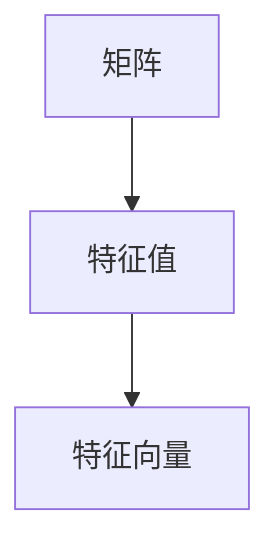
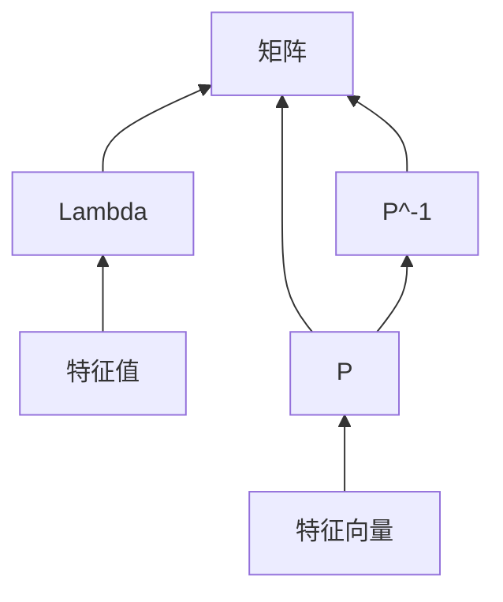

#线性代数 
# 全知求解
## 矩阵求特征
从矩阵求特征值和特征向量
设$Ax=\lambda x$
可得$|\lambda E-A|=0$
这是特征方程
求解特征方程可得特征值
再将特征值代入$Ax=\lambda x$可以解得特征向量

___
## 特征求矩阵
已知所有的特征值和特征向量
将特征值$\lambda$拼成特征值矩阵
$$
\Lambda=
\begin{pmatrix}
	\lambda_{1} \\
	 & \lambda_{2} \\
	 &  & \ddots \\
	 &  &  & \lambda_{n}
\end{pmatrix}
$$
再将对应的特征向量拼成相似化矩阵
$$
P=
\begin{pmatrix}
	\xi_{1} & \xi_{2} & \dots & \xi_{n}
\end{pmatrix}
$$
再求逆$P^{-1}$

可得原矩阵
$$
A=P\Lambda P^{-1}
$$

___
# 受限求解

## 求特征向量

### 非对称
已知一非对称矩阵A,全部特征值和部分特征向量,求剩下的特征向量