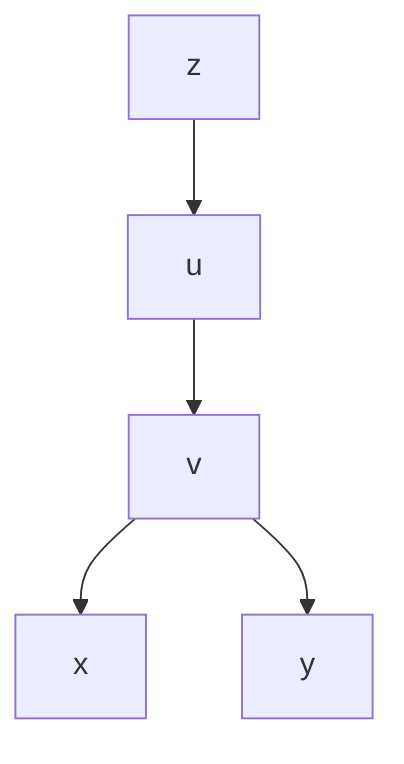
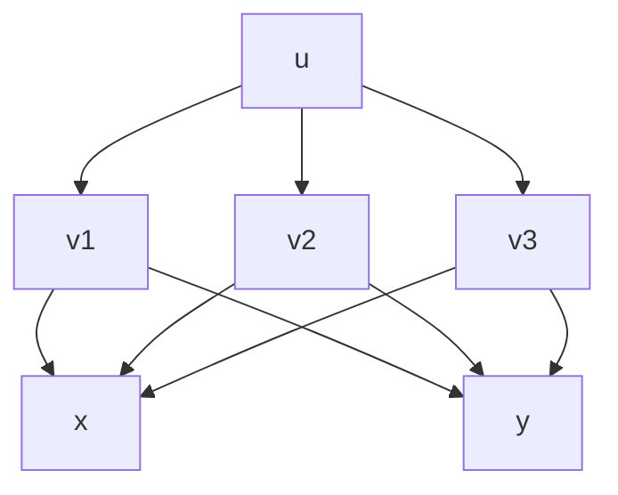

#多元函数微分学 

# 基本概念

## n维空间

我们将n元有序数组$(x_{1},x_{2},\dots,x_{n})$的全体所构成的集合记为$\mathbb{R}^n$,即
$$
\mathbb{R}^n=\{ (x_{1},x_{2}x\dots,x_{n})|x_{i}\in R,i=1,2,\dots,n \}
$$

$\mathbb{R}^n$中的每一个元素$(x_{1},x_{2},\dots,x_{n})$可以看成空间里的一个点,也可以看成起点为原点,终点为该点的向量
___
## 数量积/内积

既然可以看作向量,我们不妨再定义两个n元向量的数量积

已知$\boldsymbol{x}=(x_{1},x_{2},\dots,x_{n}),\boldsymbol{y}=(y_{1},y_{2},\dots,y_{n})\in \mathbb{R}^n$,定义两者的数量积记为
$$
(\boldsymbol{x},\boldsymbol{y})=\sum_{i=1}^n x_{i}y_{i}
$$
___
## 距离

$\mathbb{R}^n$中的两点$\boldsymbol{x}=(x_{1},x_{2},\dots,x_{n}),\boldsymbol{y}=(y_{1},y_{2},\dots,y_{n})$之间的距离记为$\rho(x,y)或||x-y||$
$$
\rho(x,y)=\sqrt{ \sum_{i=1}^n(x_{i}-y_{i}) }
$$
我们将x到零元的距离直接记为$||x||$
$$
||x||=\sqrt{ \sum_{i=1}^n x_{i}^2 }
$$
当$n=1,2,3$时,$||x||$直接记为$|x|$

当$\mathbb{R}^n$中的变元x趋近于定元a,即$||x-a||\to 0$,记作$x\to a$
___
## 邻域

$\mathbb{R}^n$中点$P_{0}$的$\delta$邻域为
$$
U(P_{0},\delta)=\{ x|x \in \mathbb{R}^n,\rho(x,P_{0})<\delta \}
$$
其中$\delta$称为邻域半径,若不强调邻域半径可直接记为$U(P_{0})$
去心邻域记为$\overset{\circ}{U}(P_{0})=\{ P|0<|PP_{0}|<\delta \}$

在平面中,邻域为圆邻域
$$
U(P_{0},\delta)=\left\{ (x,y)| \sqrt{ (x-x_{0})^2+(y-y_{0})^2 }<\delta \right\}
$$
在空间里,邻域为球邻域
$$
U(P_{0},\delta)=\left\{ (x,y,z)| \sqrt{ (x-x_{0})^2+(y-y_{0})^2+(z-z_{0})^2 }<\delta \right\}
$$

我们也常使用方邻域,圆邻域和方邻域可以进行夹逼
平面上的方邻域为
$$
U(P_{0},\delta)=\left\{ (x,y)|\ |x-x_{0}|<\delta,|y-y_{0}|<\delta  \right\}
$$
___
## 点的分类

### 按位置分类

$\forall P\in \mathbb{R}^n 或\forall E \subset \mathbb{R}^n$必为以下的三种位置之一

#### 内点

设有一点集E和一点P,若存在点P的某邻域$U(P)\subset E$,则称P为E的**内点**

#### 外点

若存在点P的某邻域$U(P)\cap E=\varnothing$,则称P为E的**外点**

#### 边界点

若对点P的任一邻域$U(P)$既含E中的内点也含E的外点,则称P为E的**边界点**,边界点不一定属于E

E的全体边界点形成的点集称为E的边界,记为$\partial E$

### 按性质分类

#### 聚点

若对于任意给定的$\delta$,点P的去心邻域$\overset{\circ}{U}(P,\delta)$内总有E中的点,则称P为E的**聚点**

聚点也不一定属于E(可以是边界点),所有聚点形成的点集称为E的导集

#### 孤立点

若点$X_{0}\in E$,但存在$\overset{\circ}{U}(X_{0}) \cap E=\varnothing$,则称$X_{0}$为E的**孤立点**

## 区域

若点集E的点都是内点,则称E为**开集**,若E包含它的边界,则称E为**闭集**

连通的开集称为**开区域**,简称区域,开区域连其边界称为**闭区域**

对于区域D,若存在正数K,使得一切点$P\in D$与某定点A的距离$|AP|\le K$,则称D为**有界域**,否则称为**无界域**

## 二元函数

### 定义

设D是平面上的一个点集,如果对于每一个点$P(x,y)\in D$,变量z按照一定的法则总有确定的值和它对应,则称z是变量x,y的**二元函数**,记为$z=f(x,y)或z=f(P)$

### 定义域

使得算式有意义的x,y的变化范围所确定的点集或者使得实际问题有意义的x,y的变化范围所确定的点集称为二次函数的**定义域**

二元函数的定义域一般是平面上的区域,二元函数的两要素是定义域和对应的法则

### 几何意义

二元函数的几何意义可以看作是空间直角坐标系里的一个曲面

### 等值线

曲面$z=f(x,y)$与平面z=c的交线在$xoy$平面上的投影称为二元函数$z=f(x,y)$的等值线

## 多元函数

设有n维空间内的点集D,如果对于每一个点$P(x_{1},x_{2},\dots,x_{n})\in D$,变量u按照一定法则总有确定的值和它对应,则称u为$x_{1},x_{2},\dots,x_{n}$的n元函数,记为
$$
u=f(x_{1},x_{2},\dots,x_{n})
$$

n元函数在几何上表示为n+1维上的曲面

多元函数的复合关系很复杂,需要借助链式图表示,比如

对于$z(x,y)$
由$z=f_{1}(u),u=f_{2}(v),z=f_{3}(v)$复合,故表示为

又比如,对于$u=f(x+y,xy,x^2+y^2)$
由$u=f(v_{1},v_{2},v_{3}),v_{1}=x+y,v_{2}=xy,v_{3}=x^2+y^2$复合而成,故表示成

# 多元函数的极限

## 二元函数的极限

### 定义

#### 描述性定义

设函数$z=f(x,y)$的定义域为D,$P_{0}(x_{0},y_{0})$是其聚点,如果点$P(x,y)$以***任何方式***趋近于点$P_{0}(x_{0},y_{0})$时,对应的函数值$f(x,y)$就无限接近于一个确定的常数A,则称A为$z=f(x,y)当x\to x_{0},y\to y_{0}$时的极限,记为
$$
\lim_{ x \to x_{0},y \to y_{0} } f(x,y)=A或\lim_{ (x,y) \to (x_{0},y_{0}) }f(x,y)=A 
$$

#### 精确定义

设函数$z=f(x,y)$的定义域为D,$P_{0}(x_{0},y_{0})$是其聚点,$A\in R$是常数,若$\forall \epsilon>0,\exists \delta>0$,对于适合$0<\rho=\sqrt{ (x-x_{0})^2+(y-y_{0})^2 }<\delta$的一切$(x,y)$都有$|f(x,y)-A|<\epsilon$成立,则称A为$z=f(x,y)当x\to x_{0},y\to y_{0}$时的极限

#### 点函数定义

$\forall \epsilon>0,\exists \delta>0$,当$0<|PP_{0}|<\delta$时,有$|f(P)-A|<\epsilon$

#### 注意

趋近极限的方式必须是任意的

二元函数的极限也称为二重极限
___
### 计算

在计算二元函数的极限时任可运用一元函数计算极限的一些法则和方法,但不可以随意使用洛必达法则计算未定式,必须将其化为确定型
___
#### 举例1

如$f(x,y)=(x^2+y^2)\sin{\frac{1}{x^2+y^2}}\quad (x^2+y^2\ne_{0})$
求证:$\lim_{ x \to 0,y \to 0 }f(x,y)=0$

$$
\begin{gather}
	\because|(x^2+y^2)\sin{\frac{1}{x^2+y^2}}-0| \\
	=|x^2+y^2|\cdot|\sin{\frac{1}{x^2+y^2}}| \\
	\le x^2+y^2 \\
	\forall \epsilon>0,要使|(x^2+y^2)\sin{\frac{1}{x^2+y^2}}-0|\epsilon \\
	则$x^2+y^2<\epsilon,即\sqrt{ x^2+y^2 }<\sqrt{ \epsilon } \\
	取\delta=\sqrt{ \epsilon } \\
	当0<\sqrt{ (x-0)^2+(y-0)^2 }<\delta时 \\
	|(x^2+y^2)\sin{\frac{1}{x^2+y^2}}-0|<\epsilon \\
	即证
\end{gather}
$$
___
#### 举例2:

如$f(x,y)=(x^2+y^2)e^{-(x+y)}$
计算$\lim_{ x \to +\infty,y \to +\infty }f(x,y)$

$$
\begin{gather}
	0 \le (x^2+y^2)e^{-(x+y)} \le (x+y)^2e^{-(x+y)} \\
	令t=x+y,可得 \\
	\lim_{ x \to +\infty,y \to +\infty }(x+y)^2e^{-(x+y)} =\lim_{ t \to +\infty }t^2e^{-t}  \\
	=\lim_{ t \to +\infty }\frac{t^2}{e^t}=\lim_{ t \to +\infty }\frac{2t}{e^t}=0 \\
	\therefore 原式=0
\end{gather}
$$
___
#### 举例3

$$
设f(x,y)=\begin{cases}
	x\sin\frac{1}{y}+y\sin\frac{1}{x},xy \ne 0 \\
	0,xy=0
\end{cases}
$$
求证:$\lim_{ x \to 0,y \to 0 }f(x,y)=0$

$$
\begin{gather}
	\because 0 <\left| x\sin\frac{1}{y}+y\sin\frac{1}{x} \right| \\
	\le\left| x\sin\frac{1}{y} \right|+\left| y\sin\frac{1}{x} \right| \\
	\le |x|+|y|\to 0 \\
	\therefore 原式=0
\end{gather} 
$$
___
#### 举例4

$$
设f(x,y)=\begin{cases}
	xy\frac{x^2-y^2}{x^2+y^2},(x,y)\ne(0,0) \\
	0,(x,y)=(0,0)
\end{cases}
$$
证明:$\lim_{ (x,y) \to (0,0) }f(x,y)=0$

$$
\begin{gather} 
 作极坐标变换x=r\cos \varphi,y=r\sin \varphi \\
 此时(x,y)\to(0,0)\iff r\to 0 \\
 |f(x,y)-0|=\left| xy\frac{x^2-y^2}{x^2+y^2} \right| \\
 =\frac{1}{4}r^2|\sin 4\varphi|\le \frac{1}{4}r^2 \\
 \therefore \forall \epsilon>0,令r=\sqrt{ x^2+y^2 }<\delta=2\sqrt{ \epsilon } \\
 对任何\varphi,有|f(x,y)-0|\le \frac{1}{4}r^2 <\epsilon \\
 即证
\end{gather}
$$
___
### 极限不存在

证明二元函数极限不存在的定理和推论如下,其类似于一元函数对应的海涅归结定理

#### 定理

$\lim_{ P \to P_{0},P \in D }f(P)=A$的充要条件是,对于D的任一子集E,只要$P_{0}$仍是E的聚点就有
$$
\lim_{ P \to P_{0},P \in D }f(P)=A 
$$
___
#### 推论1

若$\exists E_{1}\subset D,P_{0}是E_{1}$的聚点,则$\lim_{ P \to P_{0},P \in E_{1} }f(P)$不存在,则$\lim_{ P \to P_{0},P \in D }$也不存在
___
#### 推论2

若$\exists E_{1},E_{2}\subset D,P_{0}$是它们的聚点,使得
$$
\lim_{ P \to P_{0},P \in E_{1} }f(P)=A_{1} ,\lim_{ P \to P_{0},P\in E_{2} }f(P)=A_{2} 
$$
两个极限都存在,但$A_{1}\ne A_{2}$,则$\lim_{ P \to P_{0},P \in D }f(P)$不存在
___
#### 推论3

极限$\lim_{ P \to P_{0},P \in D }f(P)$存在的充要条件为:D中满足条件$P_{n}\ne P_{0}$且$\lim_{ n \to \infty }P_{n}=P_{0}$的点列$\{ P_{n} \}$,它所对应的函数列$\{ f(P_{n}) \}$都收敛
___
#### 综上所述

由以上结论,可得确定极限不存在的方法如下:

当$P(x,y)$以不同方法趋于$P_{0}(x_{0},y_{0})$时,函数趋于不同值或不存在时,就可断定此极限不存在

在(0,0)处时,一般选择下列趋近方式来判断:

- x=0;
- y=0;
- y=kx;
- $y=kx^2$;
- ......
___
#### 举例1

$$
设f(x,y)=\begin{cases}
	\frac{xy}{x^2+y^2},x^2+y^2 \ne 0 \\
	0,x^2+y^2=0
\end{cases}
$$
计算$\lim_{ x \to 0,y \to 0 }f(x,y)$

$$
\begin{gather}
	使用y=kx趋近 \\
	\lim_{ y=kx,x \to 0 }f(x,y)=\lim_{ x \to 0 }f(x,kx) \\
	=\lim_{ x \to 0 }\frac{kx^2}{x^2+k^2x^2} \\
	=\frac{k}{1+k^2} \\
	\therefore 其值随着k的不同而改变 \\
	\therefore 所求极限不存在   
\end{gather}
$$
___
#### 举例2

$$
设f(x)=\begin{cases}
	1,0<y<x^2 \\
	0,其余区域
\end{cases}
$$
计算$\lim_{ x \to 0,y \to 0 }f(x,y)$

$$
\begin{gather}
	若使用y=kx趋近 \\
	\forall k,则\lim_{ x \to 0,y \to 0 }f(x,y)=0 \\
	若使用y=mx^2趋近,0<k<1 \\
	则$\lim_{ x \to 0,y \to 0 }f(x,y)=1  \\
	\therefore 原极限不存在
\end{gather}
$$
___
#### 举例3

设$f(x,y)=\frac{xy}{x+y}$
讨论$\lim_{ x \to 0,y \to 0 }f(x,y)$不存在

$$
\begin{gather}
	若使用y=kx趋近 \\
	则\lim_{ y=kx,x \to 0 }f(x,y)=\lim_{ x \to 0 }\frac{kx^2}{(k+1)x} \\
	=\lim_{ x \to 0 }\frac{kx}{k+1}=0 \\
	若使用y=x^2-x趋近 \\
	则\lim_{ y=x^2,x \to 0 }f(x,y)=\lim_{ x \to 0 }\frac{x^3-x^2}{x^2} \\
	=\lim_{ x \to 0 }x-1=-1 \\
	\therefore 原极限不存在     
\end{gather}
$$
___
#### 举例4

设$f(x,y)=\frac{1-\cos(x^2+y^2)}{(x^2+y^2)x^2y^2}$
计算$\lim_{ x \to 0,y \to 0}f(x,y)$

$$
\begin{gather}
	x^2y^2 \le \frac{1}{4}(x^2+y^2)^2 \\
	令x^2+y^2=r^2,则 \\
	\left| \frac{1-\cos(x^2+y^2)}{(x^2+y^2)x^2y^2} \right| \ge \frac{4(1-\cos r^2)}{r^6} \\
	又\lim_{ r \to 0 }\frac{4(1-\cos r^2)}{r^6}=\lim_{ r \to 0 }\frac{2r^4}{r^6}=\infty \\
	故原极限为\infty  
\end{gather}
$$
___
## 累次极限

对于上面讨论的二元函数极限$\lim_{ x \to x_{0},y \to y_{0} }f(x,y)$,其中的自变量x和y是以任意方式趋于$(x_{0},y_{0})$,这种极限称为**重极限**

如果是x和y按一定的先后顺序,先后趋于$x_{0}和y_{0}$时f的极限,这种极限称为**累次极限**
___
### 定义

设$f(x,y),(x,y)\in D$,D在x轴,y轴上的投影分别为X,Y即
$$
X=\{ x|(x,y) \in D \},Y=\{ y|(x,y) \in D \}
$$
$x_{0},y_{0}$分别是X,Y的聚点,若对每一个$y \in Y(y \ne y_{0})$,存在极限$\lim_{ x \to x_{0} }f(x,y)$,这是一个和y有关的函数,记作
$$
\varphi(y)=\lim_{ x \to x_{0} }f(x,y) 
$$
若进一步存在极限
$$
L=\lim_{ y \to y_{0} }\varphi(y) 
$$
则称L为$f(x,y)$先对$x(\to x_{0})$后对$y(\to y_{0})$的累次极限,记为
$$
L=\lim_{ y \to y_{0} } \lim_{ x \to x_{0} } f(x,y)
$$

累次极限和重极限之间没有包含关系,是不同的概念
___
### 计算

#### 举例1

设$f(x,y)=\frac{xy}{x^2+y^2}$

$$
\begin{gather}
	当y\ne 0时,有 \\
	\lim_{ x \to 0 } \frac{xy}{x^2+y^2}=0 \\
	此时第二次极限显然 \\
	\lim_{ y \to 0 }0=0 \\
	故\lim_{ y \to 0 }\lim_{ x \to 0 }\frac{xy}{x^2+y^2}=0 \\
	同理\lim_{ x \to 0 }\lim_{ y \to 0 }\frac{xy}{x^2+y^2}=0   
\end{gather}
$$

此时f的两个累次极限都存在,但之前我们知道它的重积分不存在
___
#### 举例2

设$f(x,y)=\frac{x^2+y^2+x-y}{x+y}$

$$
\begin{gather}
	\lim_{ y \to 0 }\lim_{ x \to 0 }f(x,y)=\lim_{ y \to 0 }\frac{y^2-y}{y} \\
	=\lim_{ y \to 0 }y-1=-1 \\
	\lim_{ x \to 0 }\lim_{ y \to 0 }f(x)=\lim_{ x \to 0 }\frac{x^2+x}{x} \\
	=\lim_{ x \to 0 } x+1=1 \\
	但对于其重极限,使用y=kx趋近 \\
	\lim_{ x \to 0,y=kx }f(x,y)=\lim_{ x \to 0 }\frac{(k^2+1)x^2+(1-k)x}{(k+1)x} \\
	  =\lim_{ x \to 0 }\frac{1-k}{1+k}+\frac{1+k^2}{1+k}x=\frac{1-k}{1+k} \\
	  故其重极限不存在        
\end{gather}
$$
___
#### 举例3

设$f(x,y)=x\sin\frac{1}{y}+y\sin\frac{1}{x}$

$$
\begin{gather}
对于其累次极限,如 \\
\lim_{ x \to 0 }f(x,y)=\lim_{ x \to 0 }y\sin\frac{1}{x} \\
由于\lim_{ x \to 0 }\sin\frac{1}{x}不存在 \\
所以其累次积分不存在 \\
但在之前的重极限示例里 \\
这个函数的重极限存在    	
\end{gather}
$$
___
### 重积分和累次积分的关系

#### 定理

若$f(x,y)$的重极限$\lim_{ x \to x_{0},y \to y_{0} }f(x,y)$与累次极限$\lim_{ x \to x_{0} }\lim_{ y \to y_{0} }f(x,y)$都存在,则重极限和累次极限必定相等

$$
\begin{gather}
	设\lim_{ x \to x_{0},y \to y_{0} } f(x,y)=A \\
	\forall \epsilon>0,\exists \delta >0,使得 \\
	P(x,y) \in \overset{\circ}{U}(P_{0},\delta),有 \\
	|f(x,y)-A|<\epsilon \\
	又\because 累次极限存在且相等 \\
	\forall x:0<|x-x_{0}|<\delta \\
	\lim_{ y \to y_{0} }f(x,y)=\varphi(x)  \\
	将重极限的不等式里的y\to y_{0} \\
	|\varphi(x)-A|\le \epsilon \\
	\therefore \lim_{ x \to x_{0} }\varphi(x)=A \\
	即\lim_{ x \to x_{0} }\lim_{ y \to y_{0} } f(x,y)=A   
\end{gather}
$$
但就此不能知道另外一个累次极限的存在性,若存在则两个累次极限必须相等,否则不成立
___
#### 推论1

若重极限$\lim_{ x \to x_{0},y \to y_{0} }f(x,y)$和两个累次积分$\lim_{ x \to x_{0} }\lim_{ y \to y_{0} }f(x,y)和\lim_{ y \to y_{0} }\lim_{ x \to x_{0} }f(x,y)$都存在,则三者相等
___
#### 推论2

若两个累次极限不相等,则重极限不存在
___
## 多元函数的极限

设n元函数$f(P)$的定义域为$D,P_{0}$是其聚点,A是常数,若$\forall \epsilon>0,\exists \delta>0$使得对于符合不等式$0<|PP_{0}|<\delta$的一切点$P \in D$,都有$|f(P)-A|<\epsilon$成立,则称A为n元函数$f(P)$当$P \to P_{0}$时的极限,记为
$$
\lim_{ P \to P_{0} }f(P)=A 
$$
___
# 多元函数的连续性

## 定义

设n元函数$f(P)$的定义域为$D,P_{0}$是其聚点,如果
$$
\lim_{ P \to P_{0} }f(P)=f(P_{0}) 
$$
则称n元函数$f(P)$在$P_{0}$处**连续**
___
## 间断点

若$f(P)$在$P_{0}$处不连续,则称$P_{0}$为$f(P)$的间断点

间断点包括:
- 函数无定义的点
- 极限不存在的点
- 极限与函数值不同的点
___
## 闭区域上连续函数的性质

### 最值定理

在有界闭区域D上的多元连续函数,在D上至少取得它的最大值和最小值各一次
___
### 介值定理

在有界闭区域D上的多元连续函数,如果在D上取得两个不同的函数值,则它在D上取得介于两值之间的任何值至少一次
___
### 组合

多元连续函数之间的和差积商及其复合函数仍为连续函数
___
### 初等

由多元多项式及基本初等函数经过有限次的四则运算和复合步骤构成的可用一个式子所表示的多元函数称为**多元初等函数**,一切多元初等函数在其定义域内是连续的
___
### 极限

一般地,求$\lim_{ P \to P_{0} }f(P)$如果$f(P)$在点$P_{0}$处连续,于是$\lim_{ P \to P_{0} }f(P)=f(P_{0})$

