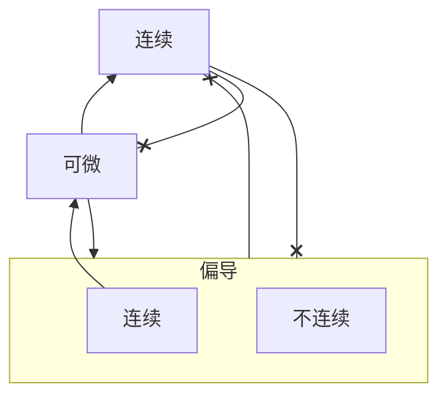

#多元函数微分学 
[[2-偏导数]]

# 全增量

仿照一元函数的增量,我们可以定义多元函数的"增量"

以二元函数为例

若函数$z=f(x,y)$在点$P(x,y)$的某邻域内有定义,$P'(x+\Delta x,y+\Delta y)$为邻域内的某一点,则称这两点的函数值之差$f(x+\Delta x,y+\Delta y)-f(x,y)$为函数在点P对于自变量增量$\Delta x,\Delta y$的**全增量**,记为$\Delta z$,即
$$
\Delta z=f(x+\Delta x,y +\Delta y)-f(x,y)
$$
___
# 全微分

在一元函数中由增量到微分为
$\Delta y=A \Delta x+o(x)\implies dy=f'(x)dx$

故若在函数$z=f(x,y)$在定义域D的内点$(x,y)$处的全增量可表示为$\Delta z=A \Delta x+B \Delta y+o(\rho),\rho=\sqrt{ (\Delta x)^2+(\Delta y)^2 }$,其中A,B不随$\Delta x,\Delta y$的改变而变化,只和$x,y$有关,则称函数$f(x,y)$在点$(x,y)$**可微**,$A \Delta x+B \Delta y$称为函数$z=f(x,y)$在点$(x,y)$处的**全微分**,记作
$$
dz=df=A \Delta x+B \Delta y
$$
___
## 可微

验证函数可微,则需要满足
- $dz$是$\Delta x,\Delta y$的线性函数
- $\frac{\Delta z-A\Delta x-B\Delta y}{\rho}\to 0,\rho\to 0$
___
### 连续与可微

#### 可微即连续

我们有定理如下:
如果函数$z=f(x,y)$在点$(x,y)$处是可微分的,则函数在该点连续
___
$$
\begin{gather}
	可微处,有 \\
	\Delta z=A\Delta x+B\Delta y+o(\rho) \\
	\lim_{ \rho \to 0 }\Delta z=0 \\
	故而有 \\
	\lim_{ \Delta x \to 0,\Delta y \to 0 }f(x+\Delta x,y+\Delta y) \\
	=\lim_{ \rho \to 0 }[f(x,y)+\Delta z] \\
	=f(x,y) \\
	故函数z在点(x,y)处连续   
\end{gather}
$$
___
#### 可微有偏导

我们有定理(可微的必要条件)如下:
若$z=f(x,y)$在$(x,y)$可微,则$\frac{\partial z}{\partial x}, \frac{\partial z}{\partial y}$,且按理,有
$$
dz=\frac{\partial z}{\partial x}dx+\frac{\partial z}{\partial y}dy
$$
___
$$
\begin{gather}
	\Delta z=A \Delta x+B \Delta y \\
	可微则对任意\Delta x,\Delta y都成立 \\
	当\Delta x=0,有 \\
	f(x,y+\Delta y)-f(x,y)=B\cdot \Delta y+o(|\Delta y|) \\
	对此,我们就可以有 \\
	\lim_{ \Delta y \to 0 }\frac{f(x,y+\Delta y)-f(x,y)}{\Delta y}=\lim_{ \Delta y \to 0 }\left[ B+\frac{o(|\Delta y|)}{\Delta y} \right]=B \\
	我们就可得 \frac{\partial z}{\partial y}=B \\
	同理 \frac{\partial z}{\partial x}=A  
\end{gather}
$$
___
#### 有偏导未必可微

多元函数的各偏导数存在不能推出全微分存在,我们讨论以下情形
$$
f(x,y)=
\begin{cases}
\frac{xy}{\sqrt{ x^2+y^2 }},\quad x^2+y^2\ne 0 \\
0, \qquad x^2+y^2=0	
\end{cases}
$$
___
讨论其在$(0,0)$的性质

首先我们求它的各偏导
$$
\begin{gather}
	f_{x}(0,0)=\lim_{ x \to 0 } \frac{f(x,0)-f(0,0)}{x} =0 \\
	f_{y}(0,0)=\lim_{ y \to 0 } \frac{f(0,y)-f(0,0)}{y}=0
\end{gather}
$$
其各偏导存在

此时我们再研究全微分
对于判定条件
$$
\begin{gather}
	\frac{\Delta z-A \Delta x-B \Delta y}{\rho} \\
	=\frac{\frac{\Delta x\cdot \Delta y}{\sqrt{ (\Delta x)^2+(\Delta y)^2 }}}{\sqrt{ (\Delta x)^2+(\Delta y)^2 }} \\
	=\frac{\Delta x\cdot \Delta y}{(\Delta x)^2+(\Delta y)^2} \\
	若\Delta y=\Delta x \to 0 \\
	=\frac{\Delta x\cdot \Delta x}{2(\Delta x)^2}
\end{gather}
$$
故$f(x,y)$在$(0,0)$处不可微
___
在这个例子里可见,在有偏导的情况下是不一定可微的
___
#### 偏导连续才可微

我们有定理如下
如果函数$z=f(x,y)$的偏导数$\frac{\partial z}{\partial x},\quad \frac{\partial z}{\partial y}$在点$(x,y)$连续,则该函数在点$(x,y)$可微分
___
$$
\begin{gather}
	\Delta z=f(x+\Delta x,y+\Delta y)-f(x,y) \\
	=[f(x+\Delta x,y+\Delta y)-f(x,y+\Delta y)]+[f(x,y+\Delta y)-f(x,y)] \\
	由中值定理,可得 \\
	=f_{x}(x+\theta_{1} \Delta x,y+\Delta y)\Delta x+f_{y}(x,y+\theta_{2}\Delta y)\Delta y \\
	(0<\theta_{1},\theta_{2}<1) \\
	由偏导数连续可得 \\
	当\Delta x \to 0,\Delta y\to 0 \\
	=[f_{x}(x,y)+\epsilon_{1}]\Delta x+[f_{y}(x,y)+\epsilon_{2}]\Delta y \\
	=f_{x}(x,y)\Delta x+f_{y}(x,y)\Delta y+\epsilon_{1}\Delta x+\epsilon_{2}\Delta y \\
	\left| \frac{\epsilon_{1}\Delta x+\epsilon_{2}\Delta y}{\rho} \right|\le |\epsilon_{1}|+|\epsilon_{2}| \\
	当\rho\to 0,|\epsilon_{1}|+|\epsilon_{2}|\to 0 \\
	即\epsilon_{1}\Delta x+\epsilon_{2}\Delta y=o(\rho) \\
	故函数z=f(x,y)在点(x,y)处可微
\end{gather}
$$
___
#### 总结

____
我们对于全微分,直接记为
$$
dz=\frac{\partial z}{\partial x}dx+\frac{\partial z}{\partial y}dy
$$
___
## 计算举例

### 举例1

$$
z=e^{xy}
$$
___
$$
\begin{gather}
	\frac{\partial z}{\partial x}=ye^{xy} \\
	\frac{\partial z}{\partial y}=xe^{xy} \\
	dz=ye^{xy}dx+xe^{xy}dy
\end{gather}
$$
___
### 举例2

$$
u=x^2y+xy^2
$$
___
$$
\begin{gather}
	\frac{\partial u}{\partial x}=2xy+y^2 \\
	\frac{\partial z}{\partial y}=x^2+2xy \\
	du=(2xy+y^2)dx+(x^2+2xy)dy
\end{gather}
$$
___
### 举例3
$$
u=x+\sin \frac{y}{2}+e^{yz}
$$
___
$$
\begin{gather}
	\frac{\partial u}{\partial x}=1 \\
	\frac{\partial u}{\partial y}=\frac{1}{2}\cos \frac{y}{2}+ze^{yz} \\
	\frac{\partial u}{\partial z}=ye^{yz} \\
	du=dx+\left( \frac{1}{2} cos\frac{y}{2}+ze^{yz} \right)dy+ye^{yz}dz
\end{gather}
$$
___

