#多元函数微分学 
[[4-方向导数和梯度]]

# 多元复合函数的微分

对于多元函数的复合函数,外层函数的是多元函数,内层函数也是多元函数

对于多元函数,我们知道它的导数已经变化为多个偏导数

而一元函数根据链式法则可以展开出复合函数的导数

多元函数的链式法则是怎么样的呢
___
## 链式法则的推广

显然,各个偏导数是用了一元函数的导数的概念推广而来,故单独的偏导数是符合链式法则的

例如$z=f(u,v),u=u(x,y),v=v(x,y)$
$$
\frac{\partial z}{\partial x}?=\frac{\partial z}{\partial u}\cdot \frac{\partial u}{\partial x}
$$
然而这就足够了吗
显然,$v$也有对$x$的偏导数,故而应该还有一部分
$$
\frac{\partial z}{\partial x}=\frac{\partial z}{\partial u}\cdot \frac{\partial u}{\partial x}+\frac{\partial z}{\partial v}\cdot \frac{\partial v}{\partial x}
$$

故而我们可以发现,要经过外层函数去对内层变量求偏导,需要遍历所有含这个变量的偏导数

即链式法则推广为"网状法则"或"树状法则"
___
## 多元复合微分定理

我们有定理
若$u=u(x,y),v=v(x,y)$在点$(x,y)$可偏导,$z=f(u,v)$在相应点$(u,v)$有连续偏导数,则$z=f(u(x,y),v(x,y))$在$(x,y)$可偏导,有
$$
\begin{gather}
\frac{\partial z}{\partial x}=\frac{\partial z}{\partial u}\cdot \frac{\partial u}{\partial x}+\frac{\partial z}{\partial v}\cdot \frac{\partial v}{\partial x} \\
\frac{\partial z}{\partial y}=\frac{\partial z}{\partial u}\cdot \frac{\partial u}{\partial y}+\frac{\partial z}{\partial v}\cdot \frac{\partial v}{\partial y}	
\end{gather}
$$
我们写成向量形式有
$$
\begin{gather}
	\frac{\partial z}{\partial x}=\begin{pmatrix}
		f_{u} & f_{v}
	\end{pmatrix}\cdot \begin{pmatrix}
		u_{x} \\
		v_{x}
	\end{pmatrix} \\
	\frac{\partial z}{\partial x}=\begin{pmatrix}
		f_{u} & f_{v}
	\end{pmatrix}\cdot \begin{pmatrix}
		u_{y} \\
		v_{y}
	\end{pmatrix}
\end{gather}
$$
___
- 如果$z=f(u,v)$仅有偏导而不连续,则定理失效
- 如果$z=f(u,v)$有连续偏导数,则$u,v$的条件可以减弱为可微
- 对自变量求偏导数时,需要经过所有可能的中间变量,再回归到最终的变量
___
## 图表示

对于"网状法则"或"树状法则"可以用图来表示出求导过程

网状图如下
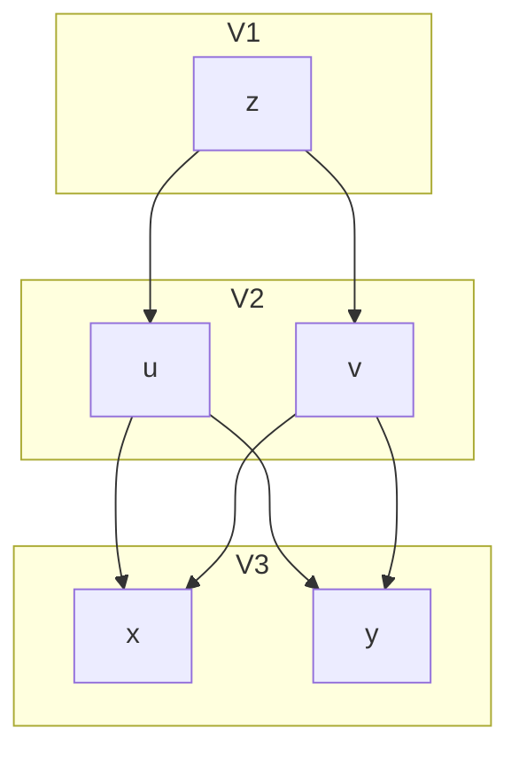
```mermaid
graph
subgraph V1
A[z]
end
subgraph V2
B[u]
C[v]
end
subgraph V3
D[x]
E[y]
end
A-->B & C
B & C-->D & E
```

树状图如下
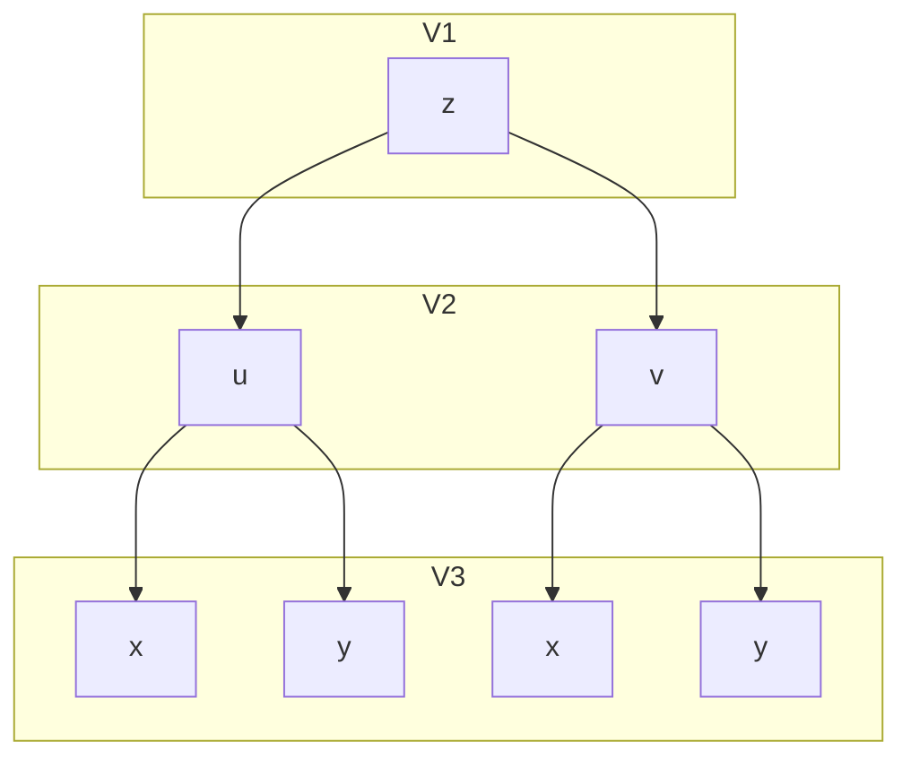
```mermaid
graph
subgraph V1
A[z]
end
subgraph V2
B[u]
C[v]
end
subgraph V3
D[x]
E[y]
F[x]
G[y]
end
A-->B & C
B-->D & E
C-->F & G
```
___
## 求导示例

### 举例1

$$
\begin{gather}
z=f(u,v,w) \\
u=\varphi(x,y),v=\psi(x,y),w=\omega(x,y)
\end{gather}
$$
___
树状图如下
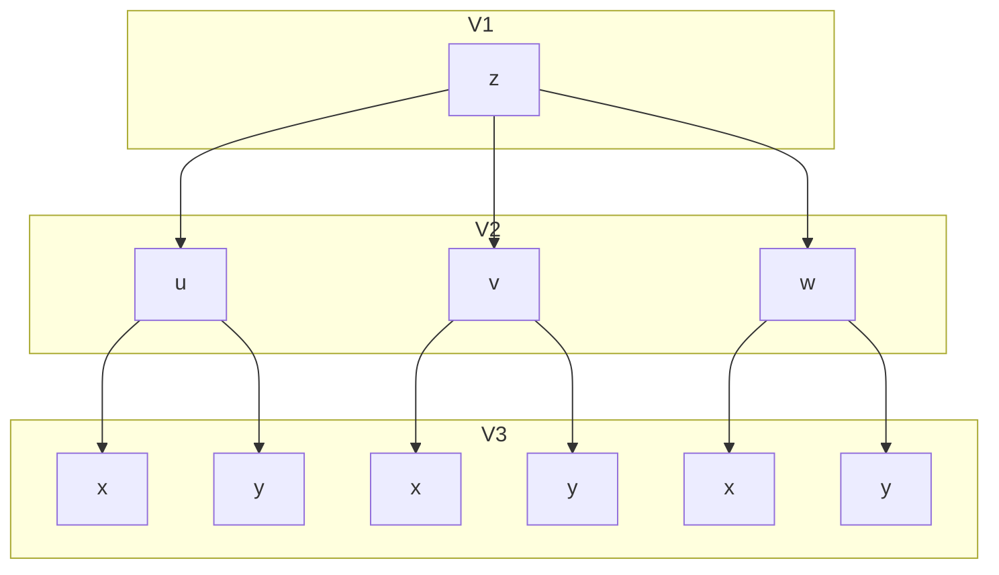
```mermaid
graph
subgraph V1
A[z]
end
subgraph V2
B1[u]
B2[v]
B3[w]
end
subgraph V3
C1[x]
C2[y]
D1[x]
D2[y]
E1[x]
E2[y]
end
A-->B1 & B2 & B3
B1-->C1 & C2
B2-->D1 & D2
B3-->E1 & E2
```
___
计算如下
$$
\begin{gather}
	\frac{\partial z}{\partial x}=\frac{\partial f}{\partial u}\cdot \frac{\partial u}{\partial x}+\frac{\partial f}{\partial v}\cdot \frac{\partial v}{\partial x}+\frac{\partial f}{\partial w}\cdot \frac{\partial w}{\partial x}  \\
	\frac{\partial z}{\partial y}=\frac{\partial f}{\partial u}\cdot \frac{\partial u}{\partial y}+\frac{\partial f}{\partial v}\cdot \frac{\partial v}{\partial y}+\frac{\partial f}{\partial w}\cdot \frac{\partial w}{\partial y}
\end{gather}
$$
向量形式为
$$
\begin{gather}
	\frac{\partial z}{\partial x}=\begin{pmatrix}
		\frac{\partial z}{\partial u} & \frac{\partial z}{\partial v} & \frac{\partial z}{\partial w}
	\end{pmatrix}
	\cdot
	\begin{pmatrix}
		\frac{\partial u}{\partial x} \\
		\frac{\partial v}{\partial x} \\
		\frac{\partial w}{\partial x}
	\end{pmatrix} \\
	\frac{\partial z}{\partial y}=\begin{pmatrix}
		\frac{\partial z}{\partial u} & \frac{\partial z}{\partial v} & \frac{\partial z}{\partial w}
	\end{pmatrix}
	\cdot
	\begin{pmatrix}
		\frac{\partial u}{\partial y} \\
		\frac{\partial v}{\partial y} \\
		\frac{\partial w}{\partial y}
	\end{pmatrix}
\end{gather}
$$
___
### 举例2

$$
\begin{gather}
	z=f(u,x,y) \\
	u=\varphi(x,y)
\end{gather}
$$
___
树状图如下
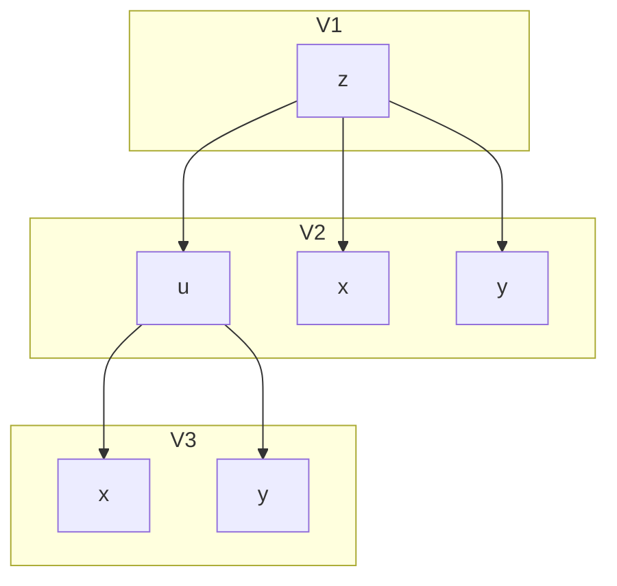
```mermaid
graph
subgraph V1
A[z]
end
subgraph V2
B1[u]
B2[x]
B3[y]
end
subgraph V3
C1[x]
C2[y]
end
A-->B1 & B2 & B3
B1-->C1 & C2
```
___
计算如下
$$
\begin{gather}
	\frac{\partial z}{\partial x}=\frac{\partial f}{\partial u}\cdot \frac{\partial u}{\partial x}+\frac{\partial f}{\partial x} \\
	\frac{\partial z}{\partial y}=\frac{\partial f}{\partial u}\cdot \frac{\partial u}{\partial y}+\frac{\partial f}{\partial y}
\end{gather}
$$
需要注意的是,我们在式子中可以看到两个项,一个是$\frac{\partial z}{\partial x}$,另一个是$\frac{\partial f}{\partial x}$,这两个在之前我们不复合的单层函数里认为是同一个量的不同记法,在这里怎么出现了分歧呢

实际上这是两个不同的结果,由于不同层出现了相同的变量导致的,其中$\frac{\partial z}{\partial x}$是根据第三层函数展开的$z(x,y)$的偏导数,而$\frac{\partial f}{\partial x}$是单单从第二层函数展开的$z=(u,x,y)$的偏导数

另外向量形式如下
$$
\begin{gather}
	\frac{\partial z}{\partial x}=\begin{pmatrix}
		\frac{\partial f}{\partial u} & \frac{\partial f}{\partial x} & \frac{\partial f}{\partial y}
	\end{pmatrix} 
	\cdot
	\begin{pmatrix}
		\frac{\partial u}{\partial x} \\
		1 \\
		0
	\end{pmatrix} \\
	\frac{\partial z}{\partial y}=\begin{pmatrix}
		\frac{\partial f}{\partial u} & \frac{\partial f}{\partial x} & \frac{\partial f}{\partial y}
	\end{pmatrix}
	\cdot
	\begin{pmatrix}
		\frac{\partial u}{\partial y} \\
		0 \\
		1
	\end{pmatrix}
\end{gather}
$$
___
### 举例3

$$
\begin{gather}
	z=f(u) \\
	u=\varphi(x,y)
\end{gather}
$$
___
树状图如下
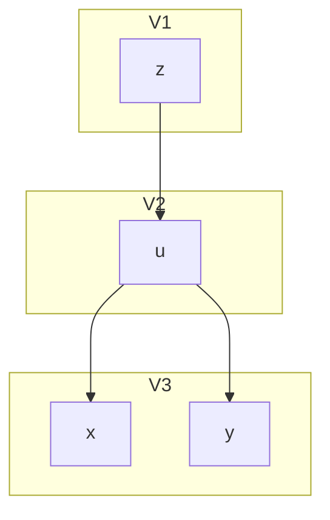
```mermaid
graph
subgraph V1
A[z]
end
subgraph V2
B[u]
end
subgraph V3
C1[x]
C2[y]
end
A-->B-->C1 & C2
```
___
计算如下
$$
\begin{gather}
	\frac{\partial z}{\partial x}=\frac{df}{du}\cdot \frac{\partial u}{\partial x} \\
	\frac{\partial z}{\partial y}=\frac{dz}{du}\cdot \frac{\partial u}{\partial y}
\end{gather}
$$
此处可见导数符号再次出现,当其中一层函数是一元函数时,可以用回导数符号
___
### 举例4

$$
\begin{gather}
	z=f(u,v) \\
	u=\varphi(x),v=\psi(y)
\end{gather}
$$
___
树状图如下
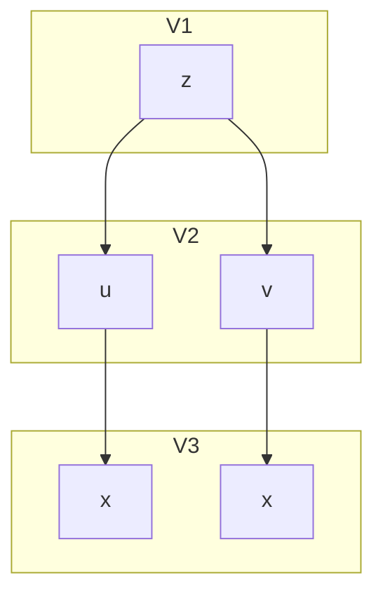
```mermaid
graph
subgraph V1
A[z]
end
subgraph V2
B1[u]
B2[v]
end
subgraph V3
C1[x]
C2[x]
end
A-->B1 & B2
B1-->C1
B2-->C2
```
___
计算如下
$$
\frac{dz}{dx}=\frac{\partial f}{\partial u}\cdot \frac{du}{dx}+\frac{\partial f}{\partial v}\cdot \frac{dv}{dx}
$$
___
### 举例5

$$
\begin{gather}
	z=f(u,v,w) \\
	u=\varphi(t),v=\psi(t),w=\omega(t)
\end{gather}
$$
___
树状图如下
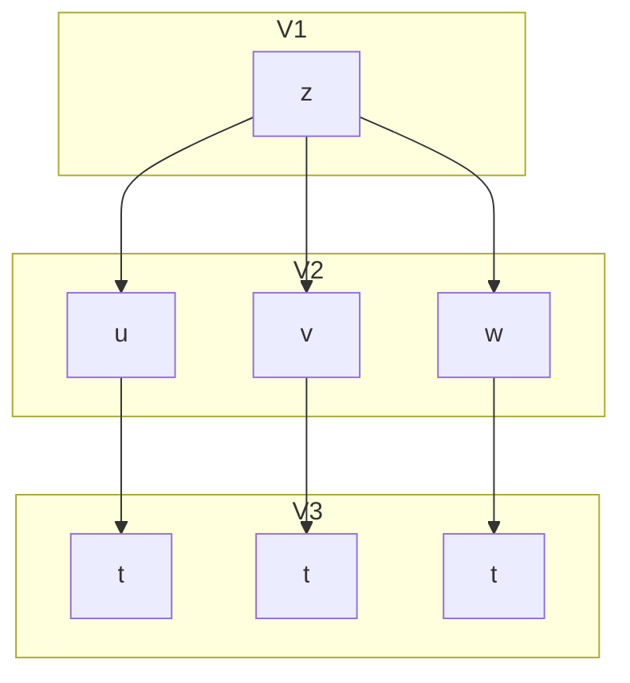
```mermaid
graph
subgraph V1
A[z]
end
subgraph V2
B1[u]
B2[v]
B3[w]
end
subgraph V3
C1[t]
C2[t]
C3[t]
end
A-->B1 & B2 & B3
B1-->C1
B2-->C2
B3-->C3
```
___
计算如下
$$
\frac{dz}{dt}=\frac{\partial f}{\partial u}\cdot \frac{du}{dt}+\frac{\partial f}{\partial v}\cdot \frac{dv}{dt}+\frac{\partial f}{\partial w}\cdot \frac{dw}{dt}
$$
___
### 举例6

$$
\begin{gather}
	z=f(u,x) \\
	u=\varphi(x)
\end{gather}
$$
___
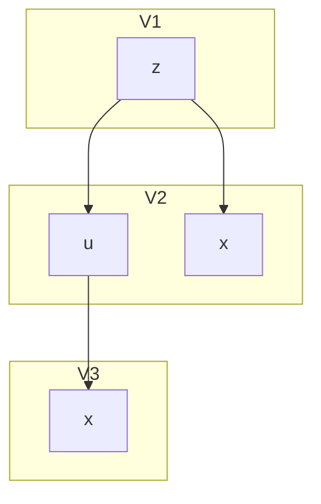
```mermaid
graph
subgraph V1
A[z]
end
subgraph V2
B1[u]
B2[x]
end
subgraph V3
C[x]
end
A-->B1 & B2
B1-->C
```
___
计算如下
$$
\begin{gather}
	\frac{dz}{dx}=\frac{\partial f}{\partial u}\cdot \frac{du}{dx}+\frac{\partial f}{\partial x}
\end{gather}
$$
___
### 举例7

$$
\begin{gather}
	z=f(u,v,t) \\
	u=\varphi(t) ,v=\psi(t)
\end{gather}
$$
___
树状图如下
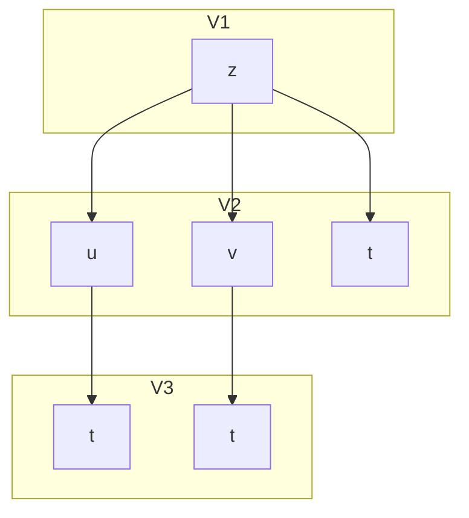
```mermaid
graph
subgraph V1
A[z]
end
subgraph V2
B1[u]
B2[v]
B3[t]
end
subgraph V3
C1[t]
C2[t]
end
A-->B1 & B2 & B3
B1-->C1
B2-->C2
```
___
计算如下
$$
\frac{dz}{dt}=\frac{\partial f}{\partial u}\cdot \frac{du}{dt}+\frac{\partial f}{\partial v}\cdot \frac{dv}{dt}+\frac{\partial f}{\partial t}
$$
___
## 计算举例

### 举例1

$$
\begin{gather}
	u=F(x,y,z) \\
	z=f(x,y) \\
	y=\varphi(x) \\ \\
	求 \frac{du}{dx}
\end{gather}
$$
___
先给出树状图如下
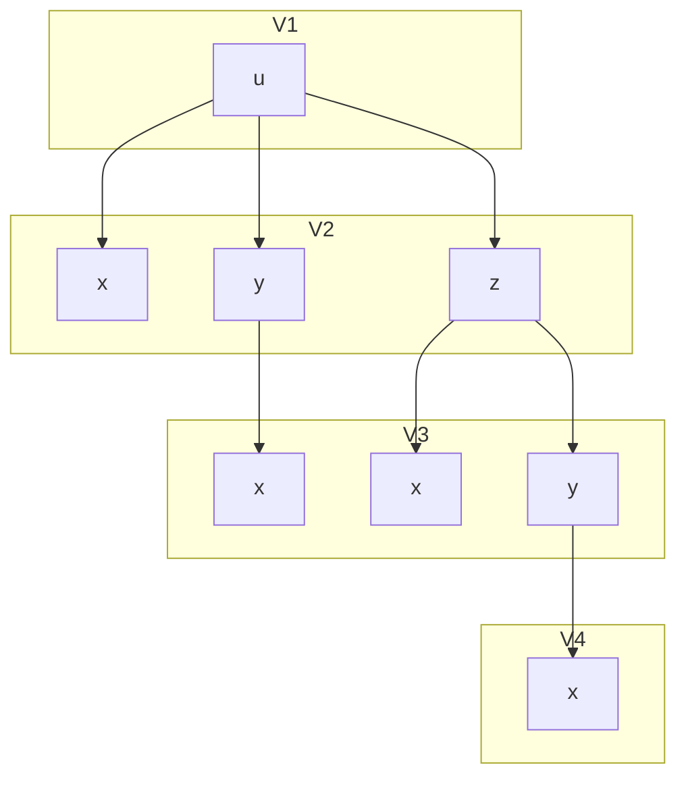
```mermaid
graph
subgraph V1
A[u]
end
subgraph V2
B1[x]
B2[y]
B3[z]
end
subgraph V3
C1[x]
C2[x]
C3[y]
end
subgraph V4
D[x]
end
A-->B1 & B2 & B3
B2-->C1
B3-->C2 & C3
C3-->D
```
故可得
$$
\frac{du}{dx}=\frac{\partial F}{\partial x}+\frac{\partial F}{\partial y}\cdot \frac{dy}{dx}+\frac{\partial F}{\partial z}\left( \frac{\partial z}{\partial x}+\frac{\partial z}{\partial y}\cdot \frac{dy}{dx} \right)
$$
为了简化式子,我们可以记
$$
F_{1}'=\frac{\partial F}{\partial x},F_{2}'=\frac{\partial F}{\partial y},F_{3}'=\frac{\partial F}{\partial z}
$$
故可写为
$$
\frac{du}{dx}=F_{1}'+F_{2}'\varphi'+F_{3}'f_{1}'+F_{3}'f_{2}'\varphi'
$$
___
### 举例2

$$
\begin{gather}
	z=u^v \\
	u=x^2+y^2,v=xy \\
	求 \frac{\partial z}{\partial x}, \frac{\partial z}{\partial y}
\end{gather}
$$
___
树状图如下

```mermaid
graph
subgraph V1
A[z]
end
subgraph V2
B1[u]
B2[v]
end
subgraph V3
C1[x]
C2[y]
C3[x]
C4[y]
end
A-->B1 & B2
B1-->C1 & C2
B2-->C3 & C4
```
我们先求导出各项
$$
\begin{gather}
	f_{1}'=\frac{\partial z(u,v)}{\partial u}=vu^{v-1} \\
	f_{2}'=\frac{\partial z(u,v)}{\partial v}=u^v\ln v \\
	g_{1}'=\frac{\partial u(x,y)}{\partial x}=2x \\
	g_{2}'=\frac{\partial u(x,y)}{\partial y}=2y \\
	h_{1}'=\frac{\partial v(x,y)}{\partial x}=y \\
	h_{2}'=\frac{\partial v(x,y)}{\partial y}=x
\end{gather}
$$
我们再求出算式有
$$
\begin{gather}
	\frac{\partial z}{\partial x}=\frac{\partial z}{\partial u}\cdot \frac{\partial u}{\partial x}+\frac{\partial z}{\partial v}\cdot \frac{\partial v}{\partial x} \\
	=f_{1}'g_{1}'+f_{2}'h_{1}' \\ \\
	
	\frac{\partial z}{\partial y}=\frac{\partial z}{\partial u}\cdot \frac{\partial u}{\partial y}+\frac{\partial z}{\partial v}\cdot \frac{\partial v}{\partial y} \\
	=f_{1}'g_{2}'+f_{2}'h_{2}'
\end{gather}
$$
故可得
$$
\begin{gather}
	\frac{\partial z}{\partial x}=vu^{v-1}\cdot 2x+u^v\ln v\cdot y \\
	=(x^2+y^2)^{xy-1}[2x^2y+y(x^2+y^2)\ln(x^2+y^2)] \\
	 \\
	\frac{\partial z}{\partial y}=vu^{v-1}\cdot 2y+u^v\ln u\cdot x \\
	=(x^2+y^2)^{xy-1}[2xy^2+x(x^2+y^2)\ln(x^2+y^2)]
\end{gather}
$$
___
### 举例3

$$
\begin{gather}
	u=f(x,y,z)=e^{x^2+y^2+z^2} \\
	z=x^2\sin y \\
	求 \frac{\partial u}{\partial x}, \frac{\partial u}{\partial y}
\end{gather}
$$
___
树状图如下
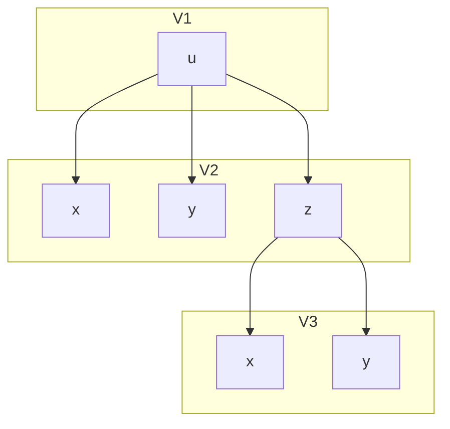
```mermaid
graph
subgraph V1
A[u]
end
subgraph V2
B1[x]
B2[y]
B3[z]
end
subgraph V3
C1[x]
C2[y]
end
A-->B1 & B2 & B3
B3-->C1 & C2
```
求出各项
$$
\begin{gather}
	f_{1}'=2xe^{x^2+y^2+z^2} \\
	f_{2}'=2ye^{x^2+y^2+z^2} \\
	f_{3}'=2ze^{x^2+y^2+z^2} \\
	g_{1}'=\frac{\partial z(x,y)}{\partial x}=2x\sin y \\
	g_{2}'=\frac{\partial z(x,y)}{\partial y}=x^2\cos y
\end{gather}
$$
又有最终算式
$$
\begin{gather}
	\frac{\partial u}{\partial x}=\frac{\partial f}{\partial x}+\frac{\partial f}{\partial z} \cdot \frac{\partial z}{\partial x} \\
	 =f_{1}'+f_{3}'g_{1}' \\ \\
	 
	 \frac{\partial u}{\partial y}=\frac{\partial f}{\partial y}+\frac{\partial f}{\partial z}\cdot \frac{\partial z}{\partial y} \\
	 =f_{2}'+f_{3}'g_{2}'
\end{gather}
$$
故可得
$$
\begin{gather}
	\frac{\partial u}{\partial x}=2xe^{x^2+y^2+z^2}+2ze^{x^2+y^2+z^2}\cdot 2x\sin y \\
	\frac{\partial u}{\partial y}=2ye^{x^2+y^2+z^2}+2ze^{x^2+y^2+z^2}\cdot x^2\cos y
\end{gather}
$$
___
### 举例4

$$
\begin{gather}
	z=\frac{y}{f\left( \frac{y}{x} \right)} \\
	求 \frac{\partial z}{\partial x}, \frac{\partial z}{\partial y}
\end{gather}
$$
___
不妨设$u=\frac{y}{x},z=F(y,u)$
先得出树状图
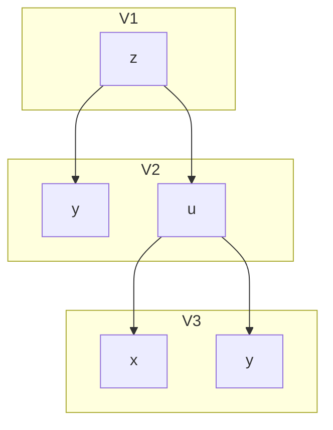
```mermaid
graph
subgraph V1
A[z]
end
subgraph V2
B1[y]
B2[u]
end
subgraph V3
C1[x]
C2[y]
end
A-->B1 & B2
B2-->C1 & C2
```
求出各项
$$
\begin{gather}
	F_{1}'=\frac{1}{f(u)} \\
	F_{2}'=-\frac{y}{f^2(u)}\cdot f'(u) \\
	g_{1}'=-\frac{y}{x^2} \\
	g_{2}'=\frac{1}{x}
\end{gather}
$$
可得算式
$$
\begin{gather}
	\frac{\partial z}{\partial x}=F_{2}'g_{1}' \\
	\frac{\partial z}{\partial y}=F_{1}'+F_{2}'g_{2}'
\end{gather}
$$
故可得
$$
\begin{gather}
	\frac{\partial z}{\partial x}=-\frac{y}{f^2(u)}\cdot f'(u)\cdot\left( -\frac{y}{x^2} \right) \\
	=\frac{y^2}{x^2}\cdot \frac{f'(u)}{f^2(u)} \\ \\
	\frac{\partial z}{\partial y}=\frac{1}{f(u)}-\frac{y}{f^2(u)}\cdot f'(u) \cdot\frac{1}{x} \\
	=\frac{1}{f(u)}-\frac{y}{x}\cdot \frac{f'(u)}{f^2(u)}
\end{gather}
$$
___
## 多元复合函数的高阶偏导数

设$u=\varphi(x,y),v=\psi(x,y)$有二阶连续偏导,$z=f(u,v)$在$(u,v)$有二阶连续偏导,则复合函数$z=f[\varphi(x,y),\psi(x,y)]$在$(x,y)$处有二阶偏导
___
### 计算举例

#### 举例1

$$
\begin{gather}
	u=f(x+y+z,xyz)
\end{gather}
$$
$f$具有二阶连续偏导数,求
$$
\frac{\partial u}{\partial x}, \frac{\partial^2 u}{\partial x \partial z}
$$
___
不妨设$v=x+y+z,w=xyz$
树状图如下
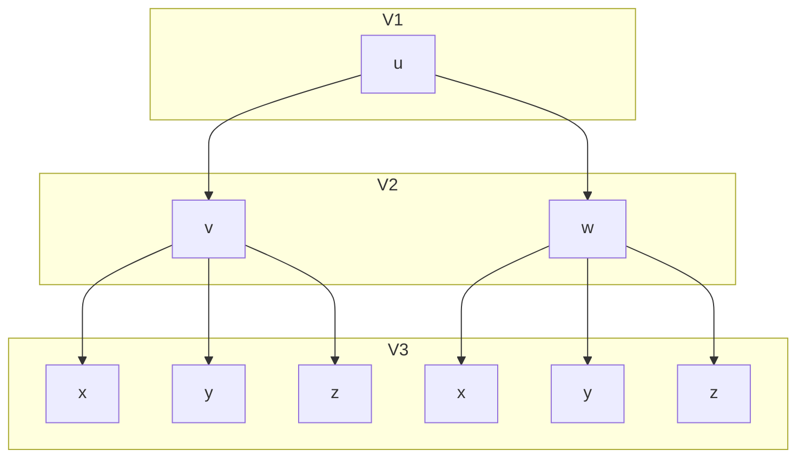
```mermaid
graph
subgraph V1
A[u]
end
subgraph V2
B1[v]
B2[w]
end
subgraph V3
C1[x]
C2[y]
C3[z]
D1[x]
D2[y]
D3[z]
end
A-->B1 & B2
B1-->C1 & C2 & C3
B2-->D1 & D2 & D3
```
先求$\frac{\partial u}{\partial x}$
$$
\begin{gather}
	\frac{\partial u}{\partial x}=\frac{\partial f}{\partial u}\cdot \frac{\partial u}{\partial x}+\frac{\partial f}{\partial v}\cdot \frac{\partial v}{\partial x} \\
	=f_{1}'+yzf_{2}'
\end{gather}
$$
再求$\frac{\partial^2u}{\partial x\partial z}$
$$
\begin{gather}
	\frac{\partial^2 u}{\partial x\partial z}=\frac{\partial f_{1}'}{\partial u}\cdot \frac{\partial u}{\partial z}+\frac{\partial f_{1}'}{\partial v}\cdot \frac{\partial v}{\partial z} +yf_{2}'+yz \left( \frac{\partial f_{2}'}{\partial u} \frac{\partial u}{\partial z}+\frac{\partial f_{2}'}{\partial v}\cdot \frac{\partial v}{\partial z}  \right) \\
	=f_{11}''+xyf_{12}''+yf_{2}'+yzf_{21}''+xy^2zf_{22}'' \\
	=f_{11}''+y(x+z)f_{12}''+xy^2zf_{22}'+yf_{2}'
\end{gather}
$$
___
#### 举例2

$$
u=f(x+y+z+xyz)
$$
$f$具有二阶连续偏导数
$$
求 \frac{\partial u}{\partial x}, \frac{\partial^2 u}{\partial x \partial z}
$$
___
设$t=x+y+z+xyz$
树状图如下
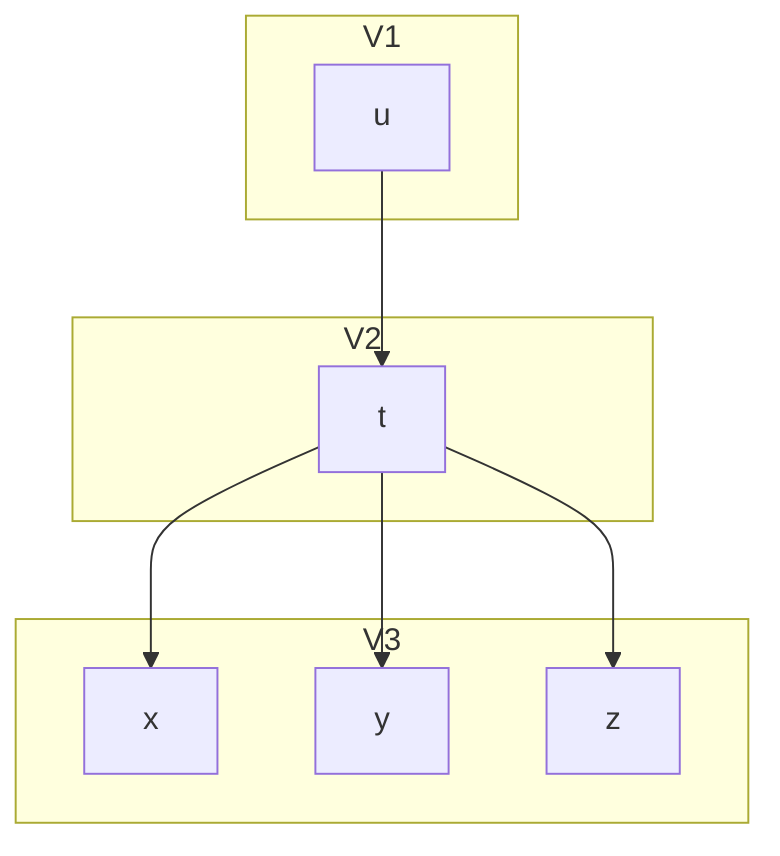
```mermaid
graph
subgraph V1
A[u]
end
subgraph V2
B[t]
end
subgraph V3
C1[x]
C2[y]
C3[z]
end
A-->B-->C1 & C2 & C3
```
先求$\frac{\partial u}{\partial x}$
$$
\begin{gather}
	\frac{\partial u}{\partial x}=\frac{du}{dt}\cdot \frac{\partial t}{\partial x} \\
	=f'(1+yz)
\end{gather}
$$
再求$\frac{\partial^2u}{\partial x\partial z}$
$$
\begin{gather}
	\frac{\partial^2u}{\partial x\partial z}=yf'+(1+yz) \frac{\partial f'}{\partial z} \\
	=yf'+(1+yz)(1+xy)f''
\end{gather}
$$
___
#### 举例3

$u=f(x,y)$有二阶连续导数,将$\frac{\partial^2u}{\partial x^2}, \frac{\partial^2u}{\partial y^2}$换为极坐标形式
___
$$
\begin{gather}
	r=\sqrt{ x^2+y^2 }, \theta=\arctan \frac{y}{x} \\
	设u=u(r,\theta)=u\left( \sqrt{ x^2+y^2 }, \arctan \frac{y}{x}  \right)=f(x,y) \\
	\frac{\partial u}{\partial x}=\frac{\partial u}{\partial r}\cdot \frac{\partial r}{\partial x}+\frac{\partial u}{\partial \theta}\cdot \frac{\partial \theta}{\partial x}
\end{gather}
$$
树状图如下
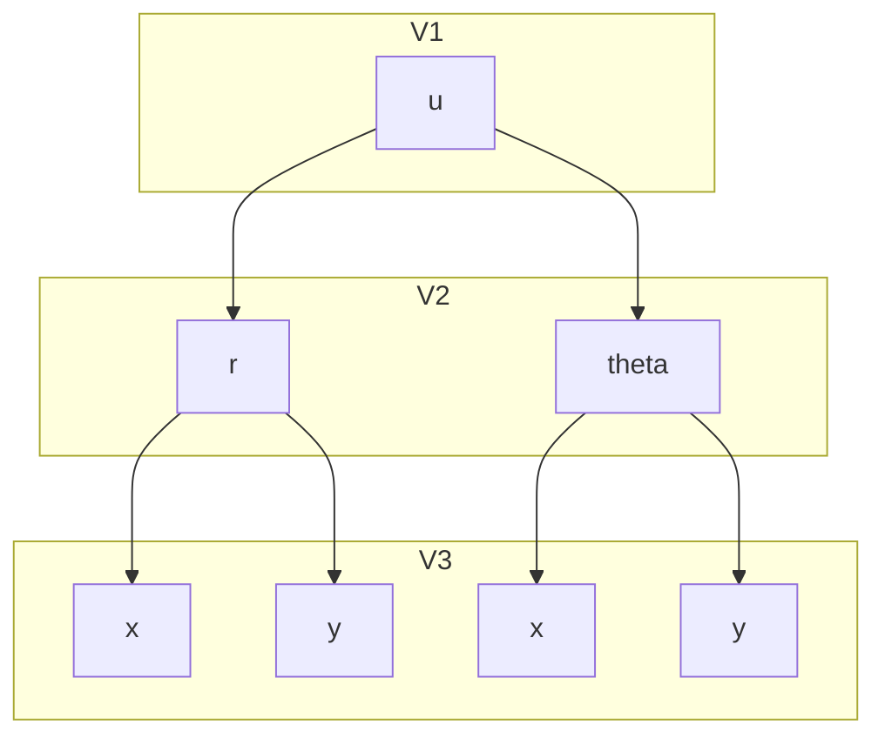
```mermaid
graph
subgraph V1
A[u]
end
subgraph V2
B1[r]
B2[theta]
end
subgraph V3
C1[x]
C2[y]
D1[x]
D2[y]
end
A-->B1 & B2
B1-->C1 & C2
B2-->D1 & D2
```
我们来计算一下其中的$r,\theta$的偏导
$$
\begin{gather}
	\frac{\partial r}{\partial x}=\frac{x}{\sqrt{ x^2+y^2 }}=\frac{x}{r} \\
	\frac{\partial r}{\partial y}=\frac{y}{\sqrt{ x^2+y^2 }}=\frac{y}{r} \\
	\frac{\partial \theta}{\partial x}=\frac{ -\frac{y}{x^2} }{1+\left( \frac{y}{x} \right)^2}=-\frac{y}{x^2+y^2}=-\frac{y}{r^2} \\
	\frac{\partial \theta}{\partial y}=\frac{ \frac{1}{x} }{1+\left( \frac{y}{x} \right)^2}=\frac{x}{\sqrt{ x^2+y^2 }}=\frac{x}{r^2}
\end{gather}
$$
我们再改$x,y$成$r\cos \theta,r\cos \theta$
$$
\begin{gather}
	\frac{\partial r}{\partial x}=\cos \theta \\
	\frac{\partial r}{\partial y}=\sin \theta \\
	\frac{\partial \theta}{\partial x}=-\frac{\sin \theta}{r} \\
	\frac{\partial \theta}{\partial y}=\frac{\cos \theta}{r}
\end{gather}
$$
___
故我们先求一阶偏导
$$
\begin{gather}
	\frac{\partial u}{\partial x}=\frac{\partial u}{\partial r}\cdot \frac{\partial r}{\partial x}+\frac{\partial u}{\partial \theta}\cdot \frac{\partial \theta}{\partial x} \\
	=\frac{\partial u}{\partial r}\cos \theta-\frac{\partial u}{\partial \theta}\cdot \frac{\sin \theta}{r} \\ \\
	\frac{\partial u}{\partial y}=\frac{\partial u}{\partial r}\cdot \frac{\partial r}{\partial y}+\frac{\partial u}{\partial \theta}\cdot \frac{\partial \theta}{\partial y} \\
	=\frac{\partial u}{\partial r}\sin \theta+\frac{\partial u}{\partial \theta}\cdot \frac{\cos \theta}{y}
\end{gather}
$$
再求二阶偏导
$$
\begin{gather}
	\frac{\partial^2u}{\partial x^2}=\frac{\partial}{\partial r}\left( \frac{\partial u}{\partial x} \right)\cdot \frac{\partial r}{\partial x}+\frac{\partial}{\partial \theta}\left( \frac{\partial u}{\partial x} \right)\cdot \frac{\partial \theta}{\partial x} \\
	=\left( \frac{\partial^2u}{\partial r^2}\cos \theta-\frac{\partial^2u}{\partial \theta \partial r}\cdot \frac{\sin \theta}{r}+\frac{\partial u}{\partial \theta}\cdot \frac{\sin \theta}{r^2} \right)\cos \theta \\
	+\left( \frac{\partial^2 u}{\partial r \partial \theta}\cos \theta-\frac{\partial u}{\partial r}\sin \theta-\frac{\partial^2 u}{\partial \theta^2}\cdot \frac{\sin \theta}{r}-\frac{\partial u}{\partial \theta}\cdot \frac{\cos \theta}{r} \right)\left( -\frac{\sin \theta}{r} \right) \\ \\
	\frac{\partial^2 u}{\partial y^2}=\frac{\partial}{\partial r}\left( \frac{\partial u}{\partial y} \right)\cdot \frac{\partial r}{\partial y}+\frac{\partial}{\partial \theta}\left( \frac{\partial u}{\partial y} \right)\cdot \frac{\partial \theta}{\partial y} \\
	=\left( \frac{\partial^2u}{\partial r^2}\sin \theta+\frac{\partial^2 u}{\partial \theta \partial r}\cdot \frac{\cos \theta}{r}-\frac{\partial u}{\partial \theta}\cdot \frac{\cos \theta}{r^2} \right)\sin \theta \\
	+\left( \frac{\partial^2 u}{\partial r \partial \theta}\sin \theta+ \frac{\partial u}{\partial r}\cos \theta +\frac{\partial^2}{\partial \theta^2}\cdot \frac{\cos \theta}{r}-\frac{\partial u}{\partial \theta}\cdot \frac{\cos \theta}{r} \right)\cdot \frac{\cos \theta}{r}
\end{gather}
$$
___
对此,其实有
$$
\frac{\partial^2 u}{\partial x^2}+\frac{\partial^2 u}{\partial y^2}=\frac{\partial^2 u}{\partial r^2}+\frac{1}{r}\cdot \frac{\partial u}{\partial r}+\frac{1}{r^2}\cdot \frac{\partial^2 u}{\partial \theta^2} 
$$
___
# 一阶微分形式不变性

设函数$z=f(u,v)$具有连续偏导数,则有全微分
$$
dz=\frac{\partial z}{\partial u}du+\frac{\partial z}{\partial v}dv
$$
又若$u,v$是$x,y$的函数,即$u=\varphi(x,y),v=\psi(x,y)$且有连续偏导,则$z=f[\varphi(x,y),\psi(x,y)]$的全微分为
$$
dz=\frac{\partial z}{\partial x}dx+\frac{\partial z}{\partial y}dy
$$
此时,如果我们将层次倒转,从$x,y$导向$u,v$,可得
$$
\begin{gather}
	dz=\frac{\partial z}{\partial x}dx+\frac{\partial z}{\partial y}dy \\
	=\left( \frac{\partial z}{\partial u}\cdot \frac{\partial u}{\partial x}+\frac{\partial z}{\partial v}\cdot \frac{\partial v}{\partial x} \right)dx+\left( \frac{\partial z}{\partial u}\cdot \frac{\partial u}{\partial y}+\frac{\partial u}{\partial v}\cdot \frac{\partial v}{\partial y} \right)dy \\
	我们将其重新组合 \\
	=\frac{\partial z}{\partial u}\left( \frac{\partial u}{\partial x}dx+\frac{\partial u}{\partial y}dy \right)+\frac{\partial z}{\partial v}\left( \frac{\partial v}{\partial x}dx+\frac{\partial v}{\partial y}dy \right) \\
	利用全微分,我们可得 \\
	=\frac{\partial z}{\partial u}du+\frac{\partial z}{\partial v}dv
\end{gather}
$$
可见
$$
\begin{gather}
	dz \\
	=\frac{\partial z}{\partial x}dx+\frac{\partial z}{\partial y}dy \\
	=\frac{\partial z}{\partial u}du+\frac{\partial z}{\partial v}dv
\end{gather}
$$
我们称之为**一阶微分形式不变性**,无论$u,v$是以中间变量还是最终变量进行微分,都能得到
$$
dz=\frac{\partial z}{\partial u}du+\frac{\partial z}{\partial v}dv
$$
## 计算举例

### 举例1

$$
\begin{gather}
	z=e^u \sin v \\
	u=xy,v=x+y \\
	求 \frac{\partial z}{\partial x}, \frac{\partial z}{\partial y}
\end{gather}
$$
___
$$
\begin{gather}
	dz=d(e^u\sin v) \\
	=e^u \sin v du+e^u\cos v dv \\
	我们用u,v的全微分展开 \\
	du=dx+dy \\
	dv=ydx+xdy \\ \\
	dz=e^u \sin v(dx+dy)+e^u\cos v(ydx+xdy) \\
	=(e^u\sin v+ye^u\cos v)dx+(e^u\sin v+xe^u\cos v)dy \\
	=e^{xy}[y\sin(x+y)+\cos(x+y)]dx+e^{xy}[x\sin (x+y)+\cos(x+y)]dy \\ \\
	可得 \\
	\frac{\partial z}{\partial x}=e^{xy}[y\sin(x+y)+\cos(x+y)] \\
	\frac{\partial z}{\partial y}=e^{xy}[x\sin(x+y)+\cos(x+y)]
\end{gather}
$$
___
### 举例2

$$
\begin{gather}
	z=f(x+y,xy) \\
	f具有一阶连续偏导,求dz
\end{gather}
$$
___
$$
\begin{gather}
	dz=f_{1}'d(x+y)+f_{2}'d(xy) \\
	=f_{1}'(dx+dy)+f_{2}'(ydx+xdy) \\
	=(f_{1}'+yf_{2}')dx+(f_{1}'+xf_{2}')dy
\end{gather}
$$
___
### 举例3

$$
\begin{gather}
	设f''(t)连续 \\
	z=\frac{1}{x}f(xy)+yf(x+y) \\
	求 \frac{\partial^2 z}{\partial x\partial y}
\end{gather}
$$
___
$$
\begin{gather}
	设u=xy,v=x+y \\
	z=\frac{1}{x}f(u)+yf(v) \\
	令z=F(x,y,u,v)
\end{gather}
$$
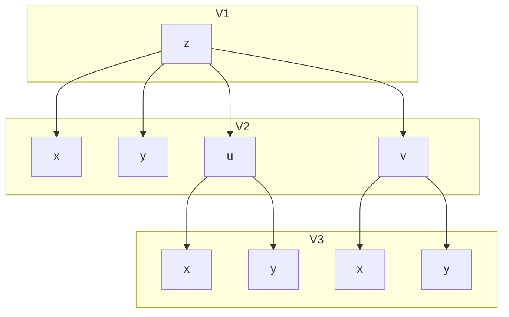
```mermaid
graph
subgraph V1
A[z]
end
subgraph V2
B1[x]
B2[y]
B3[u]
B4[v]
end
subgraph V3
C1[x]
C2[y]
C3[x]
C4[y]
end
A-->B1 & B2 & B3 & B4
B3-->C1 & C2
B4-->C3 & C4
```
$$
\begin{gather}
	\frac{\partial z}{\partial x}=\frac{\partial F}{\partial x}+\frac{\partial F}{\partial u}\cdot \frac{\partial u}{\partial x}+\frac{\partial F}{\partial v}\cdot \frac{\partial v}{\partial x} \\
	=-\frac{1}{x^2}f(u)+\frac{y}{x}f'(u)+yf'(v) \\ \\
	\frac{\partial^2 z}{\partial x\partial y}=\frac{\partial}{\partial y}\left( \frac{\partial z}{\partial x} \right)+\frac{\partial}{\partial u}\left( \frac{\partial z}{\partial x} \right) \frac{\partial u}{\partial y}+\frac{\partial}{\partial v}\left( \frac{\partial z}{\partial x} \right) \frac{\partial v}{\partial y} \\
	=\left[ \frac{1}{x} f'(u)+f'(v) \right]+x\left[ -\frac{1}{x^2}f'(u)+\frac{y}{x}f''(u) \right]+[yf''(v)] \\
	=f'(v)+yf''(u)+yf''(v) \\
	=y[f''(xy)+f''(x+y)]+f'(x+y)
\end{gather}
$$
___
### 举例4

$$
\begin{gather}
	e^{-xy}-2z+e^z=0 \\
	求 \frac{\partial z}{\partial x}, \frac{\partial z}{\partial y}
\end{gather}
$$
___
$$
\begin{gather}
	不妨设 \\
	w=-xy \\
	s=f(z,w)=e^{-xy}-2z+e^z=0
\end{gather}
$$
有树状图
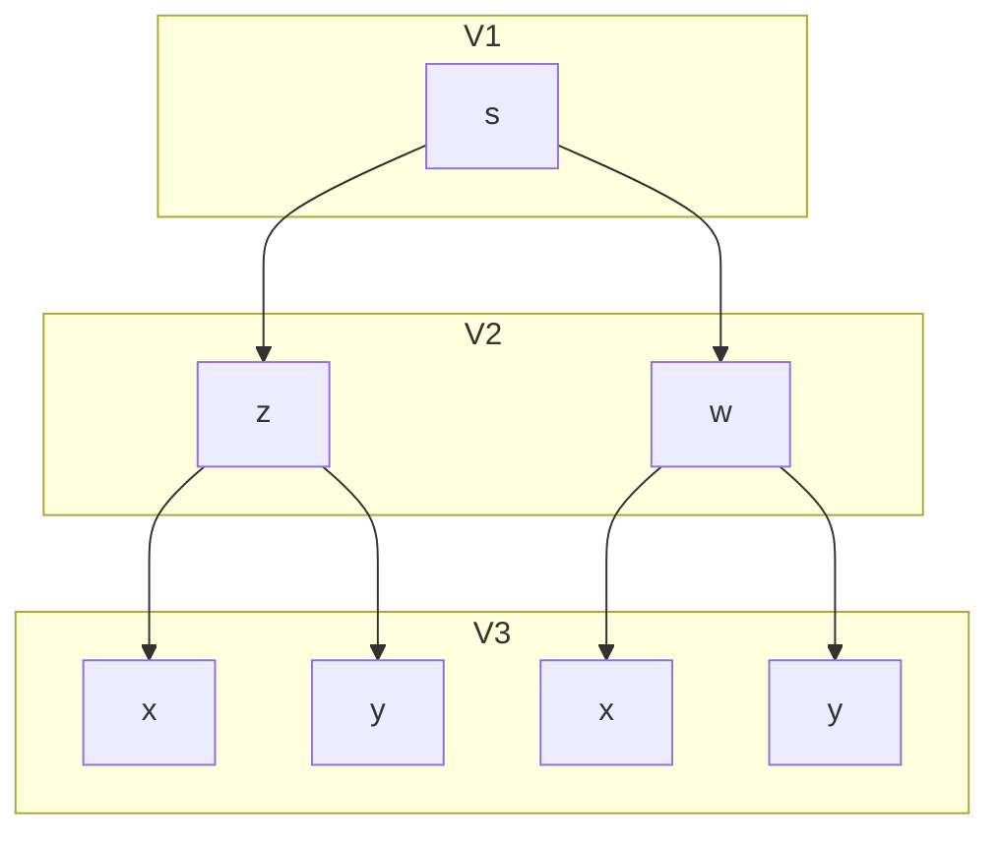
```mermaid
graph
subgraph V1
A[s]
end
subgraph V2
B1[z]
B2[w]
end
subgraph V3
C1[x]
C2[y]
C3[x]
C4[y]
end
A-->B1 & B2
B1-->C1 & C2
B2-->C3 & C4
```
$$
\begin{gather}
	ds=0 \\
	ds=e^{w}dw+(e^z-2)dz \\
	(e^z-2)dz=-e^wdw \\
	=e^{-xy}(ydx+xdy) \\ \\
	dz=\frac{ye^{-xy}}{e^z-2}dx+\frac{xe^{-xy}}{e^z-2}dy \\ \\
	\frac{\partial z}{\partial x}=\frac{ye^{-xy}}{e^z-2}, \frac{\partial z}{\partial y}=\frac{xe^{-xy}}{e^z-2}
\end{gather}
$$
___

