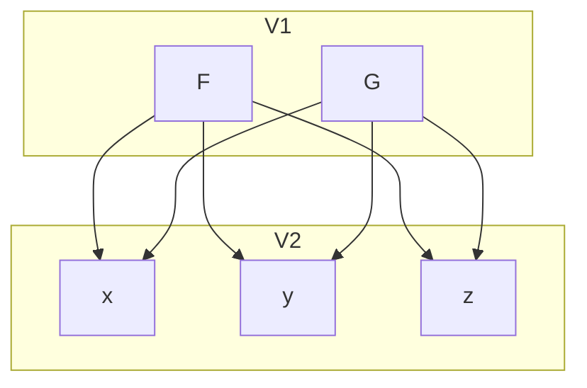
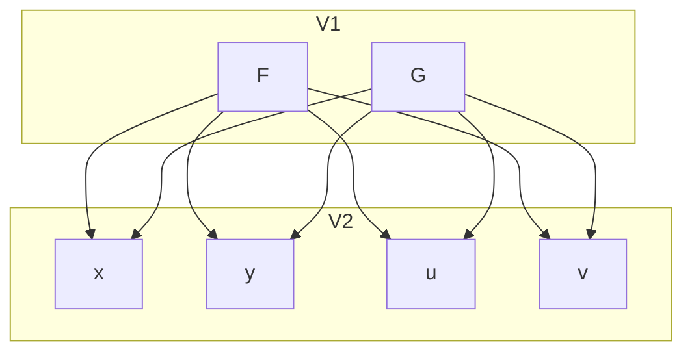
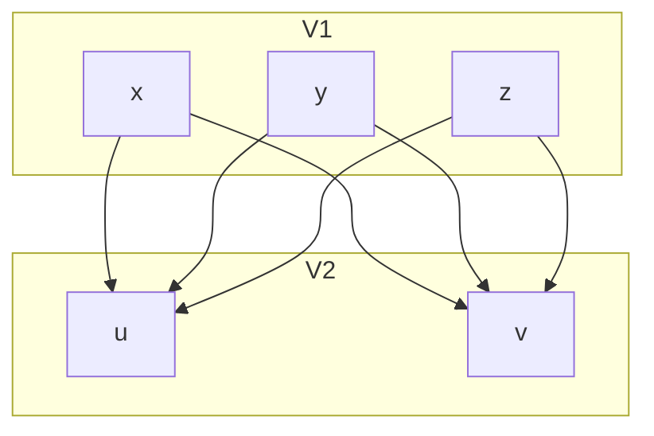
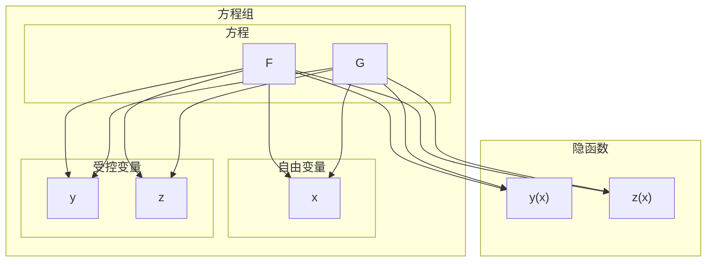
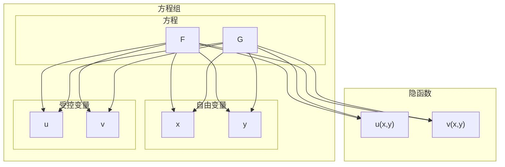
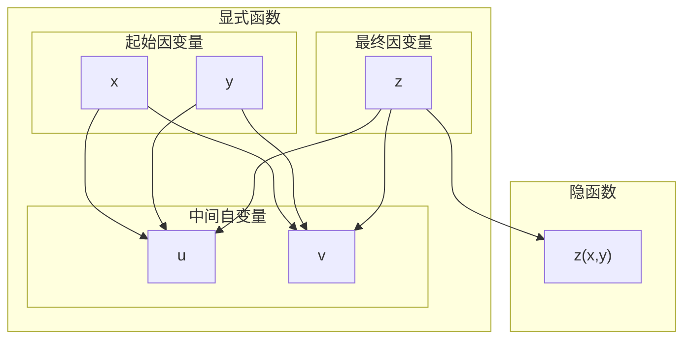

#多元函数微分学 
[[5-复合函数微分]]

# 单方程隐函数

设函数$F(x,y)$在点$P(x_{0},y_{0})$的某一邻域内满足
- $F(x_{0},y_{0})=0$
- $F_{y}(x_{0},y_{0})\ne 0$
则方程$F(x,y)=0$在$x_{0}$的某邻域内可唯一确定一个单值连续函数$y=f(x)$,满足$y_{0}=f(x_{0})$,并有连续导数
$$
\frac{dy}{dx}=-\frac{F_{x}}{F_{y}}
$$
这是一元隐函数的求导,同样对于多元函数有定理如下

若$F(x,y,z)$在$U(P_{0},\delta)$内有连续偏导数且满足
- $F(x_{0},y_{0},z_{0})=0$
- $F_{z}(x_{0},y_{0},z_{0}) \ne 0$

则$F(x,y,z)=0$在$U(P_{0},\delta)$内确定了唯一的单值连续函数$z=f(x,y)$,且$z_{0}=f(x_{0},y_{0})$,且有连续偏导数
$$
\frac{\partial z}{\partial x}=-\frac{F_{x}}{F_{z}}, \frac{\partial z}{\partial y}=-\frac{F_{z}}{F_{y}}
$$
这就是单方程确定的多元隐函数的偏导数
___
## 计算举例

### 举例1

$$
\begin{gather}
	x^2+y^2+z^2-4z=0 \\
	求 \frac{\partial^2 z}{\partial x^2}
\end{gather}
$$
___
$$
\begin{gather}
	x^2+y^2+z^2-4z=0 \\
	\implies 2x+2z \frac{\partial z}{\partial x}-4\frac{\partial z}{\partial x}=0 \\
	\implies 2+2\left( \frac{\partial z}{\partial x} \right)^2+2z \frac{\partial^2z}{\partial x^2} -4 \frac{\partial^2 z}{\partial x^2}=0 \\ \\
	\frac{\partial z}{\partial x}=\frac{x}{2-z} \\ \\
	\frac{\partial^2z}{\partial x^2}=\frac{1+\left( \frac{\partial z}{\partial x} \right)^2}{2-z} \\
	=\frac{(2-z)^2+x^2}{(2-z)^3}
\end{gather}
$$
___
### 举例2

设$F(x,y)$具有连续偏导数,已知方程
$$
F\left( \frac{x}{z}, \frac{y}{z} \right)=0
$$
求$dz$
___
$$
\begin{gather}
	F_{1}'d\left( \frac{x}{z} \right)+F_{2}'d\left( \frac{y}{z} \right)=0 \\
	\implies F_{1}'\left(  \frac{1}{z}dx-\frac{x}{z^2}dz  \right)+F_{2}'\left( \frac{1}{z}dy-\frac{y}{z^2}dz \right)=0 \\
	\implies \frac{xF_{1}'+yF_{2}'}{z^2}dz=\frac{F_{1}'dx+F_{2}'dy}{z} \\
	\implies dz=\frac{z(F_{1}'dx+F_{2}'dy)}{xF_{1}'+yF_{2}'}
\end{gather}
$$
___
### 举例3

函数$z=z(x,y)$由方程
$$
F\left( x+\frac{z}{y}, y+\frac{z}{x} \right)=0
$$
所确定,证明:
$$
x \frac{\partial z}{\partial x}+y \frac{\partial z}{\partial y}=z-xy
$$
___
$$
\begin{gather}
	令 \Phi(x,y,z)=F\left( x+\frac{z}{y}, y+\frac{z}{x} \right) \\ \\
	\Phi_{x}=F_{1}'-\frac{z}{x^2} F_{2}' \\
	\Phi_{y}=-\frac{z}{y^2}F_{1}'+F_{2}' \\
	\Phi_{z}=\frac{1}{y}F_{1}'+\frac{1}{x}F_{2}' \\ \\
	\frac{\partial z}{\partial x}=-\frac{\Phi_{x}}{\Phi_{z}} \\
	=\frac{y(zF_{2}'-x^2F_{1}')}{x(xF_{1}'+yF_{2}')} \\ \\
	\frac{\partial z}{\partial y}=-\frac{\Phi_{y}}{\Phi_{z}} \\
	=\frac{x(zF_{1}'-y^2F_{2}')}{y(xF_{1}'+yF_{2}')} \\ \\
	代入我们所求的等式中可得 \\ \\
	x \frac{\partial z}{\partial x}+y \frac{\partial z}{\partial y} \\
	=x \frac{y(zF_{2}'-x^2F_{1}')}{x(xF_{1}'+yF_{2}')}+y \frac{x(zF_{1}'-y^2F_{2}')}{y(xF_{1}'+yF_{2}')} \\
	=\frac{y(zF_{2}'-x^2F_{1}')+x(zF_{1}'-y^2F_{2}')}{xF_{1}'+yF_{2}'} \\
	=\frac{(z-xy)(xF_{1}'+yF_{2}')}{xF_{1}'+yF_{2}'} \\
	=z-xy
\end{gather}
$$
___
### 举例4

$$
\begin{gather}
	z=f(x+y+z,xyz) \\
	求 \frac{\partial z}{\partial x}, \frac{\partial x}{\partial y}, \frac{\partial y}{\partial z}
\end{gather}
$$
___
$$
\begin{gather}
	令F(x,y,z)=f(x+y+z,xyz)-z \\ \\
	F_{x}=f_{1}+yzf_{2} \\
	F_{y}=f_{1}+xzf_{2} \\
	F_{z}=f_{1}+xyf_{2} \\ \\
	\frac{\partial z}{\partial x}=-\frac{F_{x}}{F_{z}} \\
	=\frac{f_{1}+yzf_{2}}{1-f_{1}-xyf_{2}} \\ \\
	\frac{\partial x}{\partial y}=-\frac{F_{y}}{F_{x}} \\
	=-\frac{f_{1}+xzf_{2}}{f_{1}+yzf_{2}} \\ \\
	\frac{\partial y}{\partial z}=-\frac{F_{z}}{F_{y}} \\
	=\frac{1-f_{1}-xyf_{2}}{f_{1}+xzf_{2}}
\end{gather}
$$
___
# 方程组隐函数

对于一些隐函数,它们甚至无法只用一个简单的方程来表示,需要用多个方程联立的方程组来表示,如
- 举例1
$$
\begin{cases}
	F(x,y,z)=0 \\
	G(x,y,z)=0
\end{cases}
$$
对于这个方程组,选取其中一个变量,则确定了另外两个变量关于这个变量的两个隐式一元函数

- 举例2
$$
\begin{cases}
	F(x,y,u,v)=0 \\
	G(x,y,u,v)=0
\end{cases}
$$
选取其中两个变量,则确定了另外两个变量关于这两个变量的两个隐式二元函数

- 举例3
$$
\begin{cases}
	x=x(u,v) \\
	y=y(u,v) \\
	z=z(u,v)
\end{cases}
$$
由于显式地给出了三个变量关于$u,v$的二元函数,在这三个变量中选取两个,则确定了另外一个变量关于这个变量的隐式二元函数

___
## 求导定理

在这些情况下,我们有定理如下

### 情况1

对于举例1里的这种情形,其对应的是一种隐函数的情形,即隐函数是一元函数,有定理如下
条件有
- $F(x,y,z),G(x,y,z)$在含点$(x_{0},y_{0},z_{0})$的一个开区域$D$上连续
- $F,G$在$D$上有连续的偏导数
- $F(x_{0},y_{0},z_{0})=G(x_{0},y_{0},z_{0})=0$
- $$
\frac{\partial(F,G)}{\partial(y,z)}=\begin{vmatrix}
	F_{y} & F_{z} \\
	G_{y} & G_{z}
\end{vmatrix} \ne 0
$$
我们将上面提到的
$$
\frac{\partial(F,G)}{\partial(y,z)}=\begin{vmatrix}
	F_{y} & F_{z} \\
	G_{y} & G_{z}
\end{vmatrix}
$$
称为**雅可比行列式**,记为$J_{yz}$
___
我们不妨选定$x$作为自由变量,由条件可得,$\exists \delta >0$和定义在$\Delta=(x_{0}+\delta,x_{0}+\delta)$上的唯一的函数
$$
\begin{gather}
	\begin{cases}
	y=y(x) \\
	z=z(x)
\end{cases} \\ \\
\implies
\begin{cases}
	F(x,y(x),z(x))=0 \\
	G(x,y(x),z(x))=0
\end{cases} \quad,x \in \Delta
\end{gather}
$$
即隐函数存在

方程的数量对应了隐函数数量,所有方程变量数减去方程数为自由变量数,自由变量可以由自己决定,而隐函数形式和方程形式有关,其与方程和变量构成的图的连通性有关

我们对整个方程组进行求导
$$
\begin{gather}
	\begin{cases}
		F_{x}+F_{y}\cdot y'+F_{z}\cdot z'=0 \\
		G_{x}+G_{y}\cdot y'+G_{z}\cdot z'=0
	\end{cases} \\
	\implies
	\begin{cases}
		F_{y}\cdot y'+F_{z}\cdot z'=-F_{x} \\
		G_{y}\cdot y'+F_{z}\cdot z'=-G_{x}
	\end{cases}
\end{gather}
$$
这个形式是类似线性方程组,我们使用克莱姆法则和雅可比行列式配合,由条件中的$J_{yz} \ne 0$可得
$$
\frac{dy}{dx}=-\frac{J_{xz}}{J_{yz}} \quad , \frac{dz}{dx}=-\frac{J_{yx}}{J_{yz}}
$$
具体展开如下
$$
\begin{gather}
	\frac{dy}{dx}=-\frac
	{
	 \begin{vmatrix}
		F_{x} & F_{z} \\
		G_{x} & G_{z}
	 \end{vmatrix}
	} 
	{
	 \begin{vmatrix}
		F_{y} & F_{z} \\
		G_{y} & G_{z}
	 \end{vmatrix}
	} \\ \\
	\frac{dz}{dx}=-\frac
	{
	 \begin{vmatrix}
		F_{y} & F_{x} \\
		G_{y} & G_{x}
	 \end{vmatrix}
	}
	{
	 \begin{vmatrix}
		F_{y} & F_{z} \\
		G_{y} & G_{z}
	 \end{vmatrix}
	}
\end{gather}
$$
___
#### 计算举例

##### 举例1

$$
\begin{cases}
	z=x^2+y^2 \\
	x^2+2y^2+3z^2=20
\end{cases}
$$
该方程确定了隐函数$z=z(x),y=y(x)$,求导数$\frac{dz}{dx}, \frac{dy}{dx}$
___
$$
\begin{gather}
	我们对整个方程组进行求导 \\
	\begin{cases}
		z'=2x+2yy' \\
		2x+4yy'+6zz'=0
	\end{cases} \\
	\implies
	\begin{cases}
		z'-2yy'=2x \\
		3zz'+2yy'=-x
	\end{cases} \\ \\
	直接求解可得 \\
	\implies
	\begin{cases}
		z'=\frac{x}{3z+1} \\
		y'=-\frac{6xz+x}{6yz+2y}
	\end{cases} \\ \\
	使用行列式可得 \\ \\
	\frac{dy}{dx}=-\frac
	{
	 \begin{vmatrix}
	  1 & 2x \\
	  3z & -x
     \end{vmatrix}
	}
	{
	 \begin{vmatrix}
	  1 & -2y \\
	  3z & 2y
     \end{vmatrix}
	} \\
	=\frac{-x-6xz}{2y+6xy} \\
	=-\frac{6xz+x}{6xy+2y} \\ \\
	\frac{dz}{dx}=\frac
	{
	 \begin{vmatrix}
	  2x & -2y \\
	  -x & 2y
     \end{vmatrix}
	}
	{
	 \begin{vmatrix}
	  1 & -2y \\
	  3z & 2y
     \end{vmatrix}
	} \\
	=\frac{2xy}{2y+6xy} \\
	=\frac{x}{3x+1}
\end{gather}
$$
___
我们再分别计算雅可比行列式并使用公式
$$
\begin{gather}
J_{zy}=
    \begin{vmatrix}
	 1 & -2y \\
	 6z & 4y
    \end{vmatrix} \\
    =4y+12yz \\ \\
J_{zx}=
    \begin{vmatrix}
	 1 & -2x \\
	 6z & 2x
    \end{vmatrix} \\
	=2x+12xz	 \\ \\
J_{xy}=
    \begin{vmatrix}
	 -2x & -2y \\
	 2x & 4y
    \end{vmatrix} \\
	=-4xy \\ \\
	\frac{dy}{dx}=-\frac{J_{zx}}{J_{zy}} \\
	=-\frac{2x+12xz}{4y+12yz} \\
	=-\frac{6xz+x}{6yz+2y} \\ \\
	\frac{dz}{dx}=-\frac{J_{xy}}{J_{zy}} \\
	=-\frac{-4xy}{4y+12yz} \\
	=\frac{x}{3z+1}
\end{gather}
$$
___
##### 举例2

$$
\begin{cases}
	u=f(x,y,z,t) \\
	g(y,z,t)=0 \\
	h(z,t)=0
\end{cases}
$$
该方程组确定了隐函数$u=u(x,y)$,其中$f,g,h$均可微,且$J=\frac{\partial(g,h)}{\partial(z,t)} \ne 0$,求$\frac{\partial u}{\partial y}$
___
$$
\begin{gather}
	由题意,将方程组分成两部分 \\
	显式函数u=f(x,y,z,t) \\
	方程 \\
	\begin{cases}
		g(y,z,t)=0 \\
		h(z,t)=0
	\end{cases} \\
	在方程部分 \\
	我们设y为自由变量 \\
	这确定了隐函数 \\
	z=z(y),t=t(y) \\ \\
	\frac{\partial(g,h)}{\partial(z,t)}=
	\begin{vmatrix}
	 g_{2} & g_{3} \\
	 h_{1} & h_{2}
    \end{vmatrix} \\
	=g_{2}h_{2}-g_{3}h_{1} \\ \\
	\frac{\partial(g,h)}{\partial(y,t)}=
	\begin{vmatrix}
	 g_{1} & g_{3} \\
	 0 & h_{2}
    \end{vmatrix} \\
	=g_{1}h_{2} \\ \\
	\frac{\partial(g,h)}{\partial(z,y)}=
	\begin{vmatrix}
	 g_{2} & g_{1} \\
	 h_{1} & 0
    \end{vmatrix} \\
	=-g_{1}h_{1} \\ \\
	\frac{dz}{dy}=\frac{g_{1}h_{1}}{g_{2}h_{2}-g_{3}h_{1}} \\ \\
	\frac{dt}{dy}=-\frac{g_{1}h_{2}}{g_{2}h_{2}-g_{3}h_{1}} \\ \\
	再看显式函数f \\
	此处再有一个自由变量x \\
	\frac{\partial u}{\partial y}=f_{2}+f_{3} \frac{dz}{dt}+f_{4} \frac{dt}{dy} \\
	=f_{2}+f_{3} \frac{g_{1}h_{1}}{g_{2}h_{2}-g_{3}h_{1}}-f_{4} \frac{g_{1}h_{2}}{g_{2}h_{2}-g_{3}h_{1}}
\end{gather}
$$
___
### 情况2

对于举例2里的这种情形,对应的是一种隐函数是多元函数的情形,有定理如下
条件如下
- 在点$P(x_{0},y_{0},u_{0},v_{0})$的某一领域内具有连续偏导数
- $F(x_{0},y_{0},u_{0},v_{0})=G(x_{0},y_{0},u_{0},v_{0})=0$
- $$
J|_{P}=\frac{\partial(F,G)}{\partial(u,v)}|_{P} \ne 0
$$
___
则方程组在点$(x_{0},y_{0})$的某一邻域内有唯一确定的一组$u_{0}=u(x_{0},y_{0}),v_{0}=v(x_{0},y_{0})$,这确定了唯一一组隐函数$u=u(x,y),v=v(x,y)$

同理,偏导数公式如下
$$
\begin{gather}
	\frac{\partial u}{\partial x}=\frac
        {
         \begin{vmatrix}
	      F_{x} & F_{v} \\
		  G_{x} & G_{v}
         \end{vmatrix}
        }
        {
         \begin{vmatrix}
	      F_{u} & F_{v} \\
		  G_{u} & G_{v}
         \end{vmatrix}  
        }
		=\frac{J_{xv}}{J_{uv}}\\ \\
		\frac{\partial u}{\partial y}=\frac
        {
         \begin{vmatrix}
	      F_{y} & F_{v} \\
		  G_{y} & G_{v}
         \end{vmatrix}
        }
        {
         \begin{vmatrix}
	      F_{u} & F_{v} \\
		  G_{u} & G_{v}
         \end{vmatrix}  
        }
		=\frac{J_{yv}}{J_{uv}}\\ \\
		\frac{\partial u}{\partial y}=\frac
        {
         \begin{vmatrix}
	      F_{u} & F_{x} \\
		  G_{u} & G_{x}
         \end{vmatrix}
        }
        {
         \begin{vmatrix}
	      F_{u} & F_{v} \\
		  G_{u} & G_{v}
         \end{vmatrix}  
        }
		=\frac{J_{ux}}{J_{uv}}\\ \\
		\frac{\partial u}{\partial x}=\frac
        {
         \begin{vmatrix}
	      F_{u} & F_{y} \\
		  G_{u} & G_{y}
         \end{vmatrix}
        }
        {
         \begin{vmatrix}
	      F_{u} & F_{v} \\
		  G_{u} & G_{v}
         \end{vmatrix}  
        }
		=\frac{J_{uy}}{J_{uv}}
\end{gather}
$$
___
#### 计算举例

##### 举例1

$$
\begin{cases}
	xu-yv=0 \\
	yu+xv=1
\end{cases}
$$
求$\frac{\partial u}{\partial x}, \frac{\partial u}{\partial y}, \frac{\partial v}{\partial x}, \frac{\partial v}{\partial y}$
___
$$
\begin{gather}
	依题意,则有 \\
	\begin{cases}
	    F(x,y,u,v)=xu-yv=0 \\
	    G(x,y,u,v)=yu+xv-1=0
    \end{cases} \\ \\
	J_{uv}=
	\begin{vmatrix}
	     x & -y \\
		 y & x
    \end{vmatrix} \\
	=x^2+y^2 \\ \\
	J_{xv}=
	\begin{vmatrix}
	    u & -y \\
		v & x
    \end{vmatrix} \\
	=xu+yv \\ \\
	J_{yv}=
	\begin{vmatrix}
	    -v & -y \\
		u & x
    \end{vmatrix} \\
	=-xv-yu \\ \\
	J_{ux}=
	\begin{vmatrix}
	    x & u \\
		y & v
    \end{vmatrix} \\
	=xv-yu \\ \\
	J_{uy}=
	\begin{vmatrix}
	    x & -v \\
		y & u
    \end{vmatrix} \\
	=xu+yv \\ \\
	\frac{\partial u}{\partial x}=-\frac{J_{xv}}{J_{uv}} \\
	=-\frac{xu+yv}{x^2+y^2} \\ \\
	\frac{\partial u}{\partial y}=-\frac{J_{yv}}{J_{uv}} \\
	=\frac{xv+yu}{x^2+y^2} \\ \\
	\frac{\partial v}{\partial x}=-\frac{J_{ux}}{J_{uv}} \\
	=\frac{yu-xv}{x^2+y^2} \\ \\
	\frac{\partial v}{\partial y}=-\frac{J_{uy}}{J_{uv}} \\
	=-\frac{xu+yv}{x^2+y^2}
\end{gather}
$$
___
##### 举例2

$$
\begin{cases}
	u=f(ux,v+y) \\
	v=g(u-x,v^2y)
\end{cases}
$$
其中$f,g$具有一阶连续偏导数,求$\frac{\partial u}{\partial x}, \frac{\partial v}{\partial x}$
___
$$
\begin{gather}
	对方程组求x的偏导 \\
	\begin{cases}
		\frac{\partial u}{\partial x}=\left( x \frac{\partial u}{\partial x}+u \right)f_{1}'+\frac{\partial v}{\partial x}f_{2}' \\
		\frac{\partial v}{\partial x}=\left( \frac{\partial u}{\partial x}-1 \right)g_{1}'+2yv \frac{\partial v}{\partial x}g_{2}'
	\end{cases} \\
	\implies
	\begin{cases}
		(xf_{1}'-1) \frac{\partial u}{\partial x}+f_{2}' \frac{\partial v}{\partial x}=-uf_{1}' \\
		g_{1}' \frac{\partial u}{\partial x}+(2yvg_{2}'-1) \frac{\partial v}{\partial x}=g_{1}'
	\end{cases} \\ \\
	\begin{vmatrix}
	    xf_{1}'-1 & f_{2}' \\
		g_{1}' & 2yvg_{2}'-1
    \end{vmatrix} \\
	=2xyvf_{1}'g_{2}'-xf_{1}'-2yvg_{2}'+1-f_{2}'g_{1}' \\ \\
	\begin{vmatrix}
	    -uf_{1}' & f_{2}' \\
		g_{1}' & 2yvg_{2}'-1
    \end{vmatrix} \\
	=uf_{1}'-2yuvf_{1}'g_{2}'-f_{2}'g_{1}' \\ \\
	\begin{vmatrix}
	    xf_{1}'-1 & -uf_{1}' \\
		g_{1}' & g_{1}'
    \end{vmatrix} \\
	=g_{1}'(xf_{1}'+uf_{1}'-1) \\ \\
	\frac{\partial u}{\partial x}=\frac{uf_{1}'-2yuvf_{1}'g_{2}'-f_{2}'g_{1}'}{2xyvf_{1}'g_{2}'-xf_{1}'-2yvg_{2}'+1-f_{2}'g_{1}'} \\ \\
	\frac{\partial v}{\partial x}=\frac{g_{1}'(xf_{1}'+uf_{1}'-1)}{2xyvf_{1}'g_{2}'-xf_{1}'-2yvg_{2}'+1-f_{2}'g_{1}'}
\end{gather}
$$
___
### 情况3

对于举例3里的这种情形,对应的是一种显式函数作为中间变量的隐函数的情形

___
#### 计算举例

##### 举例1

$$
\begin{cases}
	x=u+v \\
	y=u^2+v^2 \\
	z=u^3+v^3
\end{cases}
$$
求$\frac{\partial z}{\partial x}, \frac{\partial z}{\partial y}$
___
$$
\begin{gather}
	对方程组求x的偏导 \\
	\begin{cases}
		1=\frac{\partial u}{\partial x}+\frac{\partial v}{\partial x} \\
		0=2u \frac{\partial u}{\partial x}+2v \frac{\partial v}{\partial x} \\
		\frac{\partial z}{\partial x}=3u^2 \frac{\partial u}{\partial x}+3v^2 \frac{\partial v}{\partial x}
	\end{cases} \\
	由前两个方程可得 \\
	\frac{\partial u}{\partial x}=\frac{u}{u-v}, \frac{\partial v}{\partial x}=-\frac{v}{u-v} \\
	代入第三个方程可得 \\
	\frac{\partial z}{\partial x}=3(u^2+uv+v^2) \\
	而同理可得 \\
	\frac{\partial z}{\partial y}=\frac{3}{2}(u+v)
\end{gather}
$$
___
##### 举例2

$$
\begin{cases}
	x=e^{u+v} \\
	y=e^{u-v} \\
	z=uv
\end{cases}
$$
设函数$z=z(x,y)$由该方程确定,求$\frac{\partial z}{\partial x}, \frac{\partial z}{\partial y}$
___
$$
\begin{gather}
	先修改方程组为 \\
	\begin{cases}
		\ln x=u+v \\
		\ln y=u-v \\
		z=uv
	\end{cases} \\
	再对方程组求x的偏导 \\
	\begin{cases}
		\frac{1}{x}=\frac{\partial u}{\partial x}+\frac{\partial v}{\partial x} \\
		0=\frac{\partial u}{\partial x}-\frac{\partial v}{\partial x} \\
		\frac{\partial z}{\partial x}=v \frac{\partial u}{\partial x}+u \frac{\partial v}{\partial x}
	\end{cases} \\
	对前两个方程进行求解,可得 \\
	\frac{\partial u}{\partial x}=\frac{\partial v}{\partial x}=\frac{1}{2x} \\
	代入第三个方程可得 \\
	\frac{\partial z}{\partial x}=\frac{u+v}{2x} \\ \\
	同理,对方程组求y的偏导 \\
	\begin{cases}
		0=\frac{\partial u}{\partial y}+\frac{\partial v}{\partial y} \\
		\frac{1}{y}=\frac{\partial u}{\partial y}-\frac{\partial v}{\partial y} \\
		\frac{\partial z}{\partial y}=v \frac{\partial u}{\partial y}+u \frac{\partial v}{\partial y}
	\end{cases} \\
	解前两个方程可得 \\
	\frac{\partial u}{\partial y}=\frac{1}{2y}, \frac{\partial v}{\partial y}=-\frac{1}{2y} \\
	代入第三个方程可得 \\
	\frac{\partial z}{\partial x}=\frac{v-u}{2y}
\end{gather}
$$
___

