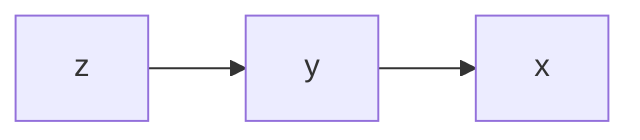
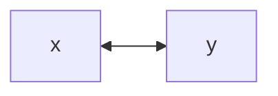
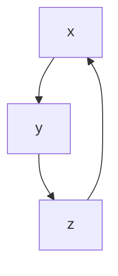

#多元函数积分学 
[[2-二重积分]]

在之前我们也简单介绍了三重积分,在学习完二重积分后我们来研究三重积分的计算

显然,三重积分也理应像二重积分可以转换为三次积分,但是对积分区域的解析将会变得复杂,故我们先将其分为一次积分和一个二重积分,则存在两种路径
___
# 先一后二

先分出一级积分再接上二重积分
___
我们对积分区域进行分离,以分离出z为例:

将积分区域$\Omega$在$xoy$面上的投影记为$D$,则可以变为
$$
\Omega=\left\{ (x,y,z)|(x,y)\in D,z_{1}(x,y) \le z \le z_{2}(x,y) \right\}
$$
这要求垂直于$xoy$面的直线与$\Omega$的交点不超过两个,即在z方向上没有弯曲

我们先分离出z
$$
F(x,y)=\int_{z_{1}(x,y)}^{z_{2}(x,y)}f(x,y,z)dz
$$
我们再把$F(x,y)$在$D$上进行二重积分
$$
\iint_{D}F(x,y)d\sigma=\int_{a}^{b}dx\int_{y_{1}(x)}^{y_{2}(x)}F(x,y)dy
$$
将两者结合起来,可得
$$
\iiint_{\Omega}f(x,y,z)dv=\int_{a}^{b}dx \int_{y_{1}(x)}^{y_{2}(x)}dy \int_{z_{1}(x,y)}^{z_{2}(x,y)}f(x,y,z)dz
$$
对此,积分次序为

___
同理对另外两个方向,也有
$$
\iiint_{\Omega}f(x,y,z)dv=\int_{a}^b dx \int_{z_{1}(x)}^{z_{2}(x)}dz \int_{y_{1}(x,z)}^{y_{2}(x,z)} f(x,y,z)dy
$$

$$
\iiint_{\Omega}f(x,y,z)dv=\int_{c}^d dy \int_{z_{1}(y)}^{z_{2}(y)} dz \int_{x_{1}(y,z)}^{x_{2}(y,z)}f(x,y,z)dx
$$
___
# 先二后一

改变路径,我们先分离二重积分再结合最后一级积分
___
同样对积分区域进行分离,以分离出平行于$xoy$面的截面为例:

我们沿着z轴取截面$D(z)$,将$\Omega$变为:
$$
\Omega:(x,y,z)|\begin{cases}
	a \le z \le b \\
	(x,y) \in D \\
	D \in \{ D(z)|_{z=a}^{z=b} \}
\end{cases}
$$

故积分分离出D:
$$
F(z)=\iint_{D(z)}f(x,y,z)dxdy
$$

再对z进行积分
$$
\int_{a}^b F(z)dz=\int_{a}^bdz \iint_{D(z)}f(x,y,z)dxdy
$$

将其结合起来,即有
$$
\iiint_{\Omega}f(x,y,z)dv=\int_{a}^b dz \iint_{D(z)}f(x,y,z)dxdy
$$
___
# 两种方法的选用

无论是先一后二还是先二后一,关键在于积分区域

对于截面复杂而轴向简单的的积分区域,我们使用先一后二
而对于截面简单的轴向复杂的积分区域我们使用先二后一

当两种都差不多时,应考虑被积函数
___
## 先一后二举例

### 例1

例如,对于一积分区域$\Omega$,其由下面两个曲面围成
$$
\begin{cases}
	z=x^2+2y^2  & 椭圆抛物面 \\
	z=2-x^2 & 抛物柱面
\end{cases}
$$
显然这两个曲面的相交曲线不在一个平面
对于其相交区域的截面来说,给出其显式解析式很复杂
而从轴向来看,直接使用这一方程组来组成不等式就可以表示
$$
x^2+2y^2 \le z \le 2-x^2
$$

同时可以求出投影$D:x^2+y^2 \le 1$即
$$
D:\begin{cases}
	-1 \le x \le 1 \\
	-\sqrt{ 1-x^2 } \le y \le \sqrt{ 1-x^2 }
\end{cases}
$$

故这个积分区域使用先一后二较为方便
___
### 例2

再有一积分区域$\Omega$,由以下曲面围成
$$
\Omega:\begin{cases}
	z=x^2+y^2 \\
	y=x^2 \\
	y=1 \\
	z=0
\end{cases}
$$
即用一弓形柱切割抛物面

此时,对截面,需解$x^2+x^4=z$的方程获取不等式,形式过于丑陋

但是在轴向,只有
$$
0 \le z \le x^2+y^2
$$

投影为$D:x^2 \le y \le 1$即
$$
D:\begin{cases}
	x^2 \le y \le 1 \\
	-1 \le x \le 1
\end{cases}
$$

故使用先一后二
___
## 先二后一举例

### 例1

设积分区域$\Omega$为坐标面和$x+y+z=1$围成的闭区域

此时,对于截面D(z)来说,截面都为三角形
$$
D: \left\{ (x,y)| 0 \le x+y \le 1-z \right\}
$$
轴向此时只为$0 \le z \le 1$

故积分区域化为
$$
\Omega:\begin{cases}
	0 \le x+y \le 1-z \\
	0 \le z \le 1
\end{cases}
$$
___
### 例2

设积分区域$\Omega$为椭球体$\frac{x^2}{a^2}+\frac{y^2}{b^2}+\frac{z^2}{c^2} \le 1$

对于轴向有
$$
-c\sqrt{ 1-\frac{x^2}{a^2}-\frac{y^2}{b^2} } \le z \le c\sqrt{ 1-\frac{x^2}{a^2}-\frac{y^2}{b^2} }
$$

对于投影有
$$
\begin{cases}
	-a \le x \le a \\
	-b\sqrt{ 1-\frac{x^2}{a^2} } \le y \le b\sqrt{ 1-\frac{x^2}{a^2} }
\end{cases}
$$

而从截面来看,有
$$
D:\frac{x^2}{a^2}+\frac{y^2}{b^2} \le 1-\frac{z^2}{c^2}
$$
同时$-c \le z \le c$

如果被积函数主要以z为主,此时用先二后一更好
___
# 轮换对称

对于积分区域,如果变量轮换后积分区域不变,则存在从区域到积分的对称性
___
对于普通的一次积分
$$
\int_{a}^b f(x)dx
$$
其中积分变量x并不重要,它可以是y,也可以是z
重要的是a,b代表的积分上下限,也就是积分区域
___
对于重积分,先以二重积分为例,如果对换x,y后积分区域不变,即x,y有一样的积分区域,则
$$
\iint_{D}f(x,y)dxdy= \iint_{D} f(y,x)dx
$$
___
## 对换

对于三重积分,如果三个变量其中的两个交换后,积分区域不变,则在被积函数里交换这两个变量积分不变

$$
\iiint_{\Omega}f(x,y,z)dxdydz=\iiint f(y,x,z)dxdydz
$$

## 轮换

如果三个变量按顺序依次替换(轮换)后积分区域不变,则在被积函数里做一样的轮换,积分不变

$$
\iiint_{\Omega}f(x,y,z)dxdydz=\iiint_{\Omega}f(y,z,x)dxdydz
$$

