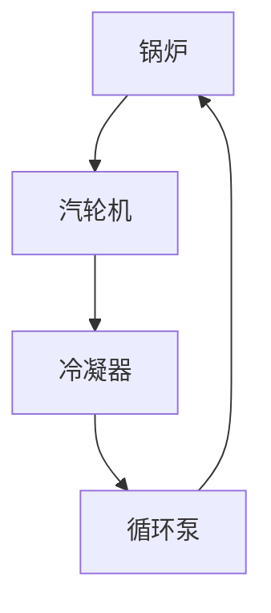
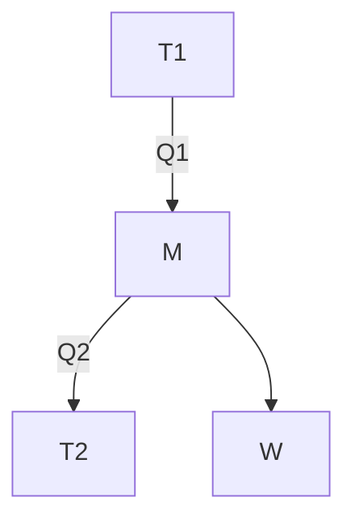
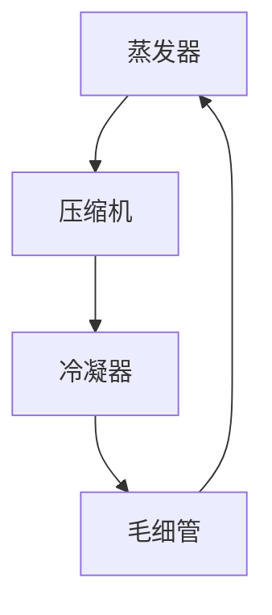
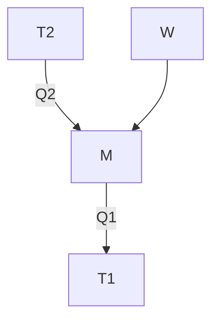
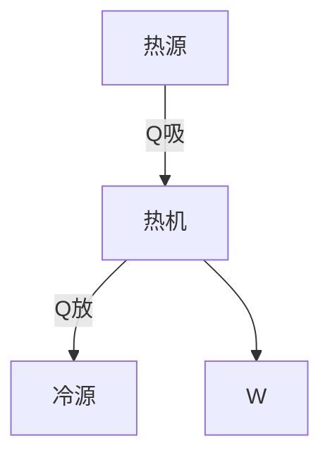

# 引入

## 热能及其利用

工程热力学是能源科学的一门基础理论课

能源是为人类生产和日常生活提供各种能量和动力的物质资源

在日常我们直接获取的能源称为一次能源,如:风能,水利能,太阳能,地热能,此外还有常规燃料中的化学能和核燃料的原子能

而其中风能,水利能是机械能
而太阳能,地热能,化学能和原子能一般是热能
所以90%的一次能源是以热能形式产生的

另外机械能和电能之间可以相互转化,利用电化学和光电效应,太阳能和化学能也能转化为电能
___
对于能源的形态和利用中我们可以看到热能在能源里占据了主导地位,故而我们关心热能的利用

其中我们直接利用是将其用于加热物体,而更重要的是将其转化为机械能再转化为电能这种间接利用,这占了热能去向的80%
___
故而我们工程热力学的研究对象是热能和机械能之间的相互转化规律,并且研究提高转换效率的方法,由此再建立起能量开发利用和节能的理论基础
___
## 工程热力学的研究内容

热能和机械能的相互转化依赖于一些装置,其中热能向机械能转换的装置称为动力装置,而将机械能向热能转换的有制冷装置和热泵装置

对于简单的蒸汽动力装置,对应的是朗肯循环(Rankine cycle),它有四个核心部件:锅炉,汽轮机,冷凝器还有循环泵

在锅炉里的管子中水吸收煤燃烧释放的热量转化为高温高压的水蒸气,进而进入汽轮机推动汽轮机转动做功(接入发电机发电),做功后带有余热的气体进入冷凝器冷凝为饱和液,再由循环泵送回锅炉

这个循环整体上我们可以抽象为物质从高温热源吸收了热量,再经过某装置将这热量一部分转化为功输出,再将剩下的热量释放到低温热源

这称为热力学原理图

我们再以制冷装置为例,它也由四个核心部件组成:压缩机,蒸发器,毛细管和冷凝器

压缩机对高温的低沸点的工质做功进行压缩,压缩后压强增大温度增大,经过冷凝器对外放热降温,再经过毛细管(节流阀)降压,部分汽化,最后进入蒸发器从外界吸热重新化为高温气体

这个循环是将热量从低温热源吸收到工质,从外界输入功,再将热量从工质释放到高温热源

由此我们研究两者共同的规律性内容:

无论是将热能转化为机械能还是将机械能转化为热能,都需要对研究能量的转换,对应的基本概念和基本定律是我们需要研究的,对应的详细内容是热力学第一定律和热力学第二定律

而在两个循环中,我们都借助了工质实现能量的转移,为了更好的实现,我们需要研究工质的热力性质,包括理想气体和实际气体的研究

最后我们是利用了热力过程和热力循环,故而我们需要研究它们的基本规律

这些就是工程热力学的主要内容
___
## 工程热力学的研究方法

对于工程热力学的研究方法,我们有微观方法,即由于物质是由微粒组成的,我们研究微粒行为的统计方法,即统计热力学

我们也有宏观的方法,将工质看作整体,着眼于其整体行为,是经典热力学,是由基本的经验定律推理出普遍结论,再用于指导实际应用
___
对此,工程热力学这门课程概念多,术语多,公式多,计算多,工程背景和科学抽象多,系统性强
___
# 热能动力装置

我们把从燃料燃烧中得到热能,以及利用热能得到动力的整套设备称为**热能动力装置**,简称**热机**

热机分两大类,蒸汽动力装置,即火电循环装置,另一类是燃气动力装置,包括内燃机,燃气轮机装置,喷气发动机
___
## 蒸汽动力装置

设备是:锅炉,汽轮机,冷凝器和水泵(循环泵)

- 锅炉:吸热,$Q_{吸}$
燃料在锅炉中燃烧,化学能转化为热能,锅炉内玻璃管中的水吸收热量转变为水蒸气,再进入过热器变为过热蒸汽,此时高温高压的蒸汽具有做功的能力

- 汽轮机:做功,$W$
蒸汽导入汽轮机后通过喷管膨胀,速度增大,热力学能转化为动能,蒸汽推动叶片使轴转动做功

- 冷凝器:放热,$Q_{放}$
做功后的蒸汽从汽轮机进入冷凝器,被冷却为冷凝水

- 循环泵:加压
冷凝水由水泵加压送回锅炉,进行循环
___
## 燃气动力装置

以内燃机的汽油机为例,其结构为:气缸,活塞,曲柄连杆,火花塞,进气阀和排气阀

四冲程汽油机的冲程如下:

- 吸气
吸入空气

- 压缩:压缩气体,喷入燃油,点火,气体压强和温度增大,$Q_{吸}$
燃料和空气的混合物在气缸中燃烧,释放出大量的热能,产生的烟气的温度压强高于周围的介质,具有做功的能力

- 膨胀:做功$W$,气体压强和温度下降
燃气在气缸中膨胀做功,推动活塞,气体能量通过曲柄连杆传到飞轮,转换为飞轮的动能,飞轮带动曲轴向外输出功

- 排气:排出废气,气体压强和温度下降,扫气,$Q_{放}$
飞轮带动的曲轴同时完成活塞的逆向移动,排出废气,完成循环
___
## 研究

工程热力学不深入研究各种热机的具体结构和特征,而是提取热机的共同问题进行探讨

热能动力装置总是通过某种媒介物质,从某个能源获取热能,从而具备做功的能力,并对机器做功,又把余下的热能排向环境介质

共同的本质是由媒介物质通过吸热-膨胀做功-放热

我们把实现热能和机械能相互转化的媒介物质称为**工质**,将与工质进行热量交换的物质系统称为**热源**
___
## 工质

工质就是实现能量传递和转换的物质,如在内燃机中是燃气,在蒸汽动力装置里是水/水蒸气

对于工质,我们要求其热力学性质良好,化学性质稳定,此外还有安全性,环保性,经济性的考虑

而热能变为功通常通过体积膨胀来实现,所以常选择气态物质
___
## 热源

热源是工质从中吸取或向其排放热能的物质系统

根据温度高低,我们可以将热源分为高温热源(热源)和低温热源(冷源)

根据温度是否变化,我们又可以将热源分为恒温热源和变温热源
___
# 热力系统

人为分割出来作为热力学分析对象的有限物质系统称为**热力系统**,简称为**系统**,或者体系

确定系统后,系统之外能与系统发生质能交换的物体称为外界,系统与外界的分界面称为边界

整理热力系统的目的是考虑热力系统与外界的相互作用,包括质量和能量的交换,其作用必须通过边界
___
系统和边界的特性有:

研究的目的不同,对象不同,其热力系统也不同,系统和外界的相互作用也是不同的

边界可以是真实或虚拟,固定或运动
___
根据系统和外界质量交换的情况,与外界无质量交换的称为**闭口系**,使用控制质量(Control Mass)分析法(CM法)

与外界有质量交换的称为**开口系**,使用控制容积(Control Volumn)分析法(CV法)
____
根据系统与外界能量交换的情况,与外界无能量交换的系统称为**绝热系**

在此之上如果既无能量交换也无质量交换的称为**孤立系**,任意一个系统加上外界就是孤立系
___
另外根据其物理化学性质可分为均匀系和非均匀系,根据其工质种类可分为单元系和多元系,根据物质的相态可分为单相系和多相系,等等

选择系统是热力学分析的第一步,直接决定了分析的难易程度
___
热力学研究里最重要的一个系统称为**简单可压缩系**,由可压缩流体构成,与外界交换的功只有一种可逆体积变化功,工程上遇见的绝大多数系统可视为简单可压缩系
___
# 热力状态和基本状态参数

工质在热力设备中通过吸热,膨胀,排热等过程中完成热能和机械能的转换,在这些过程中工质的宏观物理状况随时变化

我们把工质在热力变化过程中某一瞬间所呈现的宏观物理状况称为**热力学状态**,简称状态,描述工质所处状态的宏观物理量称为**状态参数**
___
## 状态参数

工程热力学主要从整体上去研究工质所处的状态及其变化规律,而不从微观角度去研究个别粒子的行为和特征,故而使用宏观量去描述工质的状态,即大量分子运动的宏观平均效果

状态参数的部分或全部发生变化则说明系统的状态发生变化,所以状态参数确定了,则系统的状态也就确定了,反之亦然,具有单值性,状态参数和状态一一对应

同时状态参数的变化量只与初态和终态有关而与路径无关,这就是状态参数的积分特征,表现在数学上则是点函数/态函数
___
状态参数分为两种,与系统所含物质总量无关的称为**强度量**,如压强$p$和温度$T$

与系统含有物质总量有关的称为**广延量**,如体积$V$,内能$U$,熵$S$,焓$H$等

广延量的比参数(单位工质的广延量)具有强度量的性质,不具有可加性,比参数用小写字母表示
$$
\begin{gather}
	比体积:v=\frac{V}{m} & 比内能:u=\frac{U}{m} \\
	比焓:h=\frac{H}{m} & 比熵:s=\frac{S}{m}
\end{gather}
$$
___
## 基本状态参数

另外可以直接或者简单测量的状态参数,称为**基本状态参数**,如温度$T$,压强$p$和比体积$v$

### 温度

传统上我们认为温度是物体冷热程度的量度,冷的物体温度低,热的物体温度高

微观上温度是衡量物质分子热运动的激烈程度,或者说分子平均动能的量度

在热力学上,我们将温度视为确定一个系统是否与其他系统处于热平衡的物理量

>热力学第零定律:如果两个热力系统分别与第三个热力系统处于热平衡,则这两个热力系统也必然处于热平衡

对此,处于同一**热平衡状态**的各个热力系,必然有某个宏观量是相同的,这个量就是**温度**

第零定律也给出了温度测量的理论基础,温度测量的仪器是温度计,温度计的感应元件应该在温度变化时有某物理量的显著变化

温度的数值表示法称为温标,建立一个温标需要确定温度的基准点和分度方法,选定测量物质的某种物理性质测量温度的是经验温标

摄氏温标规定一个标准大气压下,纯水的凝固点为0摄氏度,沸点为100摄氏度

华氏温标与摄氏温标的刻度相同,基准点改为盐水熔点是0华氏度,人体发烧的温度是100华氏度

华氏温标和摄氏温标的换算为
$$
t_{F}/°F=\frac{9}{5}t_{C}/°C+32
$$

这两种温标的缺点是与物质属性有关,国际单位制上确定热力学温标为测定温度的基本温标

它的理论基础是热力学第二定律,与物质属性无关,单位是开尔文($K$),规定水的三相点温度为$273.16K$,分度为水三相点温度$\times \frac{1}{273.16}$,热力学温标与理想气体温标一致,单位相同

因为热力学温标无法直接测量,国际上采用实施方便又接近热力学温标的ITS-90温标,这又称为实验温标
___
### 压强

压强,也称为压力,是指单位面积上所受到的垂直作用力
$$
p=\frac{F}{A}
$$
在单位上压强有

- 国际单位制(SI):帕斯卡($Pa$)

- 工程制:$1 at=1kgf \cdot cm^{-2}=9.80665\times 10^4 Pa$ 工程大气压

- 标准大气压:$1atm=760 mm Hg=101325Pa$

- 液柱表示:$1mmH_{2}O=9.80668Pa,\ 1mmHg=133.3Pa=1Torr$
___
压力测量所用的仪器常为弹簧管压力计或者U形管压力计,原理是受力平衡,由于压力计的测压元件处于某种环境压力作用下,由此压力计测得的压力是工质的真实压力$p$(绝对压力)和环境压力$p_{b}$之差,叫做表压力$p_{e}$或真空度$p_{V}$

$p>p_{b}$时,压力计称为压力表,读数称为表压力$p_{e}$,$p=p_{b}+p_{e}$

$p<p_{b}$时,压力计称为真空表,读数称为真空度,$p=p_{b}-p_{V}$

环境压力一般是大气压但不绝对,大气压力随时间地点不同而变化,需要通过大气压力计测得
___
### 比体积

比体积是单位质量物质所占的体积,也称为质量体积,单位$m^3\cdot kg^{-1}$
$$
v=\frac{V}{m}
$$
这是密度的倒数,故而我们直接测量密度,典型的方法有定容法和振动管法
___
# 平衡状态

当一个热力系统在不受外界影响(重力场除外)的条件下,系统的宏观状态保持不变,也就是系统的状态参数不随时间变化的状态,称为**平衡状态**,简称**平衡态**

热力学重点研究的就是平衡态,以及平衡态之间的热力变化过程

热力系常处于不平衡状态,但总会在某种势差的作用下趋于平衡,热力学里的势差有压力差,温度差,化学势差等
$$
热力平衡状态
\begin{cases}
	热平衡:无温差-\Delta T\equiv 0\\
	力平衡:无压差-\Delta p\equiv 0 \\
	相或化学平衡:无化学势差-\Delta \mu\equiv 0
\end{cases}
$$
实现平衡的充要条件是系统内部及系统与外界之间不存在势差

引入平衡状态的意义是可以用一组确定的状态参数来描述系统的状态

平衡和稳态不同,稳态是单单指系统的物理参数不随时间变化,但可能受外界影响如稳态导热,这种稳态是由外界势差维持的,若去掉外界影响则状态变化,稳态不一定平衡,平衡一定是稳态

而平衡与均匀也不同,平衡是对时间而言的,而均匀是对空间而言的,平衡不一定均匀,但单相平衡态则一定是均匀的
___
平衡状态可用一组状态参数来描述,那么我们需要给出全部的状态参数吗?

>状态公理:对于组成一定的物质系统,若存在着n种可逆功的作用,即系统进行可逆过程时和外界交换的功量的,则决定该系统平衡态的状态参数有n+1给,多出来的1是考虑系统与外界的热交换作用

对于简单可压缩系统(单相系)来说,系统与外界只交换一种可逆的体积变化功,再加上热交换,则n=2,此时,使用两个状态参数就能确定系统状态
___
## 状态方程式

状态方程式是平衡状态下基本状态参数$p,v,T$之间的关系,可以写成两种形式
$$
\begin{matrix}
	 & T=T(p,v) \\
	f(p,T,v)=0 & p=p(T,v) \\
	 & v=v(p,T)
\end{matrix}
$$
状态方程的具体形式取决于工质的性质,如理想气体的状态方程式为
$$
pv=RT
$$
实际气体的范德瓦尔方程为
$$
\left( p+\frac{a}{V_{m}^2} \right)(V_{m}-b)=RT
$$
___
## 状态参数坐标图

对于单相简单可压缩系统,由于独立参数只需要两个,可用两个独立状态参数组成二维平面坐标系,坐标图中任意一点代表系统某一确定的平衡状态,任一平衡状态也对应图上一个点,这种图称为**状态参数坐标图**

常见的有$p-v$图,$T-s$图,$h-s$图等
___
# 热力过程

系统从一个状态向另一个状态变化时经历的全部状态的总和称为**热力系统**

热力学仅对平衡状态进行描述,平衡表示宏观上是静止的,而实现能量交换需要通过过程来完成,过程意味着平衡被破坏

系统处于平衡状态时能量不发生转化,而非平衡状态无法简单描述
___
## 准静态过程

为了解决这个问题,热力学引入准静态过程

考虑一个一般热力过程,在竖直的气缸活塞系统,活塞上放置一重物,在这初始条件到达平衡后,突然撤去重物,系统在一段时间后再次到达平衡,这样一个过程中间的状态是非平衡状态,无法简单描述

我们改变一下,假设重物被分割为无限多层,一层一层逐渐去除,系统在中间无限接近平衡态,我们将这些状态的总和称为准静态过程

准静态过程是由一系列连续的平衡态组成的,也称准平衡过程,实现准静态过程需要在时间上缓慢进行,并且势差无限小

准平衡过程是实际过程进行得足够缓慢的极限情况,缓慢是热力学上的,即破坏平衡所需时间(外部影响时间)远大于恢复平衡所需时间(弛豫时间),故而有足够的时间恢复平衡,一般的工程过程都可以认为是准平衡过程,有特别说明的除外

准平衡状态的意义是它有确定的状态参数变化来描述过程,在参数坐标图上也有一条曲线用于表示过程
___
## 可逆过程

我们再考虑气缸活塞系统,如果考虑摩擦,气体膨胀系统对外做功,则有
$$
W_{内}=W_{外正}+W_{摩}
$$
而其逆过程,外界向系统输入功压缩气体,需要扣除摩擦损失的功则有
$$
W_{内}=W_{外逆}-W_{摩}
$$
可见经过正逆两个过程后,外界,系统,活塞不能同时恢复原状

若无摩擦则有
$$
W_{内}=W_{外正}=W_{外逆}
$$
这样经过正逆两个过程后,外界,系统,活塞能同时恢复原状

系统经历某一过程后,如果能使系统与外界同时恢复到初始状态而不留下任何改变,则此过程为**可逆过程**,否则此过程称为**不可逆过程**

可逆过程的实现条件是准平衡过程并无耗散效应,过程不可逆的根源是存在耗散效应和不平衡势差

可逆过程和准平衡过程的区别是有无耗散效应,可逆过程必然是准平衡过程,而准平衡过程是可逆过程的必要条件

引入可逆过程的意义是:
- 准平衡过程是实际过程的理想化过程,但不是最优过程,可逆过程是最优过程
- 可逆过程的功和热完全可用系统内工质的状态参数表达,可不考虑系统与外界的复杂关系
- 虽然可逆过程实际上并不存在,但它是一种有用的科学抽象,是一切实际过程的理想化极限模型,因而可用作为实际过程中能量转换效果比较的标准,并借以指出努力的方向
- 先按理想情况(可逆过程)进行处理,用系统参数加以分析,然后再考虑不可逆因素进行修正,这是热力学分析的惯用方法
___
# 功和热

## 功

在力学上,功是指力乘以物体在力方向上的位移,表达式为
$$
\begin{gather}
	\delta w=Fdx \\
	w=\int Fdx
\end{gather}
$$

在热力学角度,功的系统和外界交换能量的一种形式,是通过边界所传递的能量,它的全部效果相当于表现为举起重物

举起重物指的是过程产生的效果,在简单可压缩系统里,我们只研究体积变化功
___
对于可逆过程的膨胀功,即体积变化功,假设活塞中的气体在无势差的条件下从状态1膨胀到状态2,过程为可逆过程,则该过程所做的膨胀功为
$$
\begin{gather}
	\delta W=pAdx=pdV \\
	W=\int_{1}^2pdV
\end{gather}
$$
故而我们可得
$$
W=\int pdV
$$
故而$p-V$图上过程线与横轴围成的面积即为功的数值,所以$p-V$图也被称为示功图

可逆过程的功,可以用过程中工质状态参数的变化来进行计算

功与过程的路径有关,是过程量,在某一状态下没有功的概念
___
在热力学里面功有正负的意义,热力学中规定系统对外做功取正值,外界对系统做功取负值

功的数值不仅决定于工质的初终态,而且还和过程的中间途径有关,因此功是过程量

微元过程做出过程量用$\delta$表示,如微功量用$\delta w$表示,而状态参数为微增量,用$d$表示,如$dp,dv,dT$

功是有规则的宏观运动能量的传递,做功过程中往往伴随着能量形态的转换
___
## 热量

热量是系统与外界交换能量的另一种形式,仅仅由于温度不同而通过边界传递的能量

对于可逆过程的热量,表达式为
$$
\delta Q=TdS
$$
类似于功的
$$
\delta W=pdV
$$
热量是在温度的推动下表现为熵变的能量,而功是在压力的推动下表现为容积变化的能量

同样,对于1-2过程
$$
Q=\int_{1}^2 TdS
$$
在$T-S$图上过程线和横轴围成的面积等于热量的数值,所以$T-S$图也称为示热图

热力学中规定热量的正负如下:系统从外界吸热为正,系统对外界放热为负
____
# 热力循环

要想连续做功,过程必须循环

我们定义:工质经历一系列状态变化后,回到原来的状态,即封闭的热力过程,则称为**热力循环**,简称**循环**
___
根据循环进行的方向,我们分出正循环和逆循环

在状态图上,沿顺时针方向进行,消耗热量获得功量,如蒸汽动力循环和内燃机动力循环装置,这称为正循环

在状态图上,沿逆时针方向进行,消耗功量,获得热量,如制冷循环和热泵循环,这称为逆循环
___
根据组成循环的过程,我们分出两种

循环全部由可逆过程组成的称为**可逆循环**,其中有部分过程或者全部过程是不可逆过程的称为**不可逆循环**
___
评价热力循环的指标是收益/代价

对于正循环来说,我们计算热效率
$$
\eta_{t}=\frac{W}{Q_{1}}
$$
即对外做功和从高温热源所吸热量的比值

对于逆循环
其中制冷装置我们计算制冷系数
$$
\epsilon=\frac{Q_{2}}{W}
$$
即从低温热源转移的热量和所消耗的功的比值
而热泵装置我们计算制热系数
$$
\epsilon'=\frac{Q_{1}}{W}
$$
即向高温热源释放的热量和所消耗的功的比值

在相同的低温和高温热源条件下,制热系数=制冷系数+1

