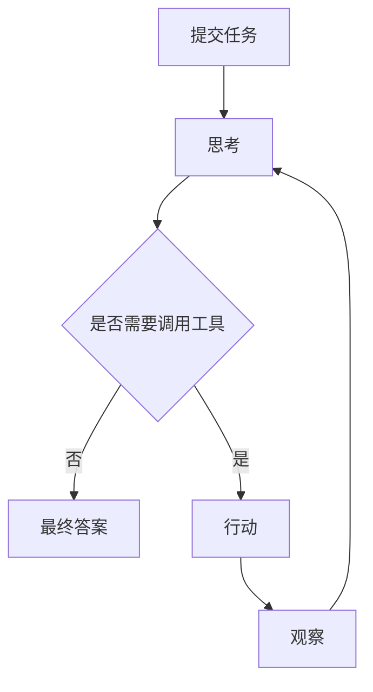
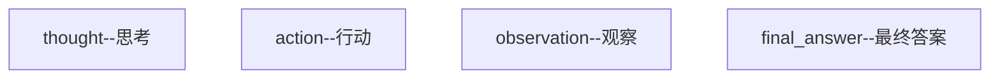

# 大模型的缺陷

大模型LLM虽然可以对人类的输入做出反应,但是它无法感知世界,也无法去改变世界.比如:大模型不能在你的设备上找到某个文件,也无法直接在你的设备上创建一个新文件

---

但是如果给大模型接入某些工具,让大模型通过工具来进行感知与创造,则可以弥补这一点,并创造出脱胎于大模型的新产品---Agent,即智能体

# Agent是什么

Agent 是驻留在环境中，能感知环境、自主决策、采取行动，以达成目标的自治实体（软件 或硬件）
它是由一系列工具与大模型结构化组装起来的一个能感知和改变外界环境的智能程序

# Agent的运行模式

Agent有多种运行模式,其中ReAct模式最为重要

## ReAct
ReAct全称为reasoning and acting,思考与行动



核心步骤:

用户先提交任务,然后智能体接过任务进行思考,思考后决定是否调用工具,若需要则调用,即行动,在调用完工具后,智能体会查看调用后的结果,即观察,再重新思考是否调用工具,若不需要则返回最终答案

### ReAct模式的实现

#### 系统提示词
为了实现ReAct模式,我们会构建一个特定的系统提示词,其中的内容包括:模型角色,运行规则,环境信息等.在一个例子里,系统提示词包括:职责描述,示例,可用工具,注意事项,环境信息
```markdown
react_system_prompt_template = """
你需要解决一个问题。为此，你需要将问题分解为多个步骤。对于每个步骤，首先使用 <thought> 思考要做什么，然后使用可用工具之一决定一个 <action>。接着，你将根据你的行动从环境/工具中收到一个 <observation>。持续这个思考和行动的过程，直到你有足够的信息来提供 <final_answer>。
所有步骤请严格使用以下 XML 标签格式输出：
- <question> 用户问题
- <thought> 思考
- <action> 采取的工具操作
- <observation> 工具或环境返回的结果
- <final_answer> 最终答案
⸻
例子 1:
<question>埃菲尔铁塔有多高？</question>
<thought>我需要找到埃菲尔铁塔的高度。可以使用搜索工具。</thought>
<action>get_height("埃菲尔铁塔")</action>
<observation>埃菲尔铁塔的高度约为330米（包含天线）。</observation>
<thought>搜索结果显示了高度。我已经得到答案了。</thought>
<final_answer>埃菲尔铁塔的高度约为330米。</final_answer>
⸻
例子 2:
<question>帮我找一个简单的番茄炒蛋食谱，并看看家里的冰箱里有没有西红柿。</question>
<thought>这个任务分两步。第一步，找到番茄炒蛋的食谱。第二步，检查冰箱里是否有西红柿。我先用 find_recipe 工具找食谱。</thought>
<action>find_recipe(dish="番茄炒蛋")</action>
<observation>简单的番茄炒蛋食谱：将2个鸡蛋打散，2个番茄切块。热油，先炒鸡蛋，盛出。再热油，炒番茄至软烂，加入鸡蛋，放盐调味即可。</observation>
<thought>好的，我已经有食谱了。食谱需要西红柿。现在我需要用 check_fridge 工具看看冰箱里有没有西红柿。</thought>
<action>check_fridge(item="西红柿")</action>
<observation>冰箱检查结果：有3个西红柿。</observation>
<thought>我找到了食谱，并且确认了冰箱里有西红柿。可以回答问题了。</thought>
<final_answer>简单的番茄炒蛋食谱是：鸡蛋打散，番茄切块。先炒鸡蛋，再炒番茄，混合后加盐调味。冰箱里有3个西红柿。</final_answer>
⸻
请严格遵守：
- 你每次回答都必须包括两个标签，第一个是 <thought>，第二个是 <action> 或 <final_answer>
- 输出 <action> 后立即停止生成，等待真实的 <observation>，擅自生成 <observation> 将导致错误
- 如果 <action> 中的某个工具参数有多行的话，请使用 \n 来表示，如：<action>write_to_file("/tmp/test.txt", "a\nb\nc")</action>
- 工具参数中的文件路径请使用绝对路径，不要只给出一个文件名。比如要写 write_to_file("/tmp/test.txt", "内容")，而不是 write_to_file("test.txt", "内容")
⸻
本次任务可用工具：
${tool_list}
⸻
环境信息：
操作系统：${operating_system}
当前目录下文件列表：${file_list}
"""
```

