时序图是一种表示交互的图,它展示了各个对象在时间顺序上如何相互操作
# 声明
声明时序图用sequenceDiagram开头
```
sequenceDiagram
```

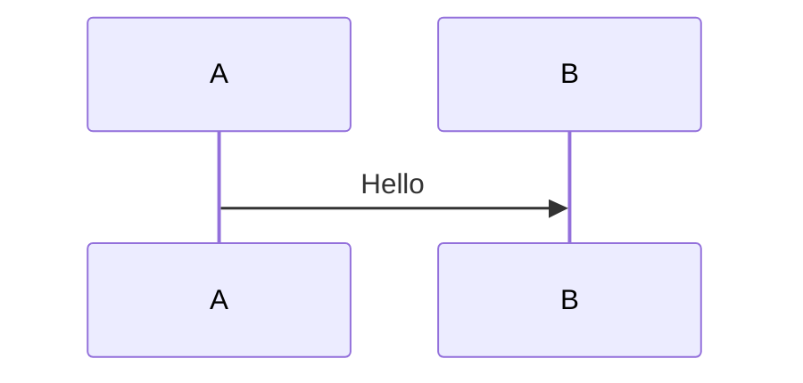
```mermaid
sequenceDiagram
participant A
participant B
A->>B:Hello
```
# 语法
## 对象(参与者)
对象用participant声明
```
participant 对象
```

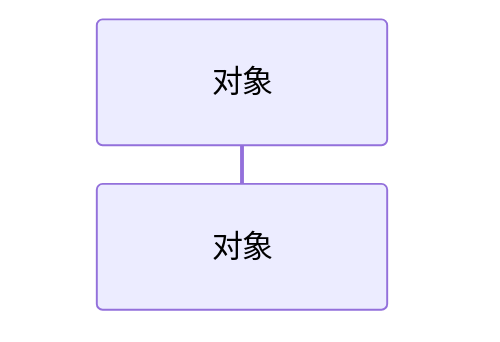
```mermaid
sequenceDiagram
participant 对象
```
对象会生成两个节点和一条时间线,交互会指向这条时间线

如果你想要生成火柴小人的节点样式可以使用actor标注
```
actor 小人
```

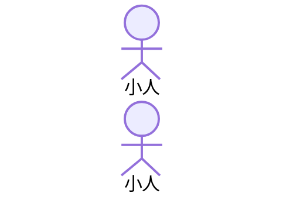
```mermaid
sequenceDiagram
actor 小人
```

在声明对象之后可以用as来声明别名
```
participant 别名 as 对象
```

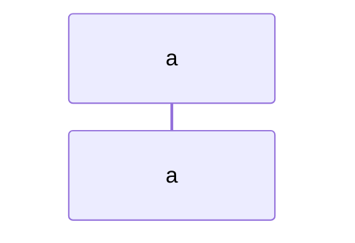
```mermaid
sequenceDiagram
participant A as a
```
可以使用create和destroy来手动创建和销毁对象
默认对象是在全局时间线中存在,手动创建删除会导致其时间线变化
默认如下
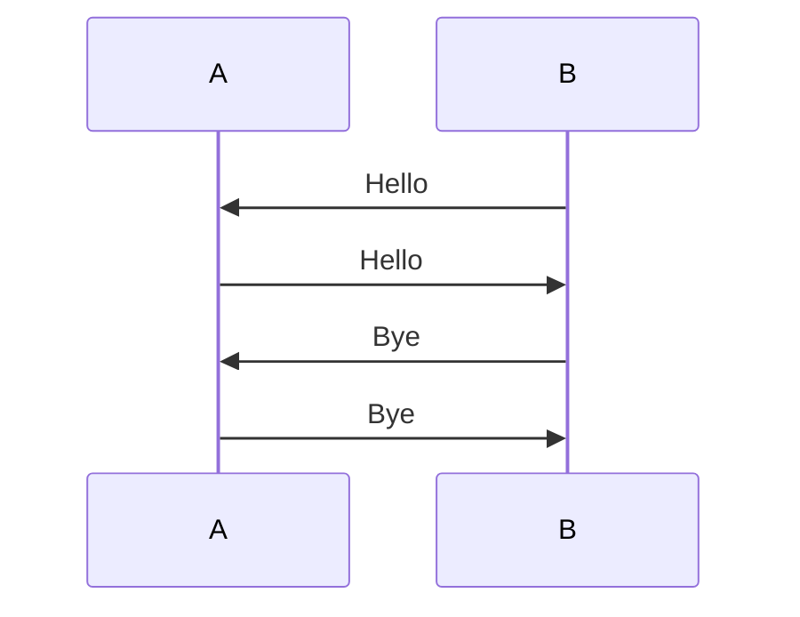
```mermaid
sequenceDiagram
participant A
participant B
B->>A:Hello
A->>B:Hello
B->>A:Bye
A->>B:Bye
destroy A
```
手动创建和删除
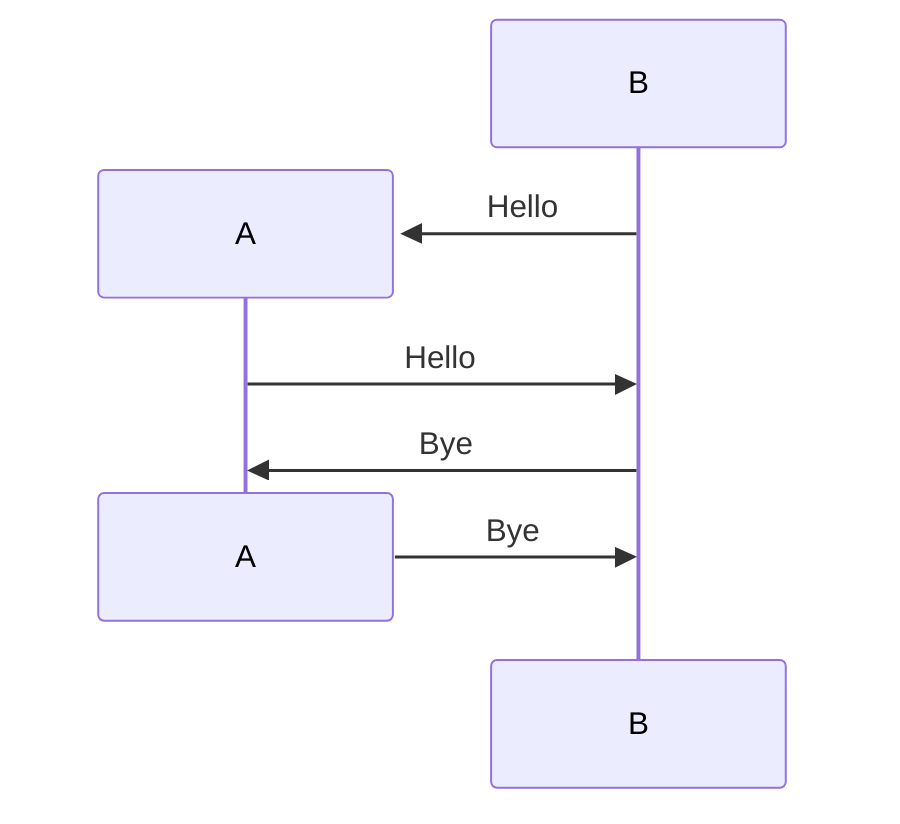
```mermaid
sequenceDiagram
create participant A
participant B
B->>A:Hello
A->>B:Hello
B->>A:Bye
destroy A
A->>B:Bye
```
手动创建默认比全局时间线晚,在创建和销毁前后的一个信息将由节点发出或指向节点
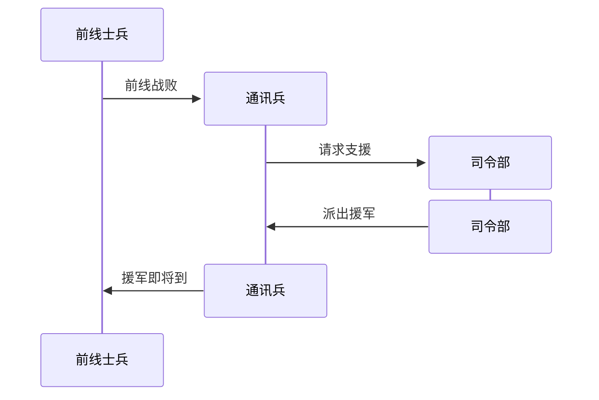
```mermaid
sequenceDiagram
participant A as 前线士兵
create participant B as 通讯兵
A->>B:前线战败
create participant C as 司令部
B->>C:请求支援
destroy C
C->>B:派出援军
destroy B
B->>A:援军即将到
```

## 消息
对象之间的交互由信息来表示,消息用文本显示在一根箭头上,线由发出者指向接收者(可以指向自己)
箭头类型如下

|   类型   |   描述   |
| :----: | :----: |
|   ->   | 无箭头实线  |
|   -)   | 开放箭头实线 |
|   -x   | 叉号箭头实线 |
|  ->>   | 带箭头实线  |
|  -->   | 无箭头虚线  |
|  --)   | 开放箭头虚线 |
|  --x   | 叉号箭头虚线 |
|  -->>  | 带箭头虚线  |
| <<->>  | 双向箭头实线 |
| <<-->> | 双向箭头虚线 |
## 注释
可以用Note来给时序图增加注释
```
Note 位置:内容
```
其中位置可以是over,right of,left of,后面加节点
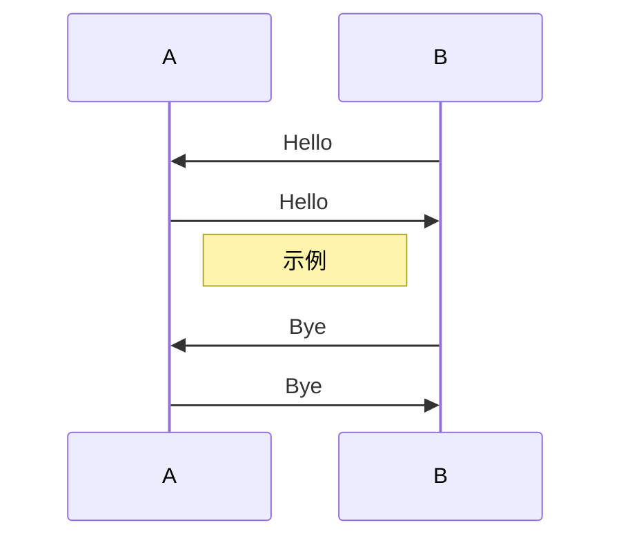
```mermaid
sequenceDiagram
participant A
participant B
B->>A:Hello
A->>B:Hello
Note left of B:示例
B->>A:Bye
A->>B:Bye
destroy A
```
## 激活
可以用activate表示对象在时间线上的某一点被激活,deactivate失活,激活时对应时间线将变为黑色长条
```
activate A
deactivate A
```

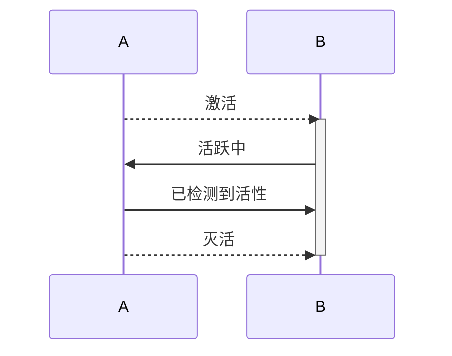
```mermaid
sequenceDiagram
	participant A
	participant B
    A-->>B: 激活
    activate B
    B->>A:活跃中
    A->>B:已检测到活性
    A-->>B: 灭活
    deactivate B
```
可以用+-来简写,写在消息箭头的后面
```
A->>+B:
B->>-A:
```

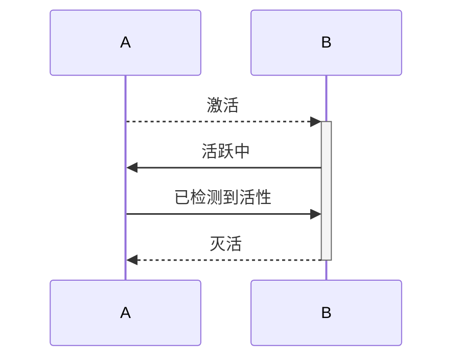
```mermaid
sequenceDiagram
participant A
participant B
    A-->>+B:激活
    B->>A:活跃中
    A->>B:已检测到活性
    B-->>-A: 灭活
```
激活可以叠加
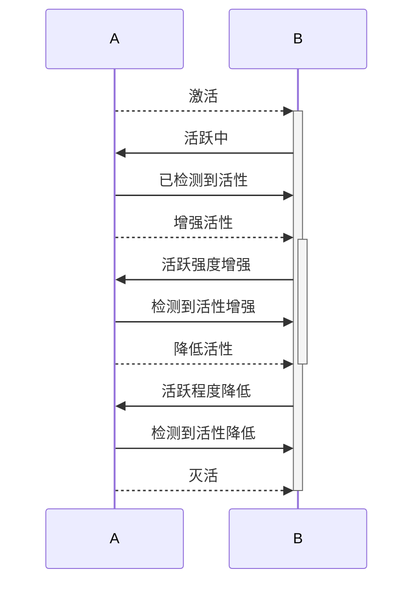
```mermaid
sequenceDiagram
    A-->>+B: 激活
    B->>A:活跃中
    A->>B:已检测到活性
    A-->>+B: 增强活性
    B->>A:活跃强度增强
    A->>B:检测到活性增强
    A-->>B: 降低活性
    deactivate B
    B->>A:活跃程度降低
    A->>B:检测到活性降低
    A-->>B:灭活
    deactivate B
```
## 循环
可以用loop和end来表示循环
```
loop 循环名
	循环内容
end
```

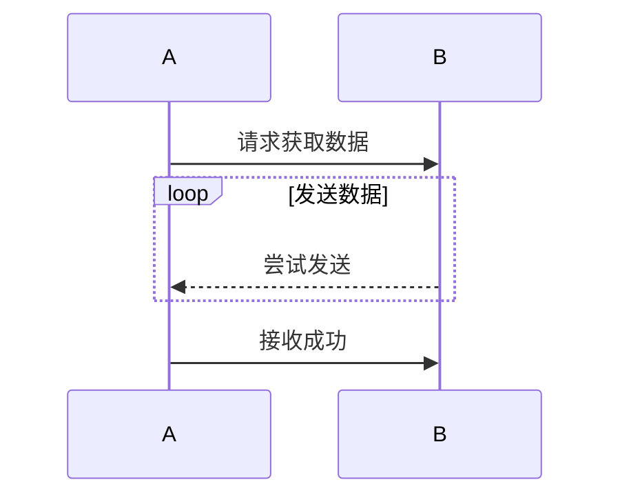
```mermaid
sequenceDiagram
participant A
participant B
A->>B:请求获取数据
loop 发送数据
	B-->>A:尝试发送
end
A->>B:接收成功
```
## 替代
可以使用alt-else-end,.opt-end来表示可替换的内容,opt表示附加可选内容
```
alt 文本
	选择1
else 文本
	选择2
end
opt 文本
	附加内容
end
```

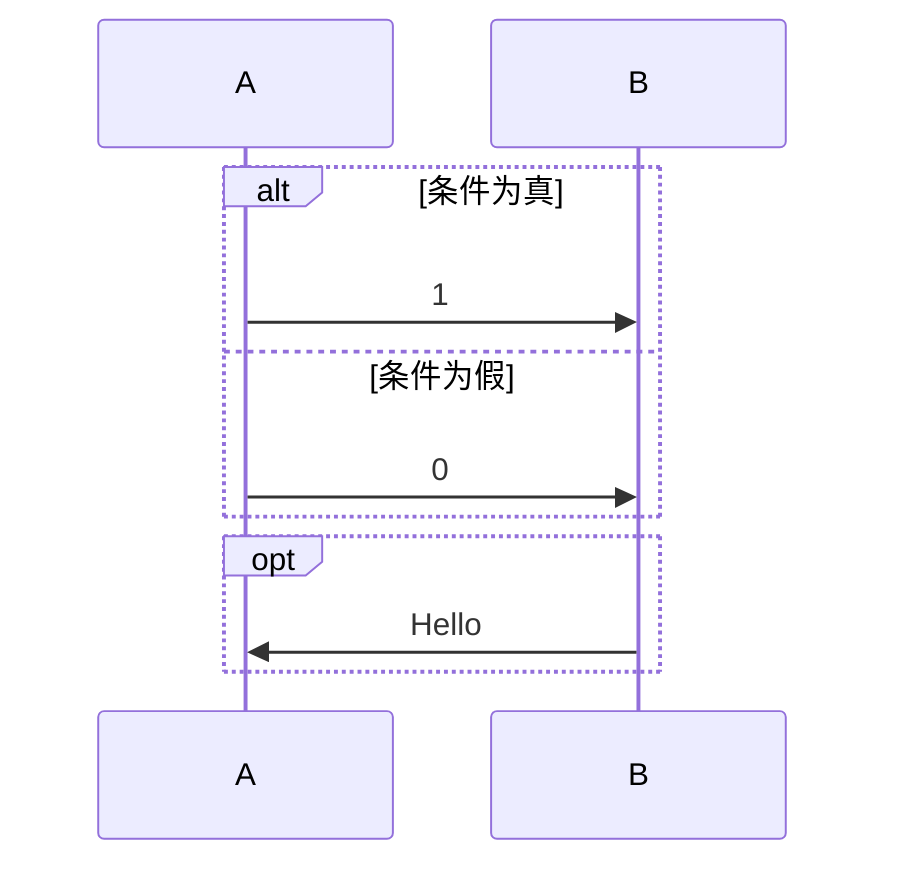
```mermaid
sequenceDiagram
participant A
participant B
alt 条件为真
	A->>B:1
else 条件为假
	A->>B:0
end
opt
	B->>A:Hello
end
```
## 并发
可以使用par-and-end表示同时发生的行为
```
par 文本
	行为1
and 文本
	行为2
end
```

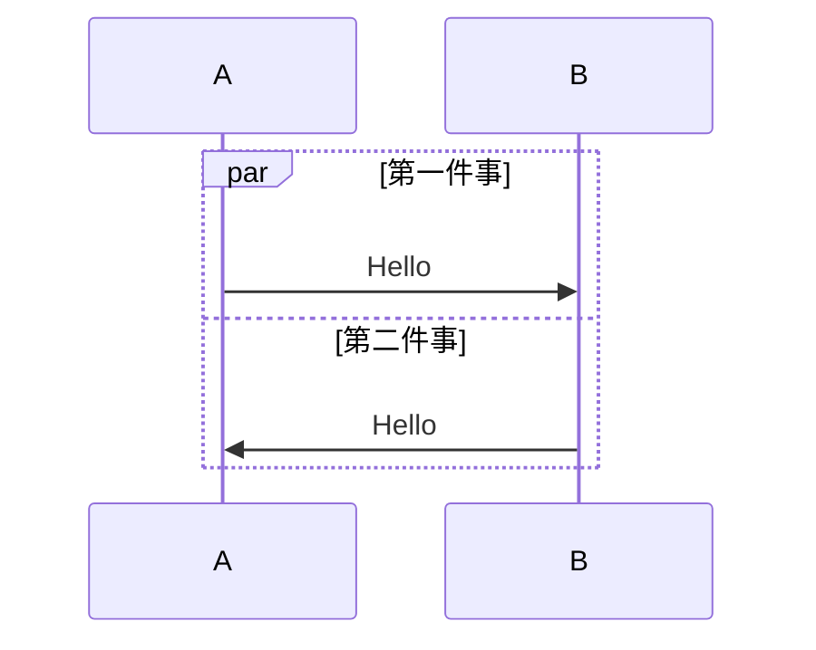
```mermaid
sequenceDiagram
participant A
participant B
par 第一件事
	A->>B:Hello
and 第二件事
	B->>A:Hello
end
```
## 临界
可以用critical-option-end来表示临界,当到达临界条件时触发对应内容
```
critical 文本
	行为
option 临界条件
	行为
option 临界条件
	行为
end
```

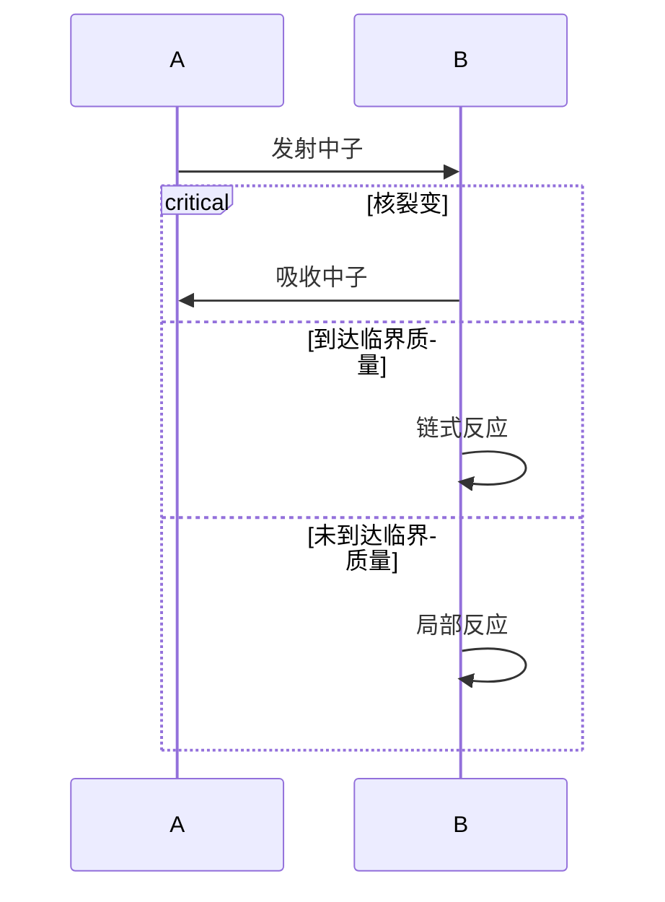
```mermaid
sequenceDiagram
participant A
participant B
A->>B:发射中子
critical 核裂变
	B->>A:吸收中子
option 到达临界质量
	B->>B:链式反应
option 未到达临界质量
	B->>B:局部反应
end
```
## 中断
可以使用break-end来表示符合某种条件时停止某种行为,否则执行
```
break 条件
	行为
end
```

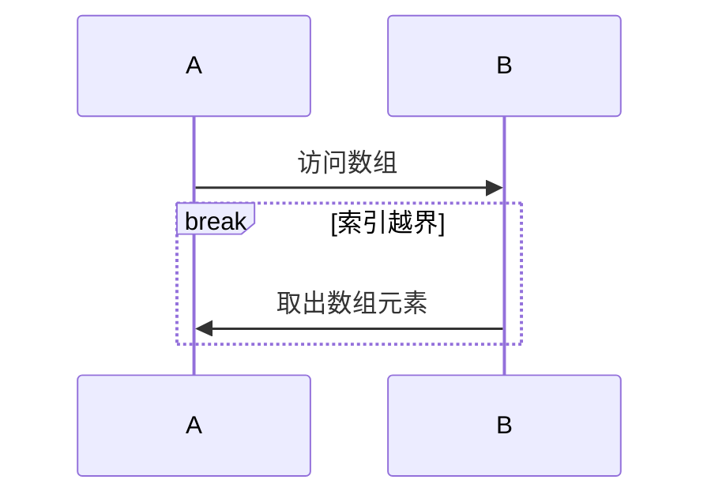
```mermaid
sequenceDiagram
participant A
participant B
A->>B:访问数组
break 索引越界
	B->>A:取出数组元素
end
```
## 分组
可以使用box-end将几个对象分成一组
```
box 文本
participant A
participant B
end
```

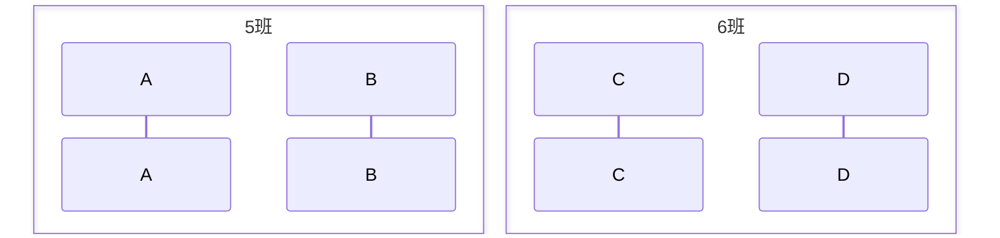
```mermaid
sequenceDiagram
box 5班
participant A
participant B
end
box 6班
participant C
participant D
end
```
分组出来的框声明其颜色,在组名的前面加上颜色的单词
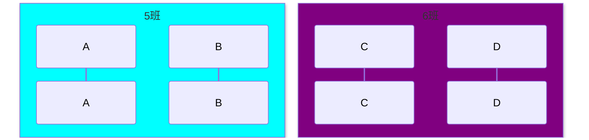
```mermaid
sequenceDiagram
box Aqua 5班
participant A
participant B
end
box Purple 6班
participant C
participant D
end
```
也可以使用rgb和rgba
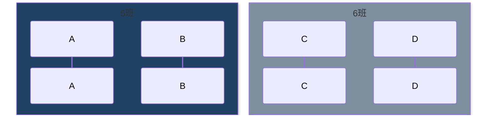
```mermaid
sequenceDiagram
box rgb(33,66,99) 5班
participant A
participant B
end
box rgba(33,66,99,0.5) 6班
participant C
participant D
end
```
## 背景填充
可以使用rect-end来声明一段内容(无论什么内容)的背景颜色
```
rect 颜色
	内容
end
```

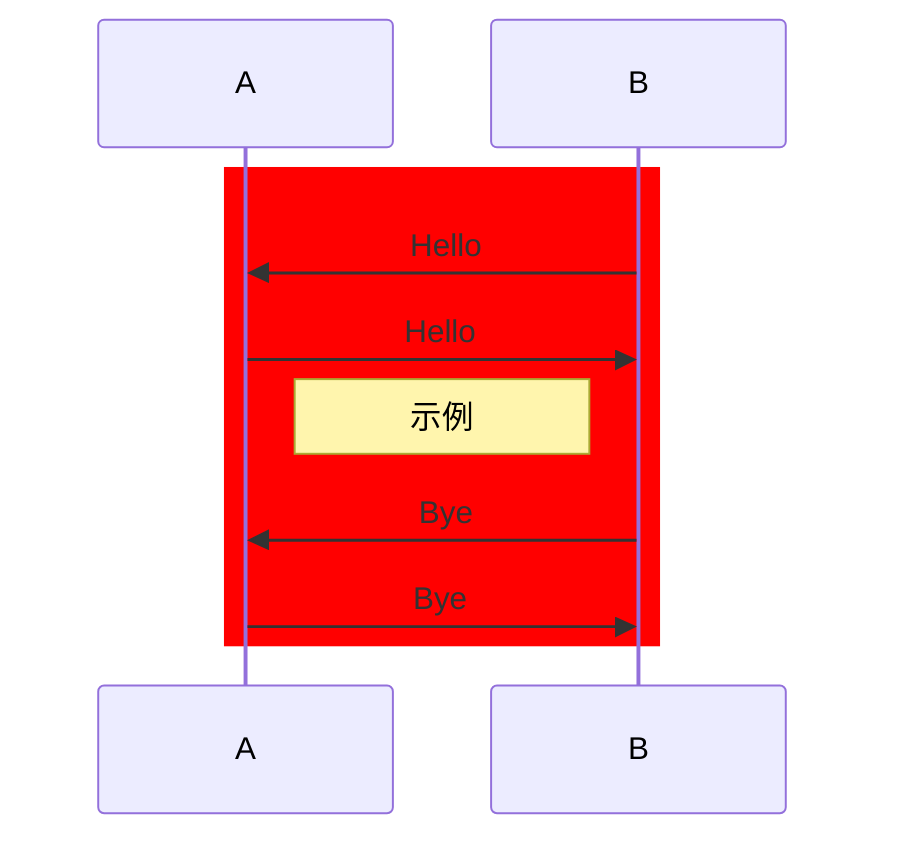
```mermaid
sequenceDiagram
rect red
participant A
participant B
B->>A:Hello
A->>B:Hello
Note left of B:示例
B->>A:Bye
A->>B:Bye
destroy A
end
```

```mermaid
sequenceDiagram
rect Green
    A-->>+B: 激活
    rect Yellow
    B->>A:活跃中
    A->>B:已检测到活性
    A-->>+B: 增强活性
    rect Red
    B->>A:活跃强度增强
    A->>B:检测到活性增强
    A-->>B: 降低活性
    end
    deactivate B
    B->>A:活跃程度降低
    A->>B:检测到活性降低
    end
    A-->>B:灭活
    deactivate B
end
```
## 