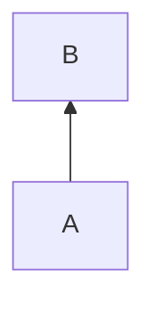

# 流程图声明
## 开头
flowchart或者graph


---

## 布局方向

### 从上到下
TD或者TB


### 从下到上
BT


### 从左到右
LR


### 从右到左
RL


---

# 节点

## 原生节点
### 矩形方框
```
节点名[内容]
```


### 圆角矩形
```
节点名(内容)
```


### 跑道形
```
节点名([])
```


### 菱形判断框
```
节点名{内容}
```


### 圆形节点
```
节点名((内容))
```


### 平行四边形
```
节点名[/内容/]
```


### 反向平行四边形

```
节点名[\内容\]
```


### 六角节点
```
节点名{{内容}}
```


### 子程序
```
节点名[[子程序]]
```


### 数据库圆柱
```
节点名[(内容)]
```


### 双圆环
```
节点名(((内容)))
```


### 梯形
```
节点名[/内容\]
```


### 反向梯形
```
节点名[\反向梯形/]
```


### 书签形
```
节点名>内容<
```


# 连线

## 连线类型

### 普通线

#### 普通实线

```
A --- B
```

```mermaid
graph LR
A --- B
```
obsidian里好像没有这个,默认带箭头

#### 实线箭头

```
A-->B
```

```mermaid
graph LR
A-->B
```

#### 带文本实线

```
A--文本---B
```

```mermaid
graph LR
A--文本---B
```

或者
```
A---|文本|B
```

```mermaid
graph LR
A---|文本|B
```

#### 带文本箭头

```
A--文本-->B
```

```mermaid
graph LR
A--文本-->B
```

或者
```
A-->|文本|B
```

```mermaid
graph LR
A-->|文本|B
```

#### 虚线
```
A-.-B
```

```mermaid
graph LR
A-.-B
```

#### 虚线箭头
```
A-.->B
```

```mermaid
graph LR
A-.->B
```

#### 带文本虚线
```
A-.文本.--B
```

```mermaid
graph LR
A-.文本.--B
```

或者
```
A-.-|文本|B
```

```mermaid
graph LR
A-.-|文本|B
```

#### 带文本虚线箭头
```
A-.文本.->B
```

```mermaid
graph LR
A-.文本.->B
```

或者
```
A-.->|文本|B
```

```mermaid
graph LR
A-.->|文本|B
```

#### 粗线

```
A===B
```

```mermaid
graph LR
A===B
```

#### 粗线箭头

```
A==>B
```

```mermaid
graph LR
A==>B
```

#### 带文本粗线

```
A==文本===B
```

```mermaid
graph LR
A==文本===B
```

或者
```
A===|文本|B
```

```mermaid
graph LR
A===|文本|B
```

#### 粗线带文本箭头

```
A==文本==>B
```

```mermaid
graph LR
A==文本==>B
```

或者
```
A==>|文本|B
```

```mermaid
graph LR
A==>|文本|B
```

#### 隐形线

```
A~~~B
```

```mermaid
graph LR
A~~~B
```

### 拓展线

#### 双向线
```
A<-->B
```

```mermaid
graph LR
A<-->B
```

#### 叉头线
```
 A--xB
```

```mermaid
graph LR
A--xB
```

#### 圆头线
```
A--oB
```

```mermaid
graph LR
A--oB
```
## 连线结构

### 链式连接
```
A 连接 B 连接 C ......
```

```mermaid
graph LR
A-->B-->C
```

### 一连多
```
A 连接 B & C
```

```mermaid
graph LR
A-->B & C
```

### 多连一
```
A & B-->C
```

```mermaid
graph LR
A & B-->C
```

### 交叉
```
A & B --> C & D
```

```mermaid
graph
A & B --> C & D
```

## 连线修饰
### 编号
用0代指第一条线,1代指第二条线......用-代指上一条线,default应用到全局

### 格式
```
linkStyle 编号 参数列表
```

### 参数

#### 颜色
stroke
```mermaid
graph LR
A-->B
linkStyle 0 stroke:red
```
可以直接用单词,或者rgb和#

#### 粗细
stroke-width
```mermaid
graph LR
A-->B
linkStyle 0 stroke-width:8px
```