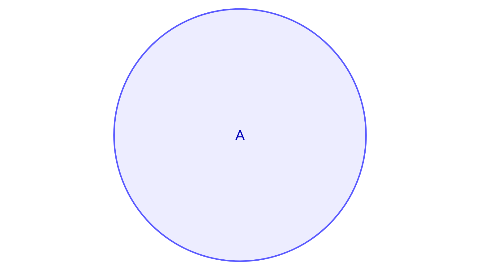
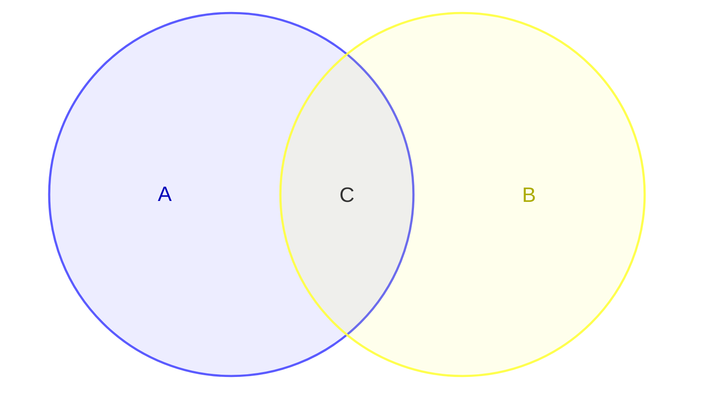
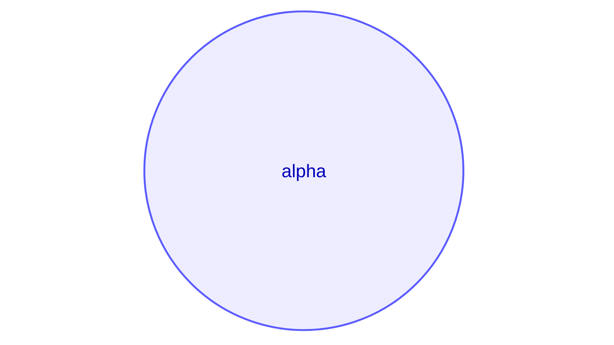
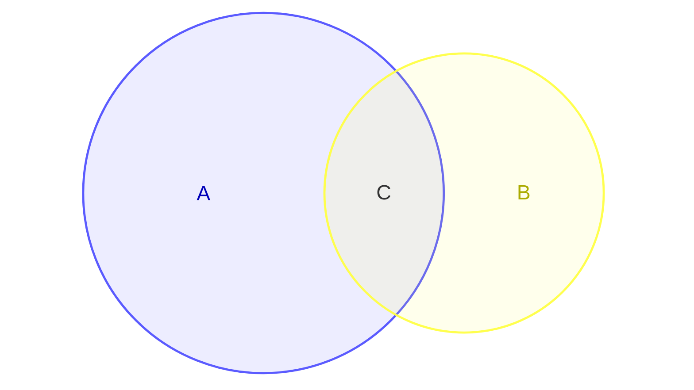
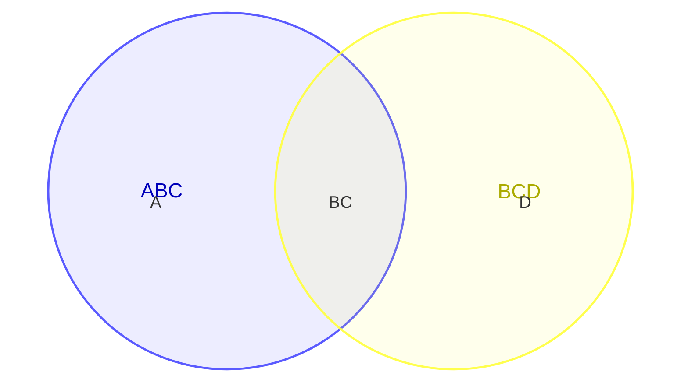
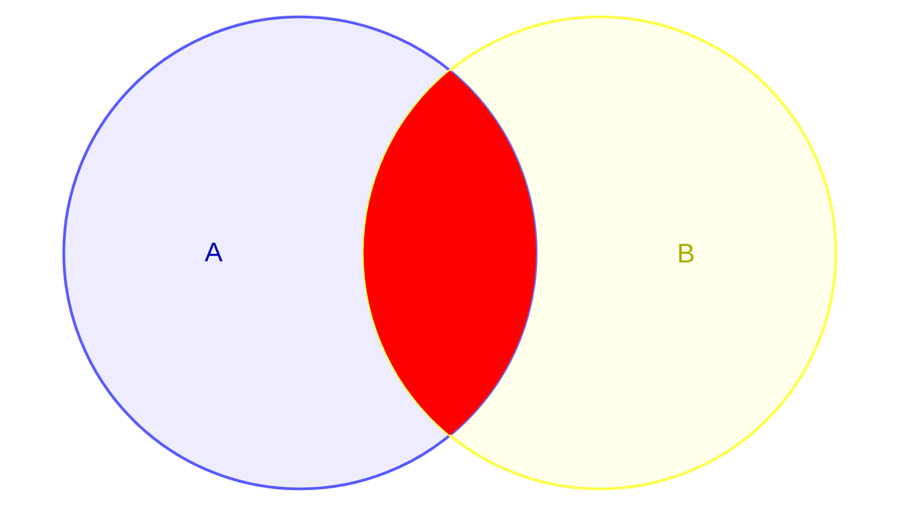

# 声明

韦恩图的声明为
```
venn-beta
```
___
# 集合

单个集合使用
```
set
```

例如
```
venn-beta
	set A
```


两个及以上的集合的交集用
```
union
```

例如
```
venn-beta
	set A
	set B
	union A,B[C]
```


___
# 标识符

在声明集合之后需要给集合一个标识符,在没有专门写出标签的时候标识符兼当标签

```
set 标识符
```

标识符可以是单独的词比如`A`,`Set_A`,也可以是带引号的`"My set"`

交集必须指定之前声明过的集合的标识符,而且无法指派一个专门的标识符

```
union 集合A,集合B[交集]
```
___
# 标签

标签即集合所显示的文字,同样可加引号可不加

```
set 标识符[标签]
```

```
set A[alpha]
```


___
# 尺寸

我们可以在集合或者交集后面指定它们的尺寸大小,默认为10
```
set A[Alpha]:10
```

```
set A:5
set B:3
union A,B[C]:1
```


___
# 文本节点

我们可以在集合内部加入文本,用缩进和`text`
```
set A
	text 标识符[文本标签]
```

生成的文本节点只存在这个集合独占的部分,会避开交集,交集内部的需要专门写

```
set ABC
	text A
set BCD
	text D
union ABC,BCD[""]
	text BC
```


___
# 样式

可以使用`style`来改变集合,交集和文本节点的样式
```
style 标识符 属性:值
```

可以改变的属性有
- `fill`：更改填充颜色
- `color`：更改文本颜色
- `stroke`：更改描边颜色
- `stroke-width`：更改笔画宽度
- `fill-opacity`：更改填充不透明度

对于交集,由于没有标识符,需要使用形成交集的两个集合的标识符来替代
```
set A
set B
union A,B[""]
style A,B fill:red
```


