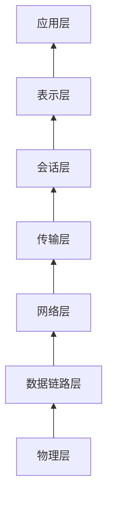
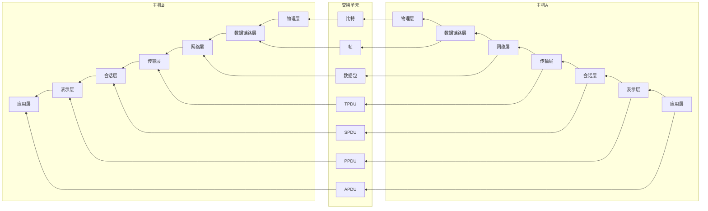
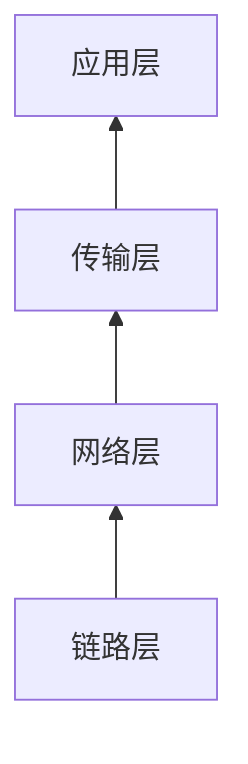
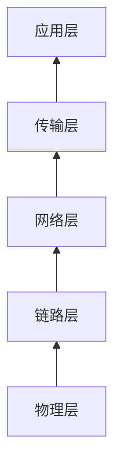

[[网络]]
# 参考模型
## OSI
基于国际标准化组织(International Standard Organization ISO)1983年开发的提案提出了OSI(Open Systems Interconnection)参考模型,并在1995年修订

### 交互

当主机A要向主机B发送数据,数据会从它的应用层一直向下传输到物理层再通过传输介质传到主机B的物理层,一步步向上传递到应用层
同一层与层之间通过通信协议进行通信和数据的交流
### 基本概念

服务
下一层向上一层提供的一组操作(原语)

### OSI参考模型的问题

#### 时机
市面上已有TCP/IP体系

#### 设计
规定的内容过于冗杂,通时不同层之间的内容不均匀,表示层和会话层几乎没有内容,内容几乎全在数据链路层和物理层

## TCP/IP参考模型
TCP/IP模型最早作为Berkerley Unix的一部分,学术界将此看作Unix的一部分

### TCP/IP参考模型的问题
TCP/IP模型没有明确区分服务,接口和协议的概念
TCP/IP模型不通用,也不能描述体系之外的协议栈如蓝牙
TCP/IP模型链路层不是通常意义的一层而是一个接口
TCP/IP模型不区分物理和数据,都放在链路层
早期自主实现的协议被广泛应用,导致其他协议难以取代

## 五层参考模型

# 各层功能介绍(OSI)

## 物理层(第一层)

用什么电信号表示0和1
一个比特传输要持续多少纳秒
传输是否在两个方向同时进行
[[物理层]]

## 数据链路层(第二层)

数据链路层使用物理层提供的比特流服务在通信信道上发送比特和接收比特,提供可靠的数据传输,并确保数据正确传输
向网络层提供一个定义良好的服务接口
将比特序列组织成帧
错误检测和纠正
调节数据流
介质访问控制
[[数据链路层]]

## 网络层(第三层)

将数据传输到目标地址
目标地址可以是多个网络通过路由器连接而成的某个地址
该层负责寻址和路由选择
[[网络层]]

## 传输层(第四层)

向应用层上的进程提供高效的可靠的性价比合理的数据传输服务
[[传输层]]

## 会话层(第五层)

负责建立和断开通信连接
何时建立,何时断开,保持多久
[[会话层]]

## 表示层(第六层)

主要负责数据格式的转换,将应用处理的信息转换为合适网络传输的格式,或者将下一层的数据转换为上层能够处理的数据
[[表示层]]

## 应用层(第七层)

为应用层序提供服务并规定应用程序中通信相关的细节
[[应用层]]
