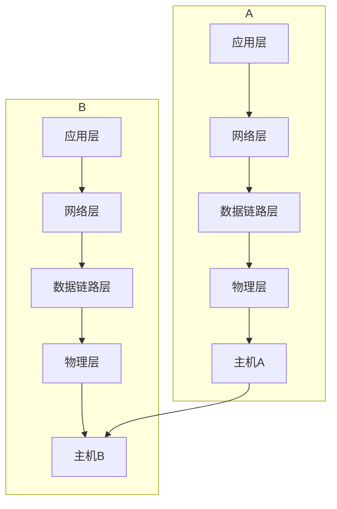
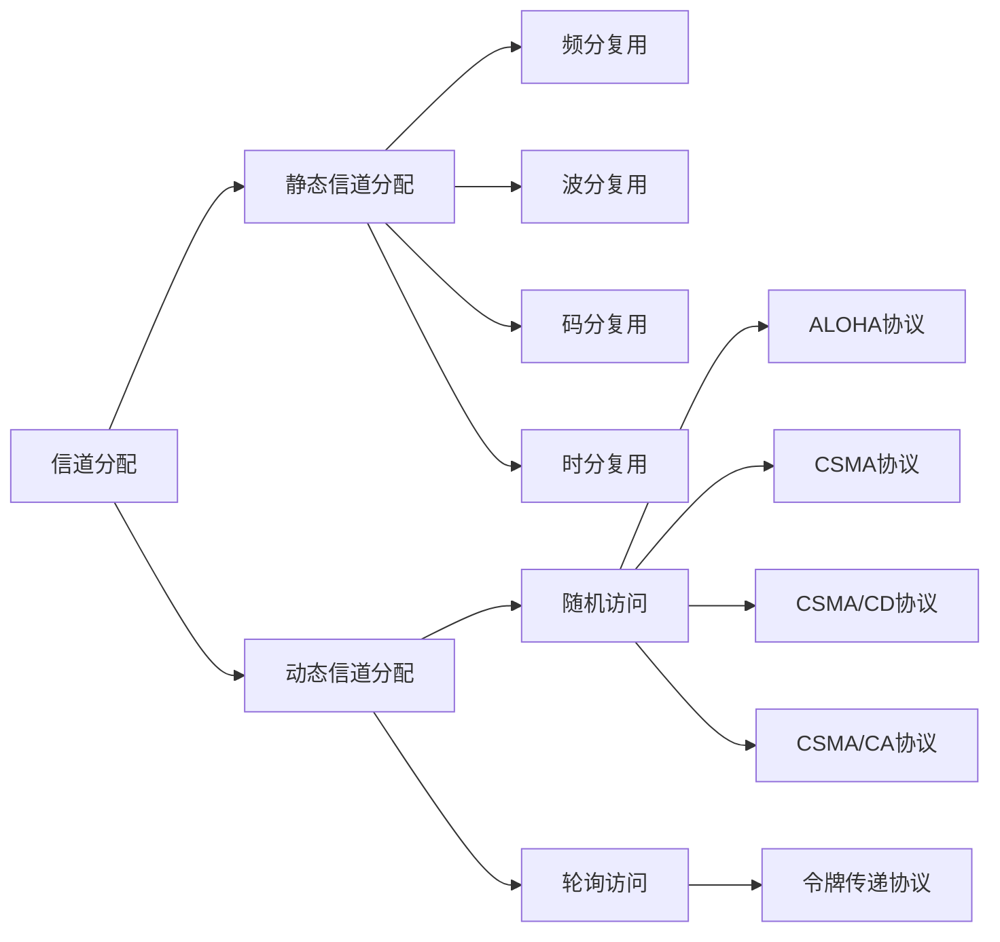
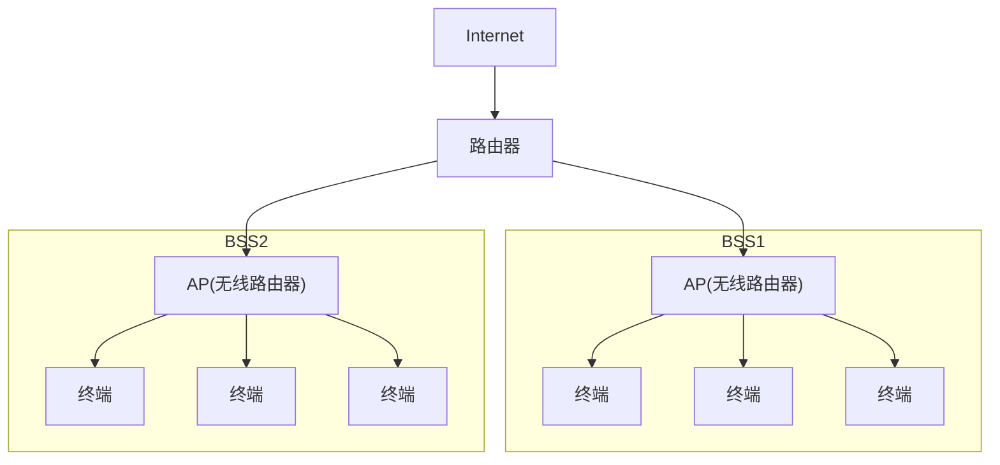

[[物理层]][[分层参考模型]]
# 帧与封装

## 帧
在数据链路层,数据以**帧**(Frame)的形式进行传输,每一帧通常包括以下三部分:
- 帧头(Header):包括地址信息(源地址,目的地址),帧类型,控制信息等
- 数据(payload):承载来自网络层的数据报文(通常是IP数据流)
- 帧尾(Trailer):通常包括校验和用于检测数据传输错误

- 主机A数据层数据为数据报
- 传输到数据链路层封装为帧,加上帧头帧尾
- 数据传输到物理层再转换成比特流
- 物理层再进行数字调制
- 将信号通过介质传输到主机B
- 主机B接收到信号
- 物理层将信号解调成比特流
- 数据链路层从比特流中解析出帧,丢弃帧头帧尾
- 网络层再将帧转换成数据报

## 封装

### 字节计数法
在帧的头部添加一个字段指明该帧的字节数

优点:
简单易实现,占用的额外开销少
缺点:
如果计数字段的数据被传输错误,会导致数据同步错误,接收端可能错误地解析数据

### 字符填充法
使用特殊字符如SOH(Start of Header)表示帧起始,EOT(End of Transmission)表示帧结束,并在数据中使用转义符如ESC避免特殊字符的冲突

优点:
解决了字节计数法的同步问题,适用于字符流
缺点:
增加了额外的转义字符,可能会占用带宽

### 比特填充法
使用特定的比特模式如`01111110`作为帧的起始和终止标志,并在数据部分中避免比特模式的冲突比如出现连续5个1时自动填充0

优点:
适合任何比特流,不限于字符编码
缺点:
需要额外的比特填充,稍微增加传输开销

### 物理层编码法
数据封装成帧后,直接在物理层使用区别于编码的信号的变化来表示帧的起始和结束,而不依赖于帧的额外内容,比如在曼彻斯特编码的比特流中,在帧起始和结束的位置加入一段无变化的电平

优点:
不需要额外填充,没有额外开销
缺点:
依赖于物理层的编码方式,不适用于所有链路协议

## 错误检测
数据在传输过程中,由于各种因素如干扰,噪声,信号衰减,可能导致比特错误如比特翻转,数据链路层提供错误检测机制,保证数据传输的可靠性,使得接收端能检测的错误并采取相应措施如请求重传

### 奇偶校验
Parity Check
发送方和接收方在传输前协商好校验是奇偶的哪一种,判断依据是数据中1的个数的奇偶性
发送方在原数据上加入校验位以让数据满足1的个数为奇数或偶数,即数据1的个数+校验位=要求
接收方读取数据,检验其中的1个数是否满足要求

优点:
实现简单,开销小
缺点:
检测能力弱,只能检测奇数个比特发生错误的情况,偶数个比特发生错误将相互抵消

### 校验和
Checksum
校验和是一种常用的错误检测方法,广泛用于TCP/IP协议中,具体操作如下
- 发送方将发送的数据分成若干段,通常为16位一组1
- 将这些数据进行二进制求和
- 若求和过程中产生进位,则将进位部分回卷相加,即循环进位
- 最后将求和结果取反,作为校验和附加在数据后发送
- 接收方验证后如果结果全部是1则说明数无误,否则出错

优点:
比奇偶校验强,检测更多错误,简单高效,计算量小
缺点:
不能检测所有错误,如果部分比特翻转后和相等则无法检测

### 循环冗余校验
CRC(Cyclic Redundancy Check)
CRC是一种广泛用于数据链路层的错误检测方法,常用于以太网,HDLC,PPP等协议
- 发送方和接收方事先约定一个叫做生成多项式的二进制序列
- 生成多项式如果有n位,发送方在发送数据末尾添加n-1个0
- 发送方使用末尾添加0的数据除以生成多项式,得到的余数称为CRC码
- 发送方发送原始数据在末尾添加CRC码
- 接收端收到数据后除以同样的生成多项式,若余数为0则数据无误,否则数据有误

生成多项式是二进制多项式,因为只能是0和1,0表示该项不存在,1表示该项存在,如$x^3+x+1$即可表示为`1011`,对应位表示对应次数

生成多项式不是随机的,也不是根据数据临时决定,而是事先由协议规定,固定不变,每一种协议在指定之初就规定了对应的CRC生成多项式,不同协议使用的生成多项式不同且标准化,发送端和接收端都按照协议规定使用相同的CRC生成多项式

### 对比
| 检验方法 |   附加开销    | 实现难度 |  错误检测能力   |        常用协议         |
| :--: | :-------: | :--: | :-------: | :-----------------: |
| 奇偶检测 |   1 bit   |  简单  | 弱(偶数位错漏检) |        串行通信         |
| 检验和  |  16 bit   | 较简单  |    中等     |       TCP/UDP       |
| CRC  | 16或32 bit |  中等  |    非常强    | Ethernet,Wi-Fi,HDLC |

# 流量控制与可靠传输
这部分在传输层也有
传输层关注主机1到主机2的全过程(端到端)
数据链路层关注一条链路上相邻的两个节点(点到点)

## 停止-等待协议
Stop-and-Wait
发送方给接收方发送一个数据帧,接收方接收之后会给发送方发生确认信息(Acknowledge,ACK),在接收到ACK之前,接收方会一直等待,收到ACK后再发下一个帧

往返时延(Round Trip Time,RTT),从发送方开始发送帧到发送方收到ACK结束的时间称为往返时延,它的一半称为单程时延

当数据帧或ACK发生丢失时,发送方迟迟无法收到ACK,此时发送方会发起超时重传,发送方发起超时重传的计数器比RTT略长

而接收方根据帧上的编号判断是重传还是新的一帧,通常ACK也是有序号的,以便让接收端知道发送什么帧

## 信道利用率
信道利用率U,指在一个发送周期里,链路真正用来"发送数据帧"的时间占比
$$
U=\frac{T_{f}}{T_{f}+T_{ack}+RTT}
$$
$T_{f}$:数据帧发送时间(把整帧的比特都推上链路的时间) 
$T_{f}=\frac{L}{R}$ L:帧长(bit) R:发送速率(bit/s)
$T_{ack}$:ACK发送时间(ACK帧上链路的时间)

在滑动窗口的情况下,公式应该改为
$$
U=\frac{nT_{f}}{T_{f}+T_{ack}+RTT}
$$
将原本的U求倒数可得
$$
N=\frac{1}{U}=\frac{T_{f}+T_{ack}+RTT}{T_{f}}
$$
可以得到理论上一个发送周期可以发送多少条数据帧

## 滑动窗口
单独使用停止-等待协议的信道利用率较低,发送时间通常很短,但等待ACK+单程延时很长,链路大部分时间在空转,如果能连续发送数据就可以提高信道利用率,这可以使用滑动窗口来实现

发送窗口(Send Windows):允许发送未确认的数据帧序号范围
接收窗口(Receive Windows):接收方当前愿意接收缓存的数据帧序号范围
窗口滑动(Slide):左边界右移,释放额度(即序号范围)

### 后退n协议
Go Back N,GBN
接收方只按序接收,一旦缺帧,后面的丢弃,发送方超时后从缺失处发起"一串"重传

GBN使用累计确认,所以当"某个中间ACK丢失",通常会被后续更大的ACK自动补上,只有当丢失的ACK没有被后续ACK覆盖时,发送端才会触发重传

假设用n个比特对数据帧进行编号,那么发送窗口数S和接收窗口数R需要满足的条件是$S+R\le 2^n$
在GBN协议中,R为1,故有$1 \le S \le 2^n-1$

### 选择重传协议
Select Request,SR
接收方允许乱序接收并缓存,只重传丢失的那几帧

在选择重传协议里,通常发送窗口数S等于接收窗口数R,如果S>R,那么发送的数据帧可能会溢出接收窗口,如果S\<R,那么接收窗口无法被填满

如果SR中"某个中间ACK丢失",发送方会触发超时重传,但是接收方会丢弃重传的帧,然后把ACK发送过去

# 子层:介质访问控制
介质访问控制子层(Medium Access Control,MAC)属于数据链路层上的一个子层,主要负责在共享介质上协调多个节点的运输,确保各节点按照一定规则访问信道,与物理层的信道复用有关

## 网络链路
### 点对点链路
由链路的一端的单一发送方和链路另外一端的单一端的单个接收方组成

### 广播链路
多个发送方和接收方都连接上相同的,单一的,共享的广播信道上
当任何一个节点传输一帧数据时,其他节点都会收到一个副本,这称为广播

## ALOHA协议
诞生背景:1970年代,夏威夷大学用于远程岛屿之间的无线数据传输
核心问题:多个设备共享一个信道,如何协调到谁发送数据

ALOHA协议使用完全随机和碰撞重传的解决方法

碰撞是指信道上有多个设备在发送信息,当发生碰撞时就重发

发送机制:节点一旦有数据就立刻发送,不监听信道状态,不关心其他节点,属于"盲发"
冲突处理:节点会等待一段时间(随机退避)后尝试再次发送
理论最大信道利用率大约为18.4%

### 时隙ALOHA
作为对ALOHA的改进,将时间划分为时隙,节点只能在时隙开始时发送数据
碰撞只发生在同一个时隙内,冲突概率降低
理论最大信道利用率提升至36.8%
要求各节点系统时间同步,增加了实现复杂度

## CSMA协议
载波监听多路访问(Carrier Sense Multiple Access)
当某节点要发数据时,监听信道中有无节点在发送数据,如果没有节点发送数据才发送

|          协议类型           |                  描述                  |
| :---------------------: | :----------------------------------: |
| 1-坚持CSMA(1-persistent)  |     监听到信道空闲时立即发送,若忙则持续监听,直到空闲再发      |
| 非坚持CSMA(Non-persistent) |     如果信道忙就随机等待一段时间后重试,避免抢占引发集体冲突     |
| p-坚持CSMA(p-persistent)  | 一般用于时隙信道:监听空闲后以概率p发送,1-p的概率继续等待下一个时隙 |

### 1-坚持型载波监听多路访问
节点会不断监听信道,一旦发现空闲,立刻抢占发送,信道忙就继续监听,直到空闲就马上发,不等待,不犹豫,不随机

### 非坚持型载波监听多路访问
发送数据前监听信息,如果信道空闲,立刻发送,信道忙则不会持续监听信道,随机等待一段时间后再重复上述操作

### p-坚持型载波监听多路访问
在监听到信道空闲时,不一定马上发,而是以概率p发送,以概率1-p等待下一个时隙,是一种折中策略,通常p值根据网络的负载动态调整是最优策略,但比较复杂

## CSMA/CD
带有冲突检测的CSMA(CSMA with Collision Detection)
边发边听,发现冲突马上停止,并等待随机时间再试一次
节点不仅发送前监听,还在发送的同时持续监听,一旦听到有别的节点的数据与自己数据冲突,立刻停下来
边发边听,冲突即停,随机等待后重试,是以太网经典共享介质环境下的核心协议

### 基本概念
#### 传播延迟
数据或信号从发送节点到达接收节点的时间

#### 最大传播延迟
最远两个节点之间信号传播的时间,它决定了最坏情况下发送节点多久才能知道是否发生冲突

#### 争用期(往返传播延迟)
发送节点多久才能得知是否发生冲突,是两倍的最大传播延迟
#### 最小帧长
如果数据帧过小,数据发生碰撞之前就停止监听了则无法检测冲突,所以我们需要规定最小帧长
最小帧长=争用期\*传输速率,保证数据帧发送所用的最短时间不小于争用期

#### 退避时间
当多个节点同时发生冲突,同时停下后,如果都同时重新发送,则必然再次冲突,所以设计了随机等待机制(退避),避免持续碰撞
退避时间=争用期\*随机数k,$k \in[0,2^{n-1}]$,n是重传次数,n最大为10,最多重传16次

| 重传次数 |   k    |
| :--: | :----: |
| 第一次  |  0~1   |
| 第二次  |  0~3   |
| 第三次  |  0~7   |
| ...  |  ...   |
| 第十次  | 0~1023 |

## CSMA/CA
带有冲突避免的CSMA(CSMA with Collision Avoid)

### 无线局域网(WLAN)
IEEE:电气电子工程师学会(I triple E,Institute of Electrical and Electronics Engineers)
WIFI:IEEE 802.11无线局域网
BSS:基本服务集(Basic Service Set)

一个BSS包括一个或多个无线站点和中央基站(Access Point,AP)

IEEE 802.11也有很多套不同标准

| IEEE 802.11 standard | Year | Max data rate | Range | Frequence  |     |
| :------------------: | :--: | :-----------: | :---: | :--------: | :-: |
|       802.11 b       | 1999 |    11 Mbps    | 30 m  |  2.4 GHz   |     |
|       802.11 g       | 2003 |    54 Mbps    | 30 m  |  2.4 GHz   |     |
|   802.11 n(WIFI 4)   | 2009 |   600 Mbps    | 70 m  | 2.4/5 GHz  |     |
|  802.11 ac(WIFI 5)   | 2013 |   3.47 Gbps   | 70 m  |   5 GHz    |     |
|  802.11 ax(WIFI 6)   | 2020 |    14 Gbps    | 70 m  | 2.4/5 GHz  |     |
|      802.11 af       | 2014 |  35-560 Mbps  | 1 km  | 54-790 MHz |     |
|      802.11 ah       | 2017 |   347 Mbps    | 1 km  |  900 MHz   |     |
其中最常用的是WIFI 4 5 6这三个

在有线局域网中,当一个站点发出一帧时,所以的其他站点都可以收到这个帧

在无线局域网里,由于无线电传输范围有限,无法向所有的站点传输,也无法接收来自所有其他站点的帧

在无线局域网中,相对于发送信号而言,接收到的信号可能很微弱,因此,在无线信道中进行冲突检测非常困难,硬件成本高

### 隐藏站问题
Hidden Node Problem
站B在站A和站C的信号覆盖范围内,可以接收A和C的数据,由于A和C互为竞争者离得太远而无法检测到,这个问题称为隐藏站问题

### 暴露站问题
Exposed Node Problem

## 协议对比

|   协议    | 是否监听信道 | 是否使用时隙 | 是否检测冲突 | 最大信道利用率 |    应用例子    |
| :-----: | :----: | :----: | :----: | :-----: | :--------: |
| 纯ALOHA  |   否    |   否    |   否    |   18%   |   无线早期实验   |
| 时隙ALOHA |   否    |   是    |   否    |   37%   | RFID,低速无线网 |
|  CSMA   |   是    |   否    |   否    | 高于ALOHA |    局域网     |
| CSMA/CD |   是    |   否    |   是    | 40%-60% |   有线以太网    |
| CSMA/CA |   是    |   否    |  避免冲突  |   中等    |   Wi-Fi    |

