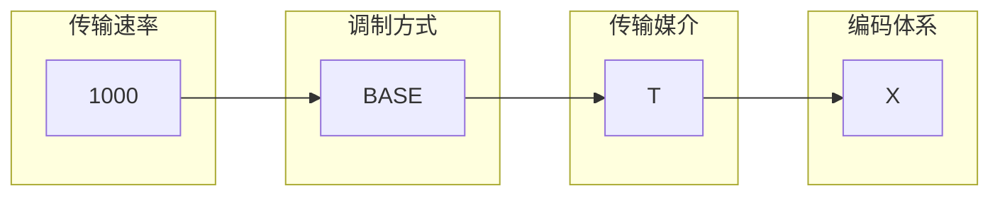

[[分层参考模型]]
# 传输介质

## 有线介质
### 双绞线(Twisted Pair)
双绞线是两根相互绝缘的铜线组成,铜线直径大约为1mm,两根线绞在一起之后,它们产生的波会相互抵消,从而显著降低电线的辐射
一般使用由四组双绞线绕成的线作为网线,将一端的双绞线的铜丝裸露出来,按照橙白,橙,绿白,蓝,蓝白,绿,棕白,棕的顺序排成一排,插入水晶头成组成网线
双绞线既可以用于传输模拟信息,也可以用于传输数字信息

有屏蔽的双绞线(Shielded Twisted Pair, STP),使用铝箔包裹在外部,减少外部电气噪声干扰的线缆,一般用于工地等噪声较多的地方

非屏蔽的双绞线(Unshielded Twisted Pair, UTP),不带任何屏蔽的双绞线,一般使用在家庭和办公室

#### 类别
| 类别  |   种类    |   传输速率    |  传输频率  |      适用范围      |
| :-: | :-----: | :-------: | :----: | :------------: |
| 3类  |   UTP   |  10Mbps   | 10MHz  |  10BASE-T以太网   |
| 4类  |   UTP   |  16Mbps   | 20MHz  | 10BASE-T,令牌环网  |
| 5类  |   UTP   |  100Mbps  | 100MHz |   100BASE-T    |
| 超5类 |   UTP   |   1Gbps   | 125MHz | 100/1000BASE-T |
| 6类  |   UTP   | \>1.5Gbps | 250MHz | 1000/10GBASE-T |
| 7类  | UTP/STP |  10Gbps   | 600MHz |   10GBASE-T    |
日常使用的是超5类的双绞线

### 光纤(Fiber)
由塑料封套,玻璃包套和玻璃芯组成
光纤传输系统由三部分组成,分别是光源,传输介质和检测器

光纤有单模光纤和多模光纤两种,两者传输距离不同

单模光纤:直径小于$10\mu m$,光信号进入光纤之后,沿着直线传播而不会发生反射,通信衰减小,通信容量大,广泛用于长距离传输,价格昂贵

多模光纤:直径大于$50\mu m$根据光发生全反射的特性,只要入射角大于临界值时,此时的光都会在光纤内部发生全反射,此时许多不同的光以不同角度发射向前传播,几乎每一束光都有不同的模式,使用于近距离传输

### 同轴电缆(Coaxial Cable)
同轴电缆由塑料保护外套,外层编织材料,内层绝缘材料,铜芯组成

同轴电缆比非屏蔽双绞线有更好的屏蔽特性和更大的带宽,过去用于电话系统长距离传输,现在已经被光纤取代,目前广泛应用于有线电视和城域网,有些地方用于互联网接入

常用的同轴光缆有$50\Omega$电缆,主要用于数字传输,$75\Omega$电缆,用于模拟传输和有线电视传输

## 无线介质
常见的无线传输介质有无线电波,红外线,微波,激光等
无线电波:具有较强的穿透能力,可以实现长距离传输,应用领域有手机通信,无线局域网,广播
微波:比无线电波频率更高的电磁波,应用领域有卫星通信
红外线:是不可见光的一种,通常用于近距离控制
激光:点对点通信技术,易受天气影响

# 编码

## 归零编码
RZ编码,Return-to-Zero Code
正电平代表逻辑1,负电平代表逻辑0,每传输完一位数据,信号返回零电平

## 不归零编码
NRZ编码,Non-Return-to-Zero Code
与归零编码相比,NRZ编码不需要归零

## 反向不归零编码
NRZI编码,Non-Return-to-Zero Code InvertedCode
信号翻转代表0,不翻转代表1

## 曼彻斯特编码
每个码元里包含一次跳变,先高后低代表0,先低后高代表1

## 差分曼彻斯特编码
中间必有一次翻转,但是是根据开始时翻转来表示,开始翻转代表0,开始不翻转代表1

## nB
如4B,5B,指用n个比特位来表示数字

# 传输标准命名规则

1000 BASE - T X

## 调制方式

### BASE
baseband,基带信号,一根线缆只能传输一个信号

### BROAD
broadband,宽频信号,一根线缆能传输多个信号

## 传输媒介

### T
Twisted Pair
双绞线

### F
Fiber
光纤

### C
Coaxial Cable
同轴电缆

## 编码方式

### 空
代表使用曼彻斯特编码

### X
快速以太网使用4B/5B作为分组码,千兆以太网使用8B/10B作为分组码

### R
使用64B/66B作为分组码

# 数字调制
为了发送数字信息,必须设法使用模拟信号表示比特(数字信息),比特与代表它们的信号之间的映射称为数字调制
有调频,调相,调幅三种方法

## 基本概念
模拟信号:连续变化的电压,光照强度,声音强度

码元:数字调制过程中用来承载信息的基本信号单位,它通过特定的映射关系,将一组比特与一个独特的信号状态对应起来,从而实现数字信号的传输

波特率:单位时间内传输的码元个数,单位为波特Balud,可表示信号传输速率,主要关注物理信号的变化,即底层通信的速率

比特率:单位时间内传输的比特个数,单位为bit,可表示数据传输速率,主要关注实际传输的数据量,即有用信息的速率

离散状态数:每个码元能表示的可能状态数

比特率B,比特率C,离散状态数N $C=B\log_{2}N$

QAM:正交振幅调制,指在频率相同的前提下将调幅和调相结合起来形成叠加的信号

比特率B,比特率C,相位数M,振幅数N $C=B\log_{2}MN$

## 奈奎斯特定理
在无噪声的情况下,码元速率极限值B与信道宽度H满足:B=2H
H是信道的宽度,即信道传输上下限频率差值,单位为Hz

无噪声信道传输能力:$C=B\log_{2}N\implies C=2H\log_{2}N$

## 香农公式
信号功率S,噪声功率N,信噪比S/N
一条带宽为H,有噪声信道的最大传输速率为$C=H\log_{2}\left( 1+\frac{S}{N} \right)$

分贝,dB
通常不使用信噪比,而使用分贝,$dB=10lg\left( \frac{S}{N} \right)$

# 交换方式

## 电路交换
电路交换是根据电话交换原理发展而来,在源站点和目标站点之间建立一条直通,独占的物理通道
电路交换包括三个步骤:建立连接,传送数据,释放连接

优点:
通信延时小,实时性强,可靠性强
数据有序传输,安全性好,实现简单
缺点:
建立时间长
线路独占,利用率低,灵活性差

## 报文交换
发送前无需建立连接,以报文作为数据传输单位
报文从源点传送到目的地采用"存储-转发"方式,在传送报文前,一个时刻仅占用一段通道,在交换站点中需要缓冲存储,报文需要排队,因此报文交换不能满足实时通信的要求

优点:
线路利用率高,提供多目标服务
不用建立连接,动态分配线路
提高了线路的可靠性和利用率
缺点:
实时性差
对报文大小无限制,存储空间可能过大
发生错误时请求重新传输整个报文都会被丢弃

## 分组交换
同报文交换一样,使用存储-转发方式
将大报文分成小的分组,每个分组都携带源地址,目的地址以及编号等消息,中间节点对分组进行存储转发,目标站点将接收到的分组根据编号重新组装成报文

优点:
存储空间开销小
无效传输低
传输延迟低
缺点:
分组乱序,各个分组可通过不同路径到达站点
通信效率低

# 信道复用
信道复用是指在有限的物理信道资源上,通过不同方式让多个信号共享一个信道,以提高资源利用率和通信效率,对物理信道进行复用主要有三种方式:频率,时间和编码

常见的信道复用技术有:频分复用,时分复用,码分复用,此外还有波分复用,本质是频分复用的光学形式

## 频分复用
频分多路复用(FDM,Frequency Division Multiplexing)
指将可用带宽划分为多个频段,每个信号占据不同的频段进行传输,如收音机

## 时分复用
时分多路复用(TDM,Time Division Multiplexing)
指多个信号按照时间片轮流占用整个信道,每个信号在不同的时间间隔内传输,如对讲机

## 码分复用
码分多路复用(CDM\,Code Divison Multiplexing)
又称码分多址(CDMA),所有用户在相同的频率和时间共享信道,每个用户使用不同的编码来区分信号,像不同语言的人在同一处交流

### 码片序列
码片(chip):在CDMA中,一比特会被再细分成多个码片,码片是比比特更短的单位,由若干$\pm1$组成,每个比特由多个码片组成,通常情况下,一个比特被分为64或128个码片

计算机网络中每一个节点会被分配一个码片序列

在计算机网络中,任意两个码片是正交的,从而实现多用户共存互不干扰

正交即任意两个不同码片的归一化内积为0,其中两个码片之间相同的数字对和不同的数字对数是相等的

任何码片与自身的归一化内积是1,与其反码的归一化内积是-1

当接收端获得多个码片叠加在一起的信号时,将获得的信号和对应码片做归一化内积即可得其对应的信号

## 波分复用
波分多路复用(WDM,Wavelength Division, Multiplexing)
类似FDM,但用于光纤通信,每个信号使用不同波长的光进行传输

# 物理层接口特性

## 机械特性
指明接口所用接线器的形状和尺寸,引脚数目和排列,固定和锁定装置

## 电气特性
指明在接口电缆各条线路上出现的电压范围,传输速率,距离限制等

## 功能特性
指明某一线路上出现的某一电平的电压表示何种意义(数据线,控制线)

## 过程特性
指明对于不同功能的各种可能出现的时间顺序
