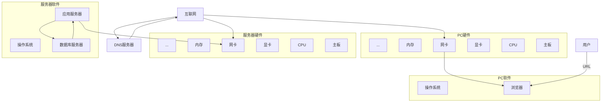
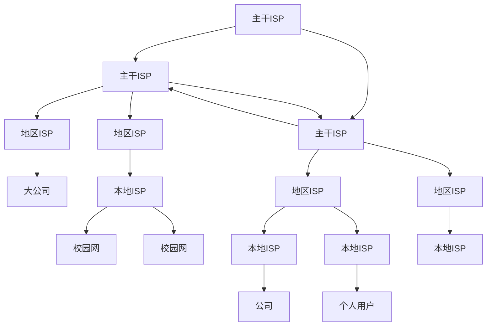

#计算机网络
# 计算机网络
计算机网络是能够相互共享资源的方式互联起来的计算机系统的集合,可以从以下四个方面来理解:

***计算机网络是利用地理上分散的且具有独立功能的多个计算机系统通过通信线路和设备在相应软件的支持下实现的数据通信和资源共享的系统***
## 目的
计算机网络建立的主要目的是实现资源共享
## 分布
互联的计算机是分布在不同地理位置的多台独立的"自治计算机"
## 协议
联网计算机之间的通信必须遵守共同的网络协议
## 传输
互联计算机之间的连接需要有通道,即由传输介质实现物理互联

# 网络例子

## 客户端和服务器

# 基本概念
## ISP
Internet Service Provider
互联网服务提供商

## 节点
node
计算机,交换机,路由器等构成网络的硬件都可以称为网络中的节点

## 主机
host
通过网络为其他机器提供服务的计算机,也称为服务器

## 客户端
client
指从主机处获得服务的计算机,也称为终端

## ISP层次

## 报文
message
网络中交换与传输的数据单元

## 分组
packet
为了从源端系统向目的端系统发送一个报文,源端将长报文划分为较小的数据块,称为分组

## 比特
bit
用小写b表示,表示一个二进制位,0或1

## 字节
byte
用大写B表示,一个字节是8个比特
1B=8b
1KB=$2^{10}$B
1MB=$2^{10}$KB
1GB=$2^{10}$MB
1TB=$2^{10}$GB

## 带宽
用来表示网络中某信道传送数据的能力,网络带宽表示单位时间内网络中的某信道所能通过的最高数据率,单位是bit/s
传输速率
1Kb/s=$10^3$b/s
1Mb/s=$10^3$Kb/s
1Gb/s=$10^3$Mb/s
1Tb/s=$10^3$Gb/s

# 网络分类
## 分布范围
### 个域网
Personal Area Network
PAN
覆盖范围为几米以内
### 局域网
Local Area Network
LAN
覆盖范围为几公里
### 城域网
Metropolitian Area Network
MAN
覆盖范围几公里到几十公里
### 广域网
Wide Area Network
WAN
覆盖范围为几百到几千公里

## 使用者

### 公用网

### 专用网

## 交换方式

### 电路交换

### 报文交换

### 分组交换

## 拓扑结构

### 星型

### 总线型

### 环型

### 树型

### 网状型

## 传输介质

### 双绞线

### 同轴电缆

### 光纤

### 无线

## 用途

### 教育

### 科研

### 商业

### 企业

### 政府