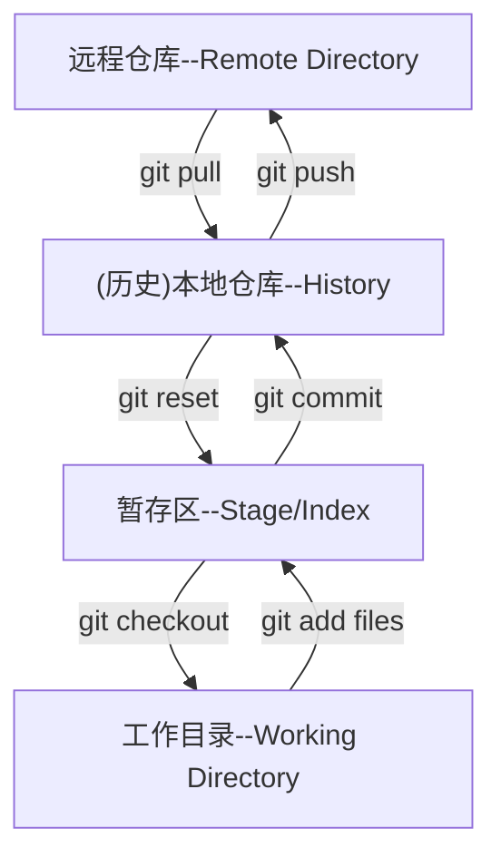
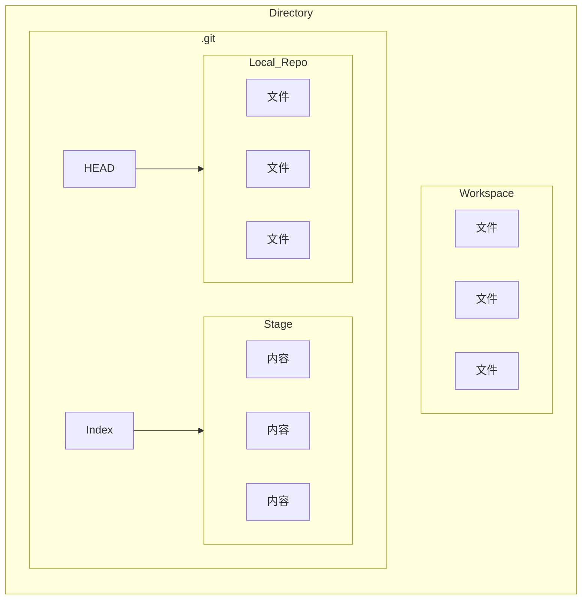
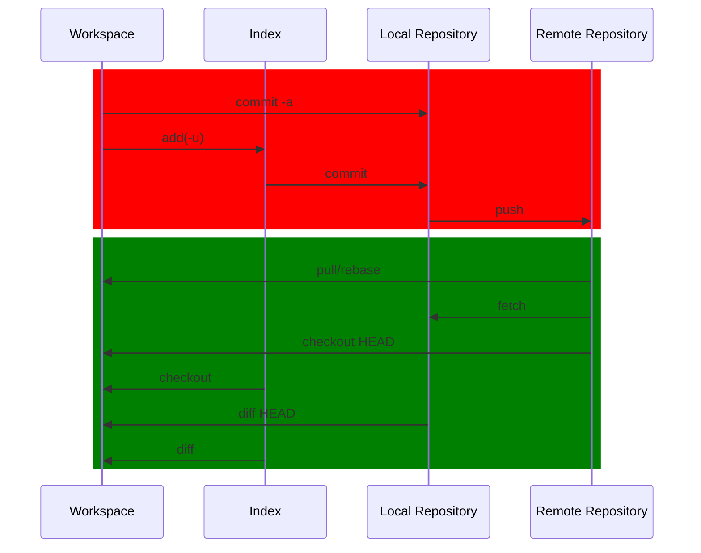
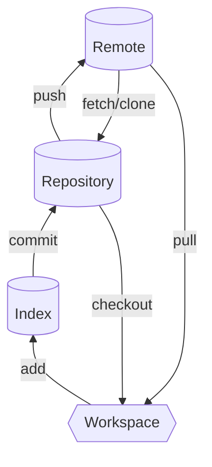

# 版本控制
Revison control
一种再开发过程中用于管理我们对文件,目录或工程等内容的修改历史.方便查看更改历史记录,备份以便恢复以前的版本的软件工程技术
- 实现跨区域多人协作开发
- 追踪和记载一个或多个文件的历史纪录
- 组织和保护你的源代码和文档
- 统计工作量
- 并行开发,提高开发效率
- 追踪记录整个软件的开发过程
- 减轻开发人员的负担,节省时间,同时降低人为错误
___
## 本地版本控制
记录文件每次的更新,可以每一个版本做一个快照,或者是记录补丁文件

## 集中版本控制
所有的版本数据都保存在服务器上,协同开发者从服务器上同步更新或上传自己的修改
所有的版本数据,都保存在服务器上用户本地只有自己以前所同步的版本,如果不联网用户就看不到历史版本,也无法切换版本验证问题,或在不同分支上工作,而且所有数据都保存在单一的服务器上,有很大的风险这个服务器会损坏,丢失所有的数据,也可以定期备份,代表产品:SVN,CVS,VSS

## 分布式版本控制
所有的版本信息仓库都同步到本地的每一个用户,可以在本地查看所有的版本历史,可以离线在本地提交,只要在联网的时候同时push到相应的服务器或者其他用户那里,由于所有用户都保存所有版本数据,只需要一个用户的设备没有问题就可以恢复所有的数据,但增加了本地空间的占用,代表产品:Git

# Git历史
Linux内核开源项目有为数众广的参与者,绝大多数的Linux的内核维护工作都花在了提交补丁和保存归档的繁琐事务上(1991~2002),到了2002年,整个项目组开始启用一个专用的分布式版本控制系统BitKeeper来管理和维护代码
到了2005年,开发BitKeeper的商业公司和Linux内核开源社区的合作关系结束,它们收回了Linux内核社区免费使用BitKeeper的权力,这就迫使Linux开源社区特别是Linux的创造者Linus Torvalds基于使用BitKeeper时的经验教训,开发出自己的版本系统Git

Git是目前世界上最先进的分布式版本控制系统,Git是免费的,开源的,最初Git是为了辅助Linux内核开发的,用来代替BitKeeper

# Git和基本命令
Git Bash:
Linux风格的命令行

Git CMD:
Windows风格的命令行

Git GUI:
图形界面

## 基本命令(Linux)
- `cd`:改变目录
- `cd..` :回到上一级目录
- `pwd`:显示当前工作路径
- `clear`:清屏
- `ls`:列出当前目录下的所有文件(白色表示文件,蓝色表示文件夹,绿色表示程序)
- `touch`:新建文件
- `rm`:删除文件
- `mkdir`:新建文件夹
- `rm-f`:删除文件夹
- `mv`:移动文件
- `reset`:重新初始化终端
- `histroy`历史命令
- `help`:查询帮助
- `exit`:退出终端
- `#`:注释
## 配置
配置存储在gitconfig文件
`git config-l`查看配置
`git congig --system -l`查看系统配置
`git config --global -l`查看全局配置
设置配置
`git config --global user.name`设置用户名
`git config --global user.email`设置邮箱

# 基本理论
## 工作区域
### 结构
Git在本地有三个工作区域:工作目录(Working Directory),暂存区(Stage/Index),资源库(Repository/Git Directory),还有一个远程git仓库(Remote Directory)

默认在工作目录进行修改
将本地文件通过git add files命令添加到暂存区
使用git commit将暂存区文件上传到本地仓库
使用git push将本地仓库的文件上传到远程仓库

将文件从远程仓库拉到本地仓库使用git pull命令
将暂存区文件回滚到上一个版本使用git reset命令
从暂存区把文件拉回工作目录使用git checkout命令
### 实现

我们的本地项目就是工作区(Workspace),当其作为我们的Git的工作目录时,会携带一个.git的隐藏文件夹

当我们需要提交版本的时候,我们需要先add files到我们的暂存区,暂存区在.git文件夹里是以Index文件的形式存在的,其中记录了我们的文件信息

再从暂存区commit到我们的本地仓库,在.git仓库中的HEAD文件就记录了ref:分支,表示我们仓库分支
远程仓库有比如github和gitee

## 工作流程
一般流程如下:
在工作目录创建新文件或修改文件
将需要进行版本控制的文件放入暂存区
将暂存区文件提交到git仓库
故git管理的文件存在三个阶段:已修改(modified),已暂存(staged),已提交(committed),未被git管理文件状态是未跟踪(Untracked)


# 项目搭建
## 日常使用指令

从工作区add到暂存区
从暂存区commit到本地仓库
从本地仓库push到远程仓库

从远程仓库fetch/clone到本地仓库
从远程仓库直接pull到工作区
从本地仓库checkout到工作区
## 本地搭建仓库
在项目目录打开Git Bash
先使用`git init`命令初始化仓库,将在目录下生成隐藏文件夹.git
## 远程克隆仓库
在项目目录打开Git Bash
可以从远程仓库`git clone`一个仓库,clone后面接url网站
# 文件操作
## 提交文件
版本控制是对文件的控制,所以首先要知道文件当前在什么状态

Untracked:未跟踪,此文件在文件夹中但是没有加入git库,不参与版本控制,通过`git add`可以将其加入git库,状态变为`Staged`

Unmodified:未修改,文件已入库,即版本库里的文件快照和文件夹中的完全一致,这种文件有两条去路:如果被修改,则变为Modified,如果使用`git rm`移出版本库,则变为Untracked

Modified:已修改,文件已修改,并没有上传,这种文件也有两条去路:通过`git add`可以进入暂存区变为staged,使用`git checkout`可以回滚版本,返回到Unmodified

Staged:已暂存,可以使用`git commit`将修改同步到库中,这时库中的文件将和本地文件一致文件变为Unmodified,执行`git reset HEAD filename`可以取消暂存,文件状态变为modified

使用`git status`可以获取当前工作目录文件状态
`git add .`将当前目录下所有文件添加到暂存区
`git commit -m`将暂存区内容提交到本地仓库,`-m`表示提交信息

## 忽略文件
当一部分文件不需要进行版本控制,如:数据库文件,临时文件,设计文件等

此时可以在工作目录下创建.gitignore文件
- 其中会忽略空行,同时以#开头的行也会被忽略(注释)
- 可以使用Linux通配符,例如星号`*`代表任意多个字符,问号`?`代表单个字符,方括号`[]`代表可选字符范围,大括号`{}`代表可选的字符串范围等
- 如果名称的最前面有一个叹号`!`表示例外规则,将不被忽略
- 如果名称的最前面是一个路径分隔符`\`表示要忽略的文件在此目录下,子目录的文件不被忽略
- 如果名称的最后面是一个路径分隔符`\`表示要忽略的是此目录下的子目录而不是文件
```
*.txt #忽略所有文本文件
!lib.txt #但是不忽略lib.txt
/temp #忽略工作目录了除了temp目录的内容
build/ #忽略build目录下的所有文件
doc/*.txt 忽略doc目录下的文本文件,但是doc的子目录里的文本文件不被忽略
```

# 远程仓库
远程仓库需要连接服务器,最大的git远程仓库服务器是github,但是在国外有防火墙限制比较慢

在国内可以使用gitee,也就是码云来代替
## 配置公钥
在每一次将新版本推到远程仓库时都需要输密码,如果不想输密码实现免密码登录,可以在本地绑定SSH公钥

SSH(Secure Shell)安全外壳协议,是一种网络安全协议

SSH可以用`ssh-keygen -t`指令生成,生成后默认存储在用户文件夹下的.ssh文件夹

使用`ls ~/.ssh/`可以查看SSH,其中的文件成对存在,没有pub的是私钥,有pub的是公钥

读取公钥后可以绑定在自己的账号上,以使用免密码登录

## 创建远程仓库
创建远程仓库之后可以设置仓库名,归属者,仓库链接和描述

仓库有开源设置,可以选择开源或私有

在初始化时,可以选择编程语言,.gitignore模板还有开源许可证

许可证包含开源内容是否可以转载,是否可以商业等限制,许可证的内容将存储在LICENSE文件中

在初始化时还可以添加一些文件,比如README,Pull Request和Issue

README是仓库对应项目的说明文档,记录该项目的详细说明

Pull Request和Issue对应的文件存储在.gitee文件夹下,包含了对于的模板

初始化时还能选择分支模型

## 克隆远程仓库
在仓库上一般会显示其对应地址,复制地址后到对应文件夹使用命令`git clone`后面加地址,即可克隆仓库

## 分支

使用`git branch`可以列出当前的所有分支
使用`git branch -d`可以删除分支
使用`git branch -r`可以显示所有远程分支
使用`git push origin -delete`或者`git branch -dr`可以删除远程分支
### 开辟分支
在开发时,如果进行多版本开发,或者让版本有试验,开发,发布等版本,可以在git中开辟分支

分支是相互平行的版本历史,在分支点处有相同的版本,相互之间不会发生冲突

使用`git checkout -b`可以新建一个分支并切换到这个分支
使用`git branch 分支名`可以不切换

### 合并分支
使用`git merge`将分支合并到当前分支

当两个分支上的同一个文件都被修改了,再进行合并将发生冲突,需要修改冲突文件后重新提交,选择要保留哪一边的结果


