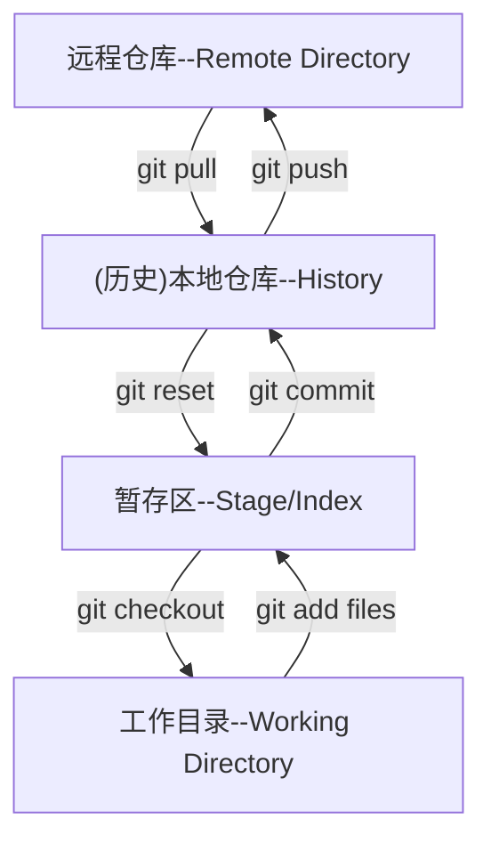
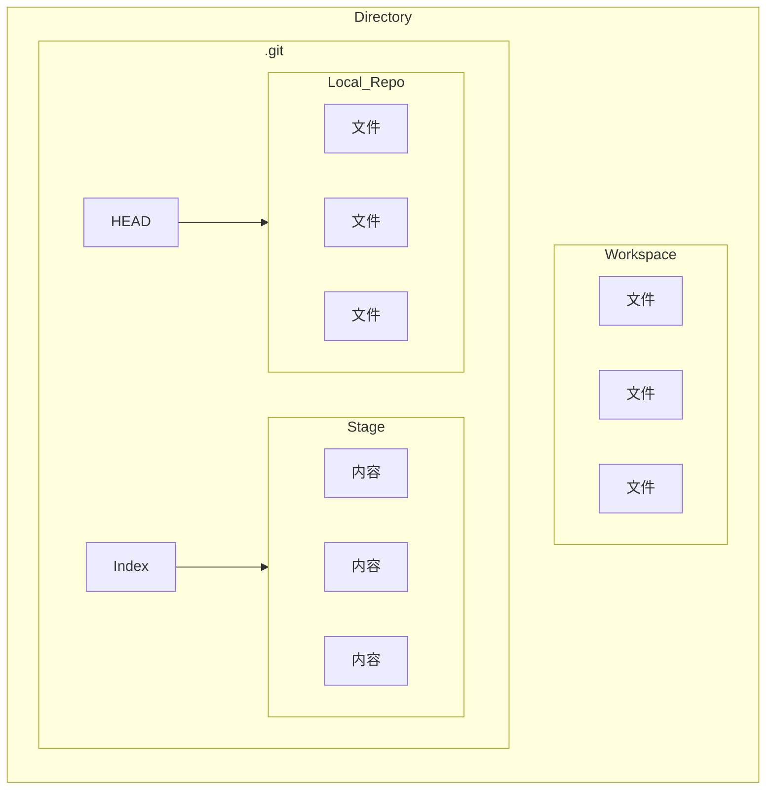

# 版本控制
Revison control
一种再开发过程中用于管理我们对文件,目录或工程等内容的修改历史.方便查看更改历史记录,备份以便恢复以前的版本的软件工程技术
- 实现跨区域多人协作开发
- 追踪和记载一个或多个文件的历史纪录
- 组织和保护你的源代码和文档
- 统计工作量
- 并行开发,提高开发效率
- 追踪记录整个软件的开发过程
- 减轻开发人员的负担,节省时间,同时降低人为错误
___
## 本地版本控制
记录文件每次的更新,可以每一个版本做一个快照,或者是记录补丁文件

## 集中版本控制
所有的版本数据都保存在服务器上,协同开发者从服务器上同步更新或上传自己的修改
所有的版本数据,都保存在服务器上用户本地只有自己以前所同步的版本,如果不联网用户就看不到历史版本,也无法切换版本验证问题,或在不同分支上工作,而且所有数据都保存在单一的服务器上,有很大的风险这个服务器会损坏,丢失所有的数据,也可以定期备份,代表产品:SVN,CVS,VSS

## 分布式版本控制
所有的版本信息仓库都同步到本地的每一个用户,可以在本地查看所有的版本历史,可以离线在本地提交,只要在联网的时候同时push到相应的服务器或者其他用户那里,由于所有用户都保存所有版本数据,只需要一个用户的设备没有问题就可以恢复所有的数据,但增加了本地空间的占用,代表产品:Git

# Git历史
Linux内核开源项目有为数众广的参与者,绝大多数的Linux的内核维护工作都花在了提交补丁和保存归档的繁琐事务上(1991~2002),到了2002年,整个项目组开始启用一个专用的分布式版本控制系统BitKeeper来管理和维护代码
到了2005年,开发BitKeeper的商业公司和Linux内核开源社区的合作关系结束,它们收回了Linux内核社区免费使用BitKeeper的权力,这就迫使Linux开源社区特别是Linux的创造者Linus Torvalds基于使用BitKeeper时的经验教训,开发出自己的版本系统Git

Git是目前世界上最先进的分布式版本控制系统,Git是免费的,开源的,最初Git是为了辅助Linux内核开发的,用来代替BitKeeper

# Git和基本命令
Git Bash:
Linux风格的命令行

Git CMD:
Windows风格的命令行

Git GUI:
图形界面

## 基本命令(Linux)
- `cd`:改变目录
- `cd..` :回到上一级目录
- `pwd`:显示当前工作路径
- `clear`:清屏
- `ls`:列出当前目录下的所有文件(白色表示文件,蓝色表示文件夹,绿色表示程序)
- `touch`:新建文件
- `rm`:删除文件
- `mkdir`:新建文件夹
- `rm-f`:删除文件夹
- `mv`:移动文件
- `reset`:重新初始化终端
- `histroy`历史命令
- `help`:查询帮助
- `exit`:退出终端
- `#`:注释
## 配置
配置存储在gitconfig文件
`git config-l`查看配置
`git congig --system -l`查看系统配置
`git config --global -l`查看全局配置
设置配置
`git config --global user.name`设置用户名
`git config --global user.email`设置邮箱

# 基本理论
## 工作区域
Git在本地有三个工作区域:工作目录(Working Directory),暂存区(Stage/Index),资源库(Repository/Git Directory),还有一个远程git仓库(Remote Directory)

默认在工作目录进行修改
将本地文件通过git add files命令添加到暂存区
使用git commit将暂存区文件上传到本地仓库
使用git push将本地仓库的文件上传到远程仓库

将文件从远程仓库拉到本地仓库使用git pull命令
将暂存区文件回滚到上一个版本使用git reset命令
从暂存区把文件拉回工作目录使用git checkout命令

我们的本地项目就是工作区(Workspace),当其作为我们的Git的工作目录时,会携带一个.git的隐藏文件夹
当我们需要提交版本的时候,我们需要先add files到我们的暂存区,暂存区在.git文件夹里是以Index文件的形式存在的,其中记录了我们的文件信息
再从暂存区commit到我们的本地仓库,在.git仓库中的HEAD文件就记录了ref:分支,表示我们仓库分支
远程仓库有比如github和gitee